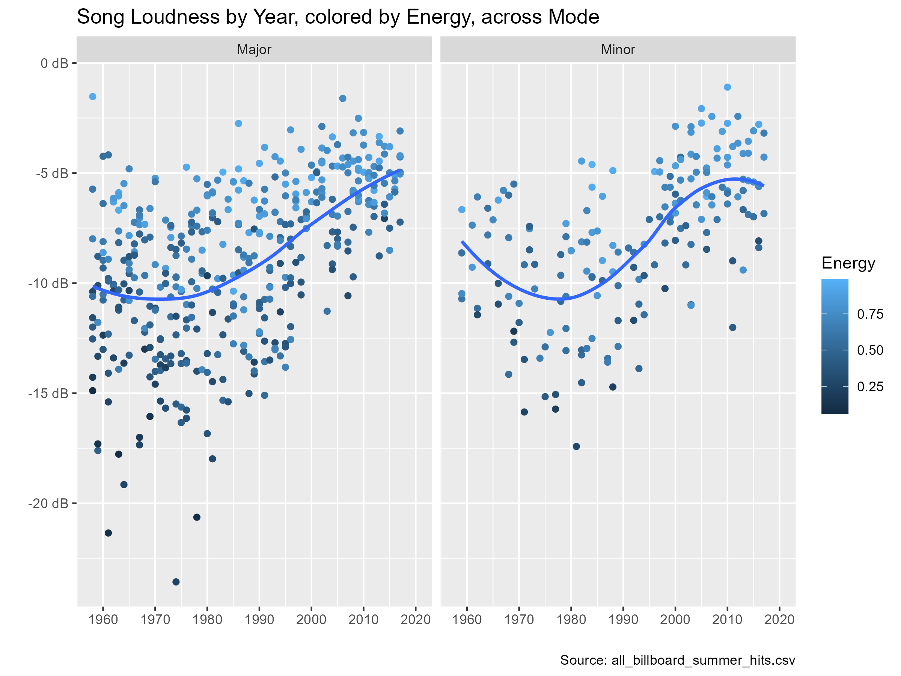
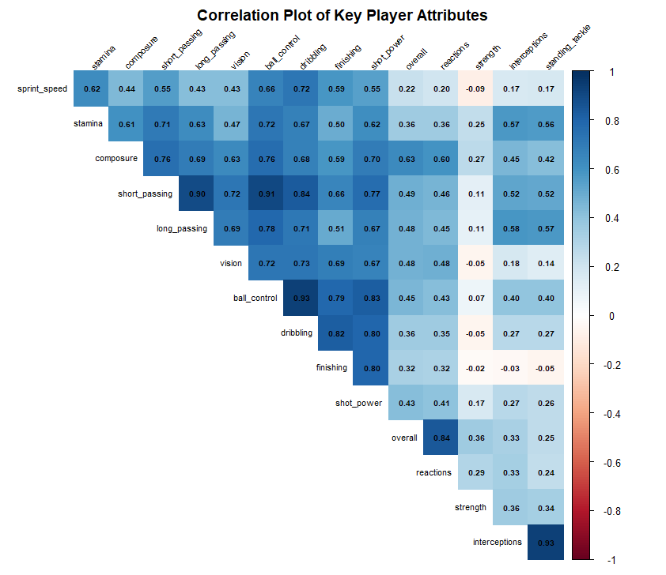
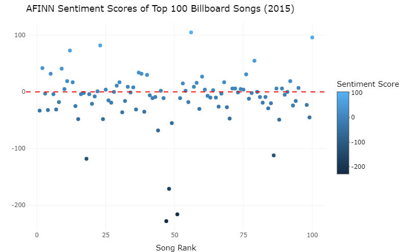

# Data Visualization and Reproducible Research

> Matthew Russo 

The following is a sample of visualizations created during the _"Data Visualization and Reproducible Research"_ course.

## Project 01

In the `project_01/` folder, you can find Mini-Project 1, where I examined the trends in music across multiple decades using the Billboard Top 100 Summer Songs dataset, with the ultimate goal of finding what was needed to make a chart-topping hit! I scored highly on this project, with the only revision needed being a simplification of a problematic bubble chart.

**Sample data visualization:** 

My favorite visualization from this project has to be this scatterplot, showing loudness over year, colored by energy. It is a very clean scatterplot that showcases the change in loudness and energy over the years, and the plot is faceted by mode to show the trends across major and minor songs.

## Project 02

In `project_02/`, you can find Mini-Project 2, where I explored the FIFA 18 Players dataset, containing information on all the available players in the titular game, FIFA 18. I examined the nationalities of players before going into a club-level analysis to determine what we should look for in a club, and by extension a player, if we want to build a winning team.

**Sample data visualization:** 

My favorite visualization from Project 2 has to be the correlogram of player variables. I enjoy this type of plot, as it presents a lot of data succinctly, giving a clear indication of what to look for in a player based on certain variables.

## Project 03

In this project, after completing the mimic plots, I used text visualization on the Billboard Top 100 songs to build a word cloud of the 200 most frequent words that appeared in song lyrics and to build an interactive plot showing each song with a sentiment score assigned based on the sum of the AFINN values of their lyrics.

**Sample data visualization:** 

[(This visualization is interactive!)](https://wholesome100.github.io/russo_dataviz_final_project/)

This is an interactive visualization showing the overall AFINN sentiment score of a song, given by summing the AFINN scores of each word in the song's lyrics. I used plotly to implement the interactivity, which ties in to it being my favorite, as I like how interactive plots can provide additional context without compromising the overall look and feel of the plot.

### Moving Forward

Data Visualization was a course I didn't expect much from, but one that proved to be interesting and entertaining. I enjoyed learning about a different visualization suite with tidyverse + ggplot in R, and I enjoyed learning the principles behind Data Visualization, such as data storytelling and reproducible research.

My goals for the future involve game development, and I want to take these skills into that domain to help drive smart, player-conscious decisions that can help direct any project I end up on. Some examples that come to mind are using a boxplot to examine the distribution of player power faceted by class, or using data to spatially visualize where players are spending most of their time.