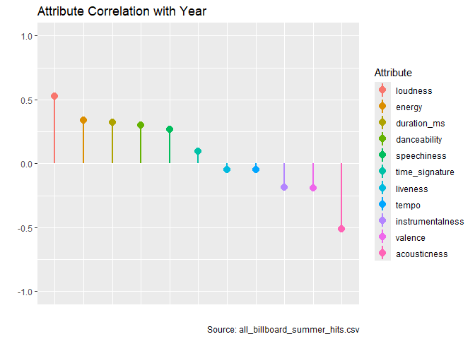
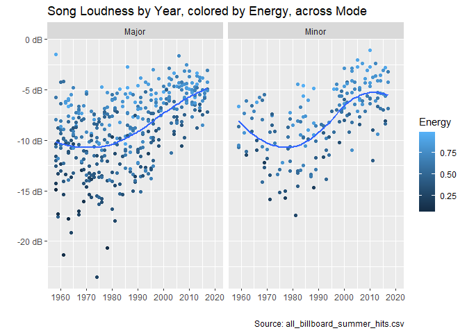
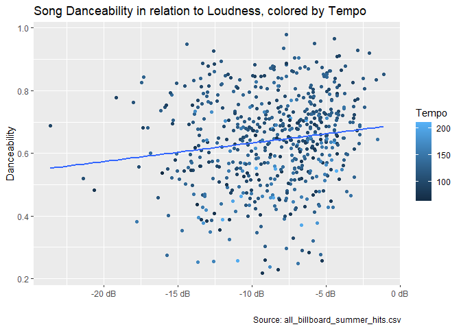
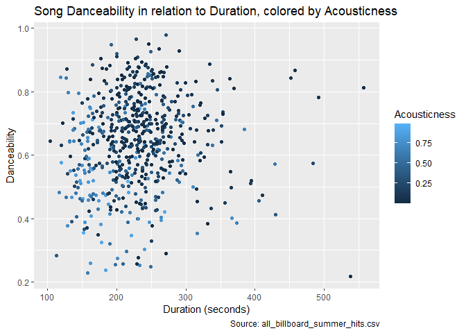
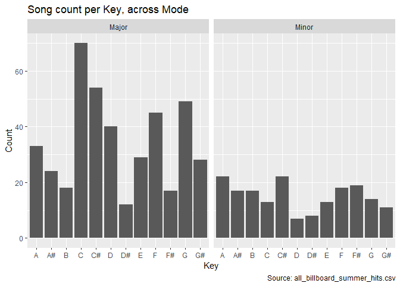
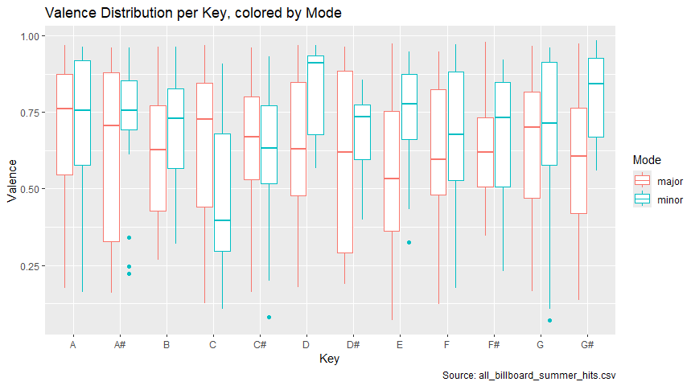
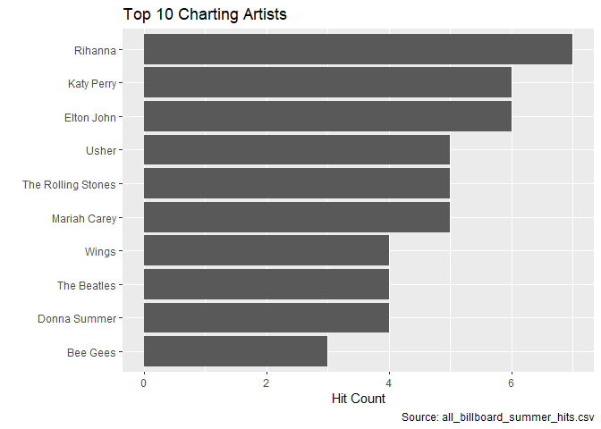

# Data Visualization Project 01


``` r
library(tidyverse)
library(scales)
summer_songs <- read_csv("../data/all_billboard_summer_hits.csv")
head(summer_songs)
```

```
## # A tibble: 6 × 22
##   danceability energy key   loudness mode  speechiness acousticness
##          <dbl>  <dbl> <chr>    <dbl> <chr>       <dbl>        <dbl>
## 1        0.518  0.06  A#      -14.9  major      0.0441        0.987
## 2        0.543  0.332 C       -11.6  major      0.0317        0.669
## 3        0.541  0.676 C        -7.99 major      0.135         0.188
## 4        0.408  0.397 A       -12.5  major      0.03          0.873
## 5        0.554  0.189 E       -14.3  major      0.0279        0.915
## 6        0.679  0.279 G       -10.4  major      0.0384        0.645
## # ℹ 15 more variables: instrumentalness <dbl>, liveness <dbl>, valence <dbl>,
## #   tempo <dbl>, track_uri <chr>, duration_ms <dbl>, time_signature <dbl>,
## #   key_mode <chr>, playlist_name <chr>, playlist_img <chr>, track_name <chr>,
## #   artist_name <chr>, album_name <chr>, album_img <chr>, year <dbl>
```
# Dataset Summaries

The cells below represent some of the dataset exploration done using dplyr functions, with their data potentially being used in visualization generation.
The annotated report starts in the Dataset Visualization section.

Most interesting dataset attributes concern the following:

- **danceability**: How well a song is suited for dancing to (no style specified)
- **energy**: Possible aggregate attribute of how intense a long is (louder, faster tempo)
- **key**: Musical key the song is in
- **loudness**: How loud a song is in relation to its maximum level (0 dB)
- **mode**: Track modality (Minor or Major)
- **speechiness**: Degree of speech in a track, with 0.0 being lower
- **acousticness**: Scale of 0-1 on how acoustic a track is (0 being electric or electronic music like rock)
- **instrumentalness**: Likelihood the track contains any vocals (1.0 meaning vocals are unlikely)
- **liveness**: Determines if an audience is present in the recording
- **valence**: Happiness of a song, with 1.0 being happier
- **tempo**: Estimated tempo of a track in BPM
- **duration**: Track length in milliseconds
- **time_signature**: Overall time signature of a track (number of beats in bar)
- **year**: Year the track was released

For grouping, playlist_name, artist_name, and album_name may be of interest.

For visualizations, I would like to look at:
1. scatterplot of loudness, energy over year
2. scatterplot of danceability, loudness, tempo
3. scatterplot of danceability, duration, valence, acousticness,  over year
4. Barchart of modality and key
5. Boxplot of valence, modality and key
6. Bar chart of artists who charted the most


``` r
# Basic dataset summary
summary(summer_songs)
```

```
##   danceability        energy           key               loudness      
##  Min.   :0.2170   Min.   :0.0600   Length:600         Min.   :-23.574  
##  1st Qu.:0.5457   1st Qu.:0.4768   Class :character   1st Qu.:-10.947  
##  Median :0.6480   Median :0.6405   Mode  :character   Median : -8.072  
##  Mean   :0.6407   Mean   :0.6221                      Mean   : -8.587  
##  3rd Qu.:0.7402   3rd Qu.:0.7830                      3rd Qu.: -5.862  
##  Max.   :0.9800   Max.   :0.9890                      Max.   : -1.097  
##      mode            speechiness       acousticness       instrumentalness   
##  Length:600         Min.   :0.02330   Min.   :0.0000488   Min.   :0.000e+00  
##  Class :character   1st Qu.:0.03280   1st Qu.:0.0417250   1st Qu.:0.000e+00  
##  Mode  :character   Median :0.04140   Median :0.1620000   Median :3.240e-06  
##                     Mean   :0.06866   Mean   :0.2665156   Mean   :3.643e-02  
##                     3rd Qu.:0.06990   3rd Qu.:0.4472500   3rd Qu.:7.133e-04  
##                     Max.   :0.51700   Max.   :0.9870000   Max.   :9.540e-01  
##     liveness          valence           tempo         track_uri        
##  Min.   :0.02480   Min.   :0.0695   Min.   : 62.83   Length:600        
##  1st Qu.:0.08595   1st Qu.:0.4790   1st Qu.:100.22   Class :character  
##  Median :0.12400   Median :0.6900   Median :120.01   Mode  :character  
##  Mean   :0.17979   Mean   :0.6488   Mean   :120.48                     
##  3rd Qu.:0.22275   3rd Qu.:0.8482   3rd Qu.:133.84                     
##  Max.   :0.98900   Max.   :0.9860   Max.   :210.75                     
##   duration_ms     time_signature    key_mode         playlist_name     
##  Min.   :103386   Min.   :3.000   Length:600         Length:600        
##  1st Qu.:192887   1st Qu.:4.000   Class :character   Class :character  
##  Median :226927   Median :4.000   Mode  :character   Mode  :character  
##  Mean   :229434   Mean   :3.972                                        
##  3rd Qu.:257854   3rd Qu.:4.000                                        
##  Max.   :557293   Max.   :5.000                                        
##  playlist_img        track_name        artist_name         album_name       
##  Length:600         Length:600         Length:600         Length:600        
##  Class :character   Class :character   Class :character   Class :character  
##  Mode  :character   Mode  :character   Mode  :character   Mode  :character  
##                                                                             
##                                                                             
##                                                                             
##   album_img              year     
##  Length:600         Min.   :1958  
##  Class :character   1st Qu.:1973  
##  Mode  :character   Median :1988  
##                     Mean   :1988  
##                     3rd Qu.:2002  
##                     Max.   :2017
```


``` r
# Cell to produce a random sample of 5 songs in major/minor mode
# Songs in major mode are deemed as happier and more upbeat (Uptown Funk)
# Songs in minor mode as deemed as sadder or more serious (Hotel California)

# Example Songs in a Major Key
summer_songs %>%
  filter(mode == "major") %>% 
  select(track_name, artist_name, mode, valence, energy) %>%
  slice_sample(n = 5, replace = TRUE) %>% 
  print()
```

```
## # A tibble: 5 × 5
##   track_name                artist_name   mode  valence energy
##   <chr>                     <chr>         <chr>   <dbl>  <dbl>
## 1 Sweet Caroline            Neil Diamond  major   0.527  0.127
## 2 Watch Me (Whip / Nae Nae) Silentó       major   0.965  0.77 
## 3 Grease                    Frankie Valli major   0.871  0.372
## 4 I Got You Babe            Sonny & Cher  major   0.619  0.696
## 5 Born To Be Wild           Steppenwolf   major   0.533  0.737
```

``` r
# Example Songs in a Minor Key
summer_songs %>%
  filter(mode == "minor") %>% 
  select(track_name, artist_name, mode, valence, energy) %>%
  slice_sample(n = 5, replace = TRUE) %>% 
  print()
```

```
## # A tibble: 5 × 5
##   track_name                  artist_name      mode  valence energy
##   <chr>                       <chr>            <chr>   <dbl>  <dbl>
## 1 Who's That Girl             Madonna          minor   0.826  0.646
## 2 Sunny                       Bobby Hebb       minor   0.661  0.347
## 3 Do You Know (What It Takes) Robyn            minor   0.857  0.74 
## 4 Find Your Love              Drake            minor   0.822  0.598
## 5 Maniac                      Michael Sembello minor   0.731  0.704
```


``` r
# Songs get louder each year
cor(summer_songs$loudness, summer_songs$year)
```

```
## [1] 0.5286474
```

``` r
# Louder songs have more energy
cor(summer_songs$loudness, summer_songs$energy)
```

```
## [1] 0.6945549
```

``` r
# Loudness increases danceability a little
cor(summer_songs$loudness, summer_songs$danceability)
```

```
## [1] 0.143182
```

``` r
# Duration has minor increase on danceability
cor(summer_songs$duration_ms, summer_songs$danceability)
```

```
## [1] 0.09003581
```

``` r
# Faster songs are harder to dance to
cor(summer_songs$tempo, summer_songs$danceability)
```

```
## [1] -0.1504569
```

``` r
# Sadder songs use more acoustics
cor(summer_songs$valence, summer_songs$acousticness)
```

```
## [1] -0.1749716
```

``` r
# People talk less in more acoustic songs
cor(summer_songs$speechiness, summer_songs$acousticness)
```

```
## [1] -0.09547774
```


``` r
numeric_cols <- summer_songs %>% 
  select(where(is.numeric))

correlation_matrix <- cor(numeric_cols, use = "pairwise.complete.obs")

year_correlations <- correlation_matrix[, "year"]

sorted_year_correlations <- year_correlations[order(year_correlations, decreasing = TRUE)]

# Correlations with year
print(sorted_year_correlations[names(sorted_year_correlations) != "year"])
```

```
##         loudness           energy      duration_ms     danceability 
##       0.52864737       0.33901678       0.32204651       0.30205908 
##      speechiness   time_signature         liveness            tempo 
##       0.26924978       0.09498807      -0.04710576      -0.04791593 
## instrumentalness          valence     acousticness 
##      -0.18712662      -0.19402793      -0.50931129
```


``` r
# Cell to get top 5 songs per category of interest
# First block are 5 songs with highest values
# Second block are 5 songs with lowest values

# --- Energy ---
summer_songs %>%
  select(track_name, artist_name, energy) %>%
  slice_max(order_by = energy, n = 5) %>%
  print()
```

```
## # A tibble: 5 × 3
##   track_name                       artist_name    energy
##   <chr>                            <chr>           <dbl>
## 1 When Doves Cry                   Prince          0.989
## 2 Promiscuous                      Nelly Furtado   0.97 
## 3 Is There Something I Should Know Duran Duran     0.967
## 4 Venus                            Bananarama      0.961
## 5 C'mon N' Ride It (The Train)     Quad City DJ's  0.959
```

``` r
summer_songs %>%
  select(track_name, artist_name, energy) %>%
  slice_min(order_by = energy, n = 5) %>%
  print()
```

```
## # A tibble: 5 × 3
##   track_name               artist_name          energy
##   <chr>                    <chr>                 <dbl>
## 1 Nel blu dipinto di blu   Domenico Modugno     0.06  
## 2 Three Times A Lady       Commodores           0.0766
## 3 Blowin' In The Wind      Peter, Paul and Mary 0.0848
## 4 Michael                  Michael              0.0979
## 5 My Heart Is An Open Book Carl Dobkins         0.12
```

``` r
# --- Valence (Happiness) ---
summer_songs %>%
  select(track_name, artist_name, valence) %>%
  slice_max(order_by = valence, n = 5) %>%
  print()
```

```
## # A tibble: 5 × 3
##   track_name                                                 artist_name valence
##   <chr>                                                      <chr>         <dbl>
## 1 She Works Hard For The Money                               Donna Summ…   0.986
## 2 When (Originally Performed By The Kalin Twins) [Full Voca… Paris Music   0.979
## 3 Mr. Big Stuff                                              Jean Knight   0.974
## 4 In the Summertime                                          Mungo Jerry   0.973
## 5 Papa Don't Preach                                          Madonna       0.971
```

``` r
cat("Tracks with low valence sound more negative (e.g., sad, depressed, angry).\n")
```

```
## Tracks with low valence sound more negative (e.g., sad, depressed, angry).
```

``` r
summer_songs %>%
  select(track_name, artist_name, valence) %>%
  slice_min(order_by = valence, n = 5) %>%
  print()
```

```
## # A tibble: 5 × 3
##   track_name                    artist_name  valence
##   <chr>                         <chr>          <dbl>
## 1 The Reason                    Hoobastank    0.0695
## 2 This Used To Be My Playground Madonna       0.0708
## 3 Turn Down for What            DJ Snake      0.0815
## 4 The Hills                     The Weeknd    0.107 
## 5 My All                        Mariah Carey  0.108
```

``` r
# --- Acousticness ---
summer_songs %>%
  select(track_name, artist_name, acousticness) %>%
  slice_max(order_by = acousticness, n = 5) %>%
  print()
```

```
## # A tibble: 5 × 3
##   track_name                                          artist_name   acousticness
##   <chr>                                               <chr>                <dbl>
## 1 "Nel blu dipinto di blu"                            Domenico Mod…        0.987
## 2 "Love Theme from \"Romeo and Juliet\" - Remastered" Henry Mancini        0.951
## 3 "Quarter To Three"                                  Gary U.S. Bo…        0.932
## 4 "Sunny"                                             Bobby Hebb           0.93 
## 5 "All of Me"                                         John Legend          0.922
```

``` r
summer_songs %>%
  select(track_name, artist_name, acousticness) %>%
  slice_min(order_by = acousticness, n = 5) %>%
  print()
```

```
## # A tibble: 5 × 3
##   track_name                                artist_name      acousticness
##   <chr>                                     <chr>                   <dbl>
## 1 Higher                                    Creed               0.0000488
## 2 Never Leave You Uh Ooh, Uh Ooh! (Lumidee) Starlite Karaoke    0.0000847
## 3 How To Love                               Lil Wayne           0.000165 
## 4 Unskinny Bop                              Poison              0.0002   
## 5 Pon de Replay                             Rihanna             0.000228
```

``` r
# --- Danceability ---
summer_songs %>%
  select(track_name, artist_name, danceability) %>%
  slice_max(order_by = danceability, n = 5) %>%
  print()
```

```
## # A tibble: 5 × 3
##   track_name       artist_name        danceability
##   <chr>            <chr>                     <dbl>
## 1 State of Shock   The Jacksons              0.98 
## 2 Hot In Herre     Nelly                     0.966
## 3 Dangerous        Kardinal Offishall        0.951
## 4 Electric Avennue Eddie Grant               0.949
## 5 Baby Got Back    Sir Mix-A-Lot             0.936
```

``` r
summer_songs %>%
  select(track_name, artist_name, danceability) %>%
  slice_min(order_by = danceability, n = 5) %>%
  print()
```

```
## # A tibble: 5 × 3
##   track_name             artist_name   danceability
##   <chr>                  <chr>                <dbl>
## 1 November Rain          Guns N' Roses        0.217
## 2 Strangers In The Night Frank Sinatra        0.229
## 3 Yes. I'm Ready         Barbara Mason        0.237
## 4 A Whiter Shade Of Pale Procol Harum         0.249
## 5 Yesterday Once More    Carpenters           0.253
```

``` r
# --- Loudness ---
summer_songs %>%
  select(track_name, artist_name, loudness) %>%
  slice_max(order_by = loudness, n = 5) %>%
  print()
```

```
## # A tibble: 5 × 3
##   track_name     artist_name    loudness
##   <chr>          <chr>             <dbl>
## 1 Not Afraid     Eminem            -1.10
## 2 Splish Splash  Bobby Darin       -1.53
## 3 Crazy          Gnarls Barkley    -1.61
## 4 Hollaback Girl Gwen Stefani      -2.07
## 5 Starships      Nicki Minaj       -2.42
```

``` r
summer_songs %>%
  select(track_name, artist_name, loudness) %>%
  slice_min(order_by = loudness, n = 5) %>%
  print()
```

```
## # A tibble: 5 × 3
##   track_name            artist_name         loudness
##   <chr>                 <chr>                  <dbl>
## 1 Feel Like Makin' Love Roberta Flack          -23.6
## 2 Michael               Michael                -21.4
## 3 Three Times A Lady    Commodores             -20.6
## 4 Memphis               Johnny Rivers          -19.2
## 5 Slow Hand             The Pointer Sisters    -18.0
```


``` r
# Cell to get song counts by key and mode
summer_songs_key_count <- summer_songs %>%
  group_by(mode, key) %>%
  count(key)
  
summer_songs_key_count
```

```
## # A tibble: 24 × 3
## # Groups:   mode, key [24]
##    mode  key       n
##    <chr> <chr> <int>
##  1 major A        33
##  2 major A#       24
##  3 major B        18
##  4 major C        70
##  5 major C#       54
##  6 major D        40
##  7 major D#       12
##  8 major E        29
##  9 major F        45
## 10 major F#       17
## # ℹ 14 more rows
```


``` r
# Cell to find popular artists who might've charted multiple times
top_artists <- summer_songs %>%
  group_by(artist_name) %>%
  summarise(hit_count = n()) %>%
  arrange(desc(hit_count)) %>%
  slice_head(n = 10)

top_artists
```

```
## # A tibble: 10 × 2
##    artist_name        hit_count
##    <chr>                  <int>
##  1 Rihanna                    7
##  2 Elton John                 6
##  3 Katy Perry                 6
##  4 Mariah Carey               5
##  5 The Rolling Stones         5
##  6 Usher                      5
##  7 Donna Summer               4
##  8 The Beatles                4
##  9 Wings                      4
## 10 Bee Gees                   3
```


# Data Visualizations

> Everybody wants to be a rockstar!

Well, maybe not everyone, but musical fame is seen by many as a ticket to freewheeling success and wealth. This begs the question, is there something to glean from the Billboard summer hits list over the past several decades? Are there any key takeaways from how music has changed in that time? Takeaways that we could potentially apply to our own musical endeavors? That is something this project seeks to determine, and we start by visualizing the correlation between several numerical attributes and year in a Lollipop chart, shown below:


``` r
# Get correlation values into a dataframe
year_correlations <- data.frame(
  attribute = names(sorted_year_correlations),
  correlation = as.numeric(sorted_year_correlations)
)

# Lollipop chart showing the correlation values against year
ggplot(year_correlations %>% filter(attribute != "year"), aes(
  x= reorder(attribute, -correlation),
  y = correlation,
  color= reorder(attribute, -correlation)
)) +
  geom_pointrange(
    aes(ymin=0, ymax=correlation),
    linewidth = 1,
    size = 0.75) +
  scale_y_continuous(limits=c(-1, 1)) +
  labs(x = "", y = "", color = "Attribute", title="Attribute Correlation with Year", caption = "Source: all_billboard_summer_hits.csv",) +
  theme(axis.text.x = element_blank(), axis.ticks.x = element_blank())
```

<!-- -->

We see from the chart, that loudness is moderately, positively correlated with year, followed by energy, duration, danceability and speechiness. Liveness and tempo are weak, negatively correlated with year, followed by instrumentalness and valence, with acousticness moderately, negatively correlated with year.
From this, we can determine that songs have gotten louder, more energetic, longer, more danceable, and contain more vocals year over year.
Liveness and tempo haven't changed too much, while valence and instrumentalness have seen a decrease, and acousticness has seen a larger fall-off.
Let's visualize the relationship between loudness and year, with energy, in a scatterplot, as shown below:


``` r
# Cell to visualize song loudness over year
ggplot(summer_songs, aes(
  x = year,
  y = loudness
)) + 
  geom_point(aes(color = energy)) + 
  geom_smooth(method="loess", se=FALSE) + 
  scale_x_continuous(breaks = breaks_width(10), limits=c(1958, 2020)) +
  scale_y_continuous(labels = label_number(suffix=" dB")) +
  labs(
    title = "Song Loudness by Year, colored by Energy, across Mode",
    caption = "Source: all_billboard_summer_hits.csv",
    y="",
    x="",
    color = "Energy"
  ) +
  facet_wrap(~ mode, labeller = as_labeller(c(`minor`="Minor", `major`="Major")))
```

```
## `geom_smooth()` using formula = 'y ~ x'
```

<!-- -->

The scatterplot shows loudness across year, with the points colored by energy, and the charts faceted by mode. We can see for songs in Major mode, there has been a consistent increase in loudness over the years, alongside louder songs tending to have a higher energy. For songs in Minor mode, we can see a dip in loudness in the 70s and 80s, before loudness increases throughout the 90s-2010, before beginning to decrease again. This is interesting, and indicates that modern songs are much louder than their older counterparts. Let's visualize loudness in relation to other positively correlated attributes, such as danceability, in the scatterplot below:


``` r
# Cell to visualize song danceability in relation to loudness,and tempo
ggplot(summer_songs, aes(
  x = loudness,
  y = danceability
)) + 
  geom_point(aes(color = tempo)) + 
  geom_smooth(method="lm", se=FALSE) +
  scale_x_continuous(labels = label_number(suffix=" dB")) +
  labs(
    title = "Song Danceability in relation to Loudness, colored by Tempo",
    caption = "Source: all_billboard_summer_hits.csv",
    y="Danceability",
    x="",
    color = "Tempo",
  )
```

```
## `geom_smooth()` using formula = 'y ~ x'
```

<!-- -->

The scatterplot shows song danceability in relation to loudness, colored by tempo. we can see an increase in danceability as the songs get louder, but there isn't a clear relationship for tempo in the graph. Most points seem to trend towards having a tempo somewhere in the ~100 range, which does make some sense. Faster songs are harder to dance to, and the same could be said for songs that are too slow. Let's take this visualization further by examining danceability in relation to duration, showing in the bubble chart below:


``` r
# lineplot to examine danceability and duration alongside energy and acousticness
# It seems like a cluster forms with shorter songs that have higher energy, lower acousticness, being more danceable
ggplot(summer_songs, aes(
  x = duration_ms,
  y = danceability,
  size = acousticness,
  alpha= 1 - acousticness,
  color = valence
)) + 
  geom_point() + 
  #geom_smooth(method="loess", se=FALSE) +
  scale_x_continuous(labels = function(x) x/1000) +
  scale_size_continuous(range = c(1, 5)) +
  labs(
    title = "Song Danceability in relation to Duration, colored by Valence",
    subtitle = "Translucent, larger points are more Acoustic",
    x = "Duration (seconds)",
    y = "Danceability",
    size = "Acousticness",
    color = "Valence",
    caption = "Source: all_billboard_summer_hits.csv",
  ) + guides(alpha="none")
```

<!-- -->

This bubble chart was a bit difficult to set up, and was the hardest graph for me to manage. As it is, we can see that there doesn't seem to be a clear relationship between danceability and duration, rather, most points seem to cluster themselves around the 200-250 second range for their duration, with varying degrees of danceability. The points are colored by valence, and each point is sized by their acousticness, and given an alpha value of the complement of their acousticness. This is to prevent more acoustic points from obscuring less acoustic points. In the cluster, there is a varied mix of songs, with the most prominent points having a lower acousticness in general, and varying valence values. To the left of the cluster, we can see a set of points that have a higher acousticness and valence, while to the bottom and bottom-right of the cluster we can see points that have a lower valence and varying amounts of acousticness. The main takeaway from the graph is that to land inside the cluser, we need to make a song somewhere between 200-250 seconds, with a lower acousticness, and a moderate degree of valence.

Another important topic to consider is what key our song should be in, a topic visualized in the bar chart below:


``` r
#Bar chart here showing count of songs in each key, per mode
ggplot(summer_songs_key_count, aes(
  x = key,
  y = n
)) + 
  geom_col() +
  labs(
    title = "Song count per Key, across Mode",
    y= "Count",
    x = "Key",
    caption = "Source: all_billboard_summer_hits.csv",
  ) +
  facet_wrap(~ mode, labeller = as_labeller(c(`minor`="Minor", `major`="Major")))
```

<!-- -->

We can see that more songs are done in Major mode as opposed to Minor mode, and the greatest count of songs are done in the C, C#, and G keys, in the Major mode. From this, it can be assumed that we should perform our songs in the major mode, in any one of the aforementioned keys. However, we need to ask ourselves if we want the song to be happy or sad. To answer this, let's visualize the valence distribution of each key, by their mode, as shown in the boxplot below:


``` r
# Boxplot showing valence based on mode and key
ggplot(summer_songs, aes(
  x = key,
  y = valence,
  color = mode
)) + 
  geom_boxplot() +
  labs(
    title = "Valence Distribution per Key, colored by Mode",
    x = "Key",
    y = "Valence",
    color = "Mode",
    caption = "Source: all_billboard_summer_hits.csv",
  )
```

<!-- -->

Instead of faceting, we opted to use color to show the different modes side by side. Major mode songs are generally considered happier, while minor mode songs are considered sadder. However, the boxplot shows a wide distribution of the valence across keys. Granted, the presence of more songs in some keys like C major can widen the distribution compared to some keys like D minor. And, considering these are the most popular songs for their summer season, it stands to reason with the general trends that sadder, less energetic songs in minor key may not chart as frequently, explaining minor key songs with higher valence as seen with D minor. However, we can see how the median valence varies across key, which allows us to pin where our song should land happiness-wise in the key and mode that we choose to perform it in. For example, if we want to play our song in G major, it appears we should have a valence of 0.7, while also keeping in mind the songs at the 25th percentile that have a valence just below 0.5.

So, let's say being original and factoring all of these audio features into our song is just too much work, is there an artist who charted multiple times that we can just emulate in the hopes of success? There is! And from the bar chart below, we can see that artist is...


``` r
# Boxplot showing the top 10 artists with the most charts
ggplot(top_artists, aes(
  y =  reorder(artist_name, hit_count),
  x = hit_count
)) +
  geom_col() +
  labs(
    title = "Top 10 Charting Artists",
    x = "Hit Count",
    y="",
    fill = "Artist",
    caption = "Source: all_billboard_summer_hits.csv"
  )
```

<!-- -->

Rihanna. If you want to be a rich and famous chart-topper, just emulate Rihanna.

Granted, it's a bit more nuanced than that, but the artists that are on this chart have songs that line up with what we uncovered across the earlier charts. Rihanna is a pop singer, and that genre is known for loud, energetic, happier songs with low acousticness (One song of hers that comes to mind, *Please Don't Stop the Music*). Below Rihanna we have Katy Perry, another pop singer (*Firework*). And below her we have an older artist, Elton John. Elton John being around for longer means he had more time to land chart toppers, but one song that comes to mind from him that fits the pattern we found is *I'm Still Standing*. The same could be said for some of the other older artists on this list like The Beatles (*Here Comes the Sun*), Donna Summer (*Last Dance*), and the Bee Gees (*Stayin Alive*). However, more contemporary artists with less time active such as Rihanna and Katy Perry, reinforce the patterns uncovered in our earlier visualizations.


# Mini-Project Report Wrapup

  From the annotated visualizations, we can surmise that to have the best chance at a chart topper, we should make a loud, energetic song with a stable tempo to make it more suitable for dancing. The song itself should have a lower acousticness and a duration between 200-250 seconds, with a varying degree of valence depending on the key and mode that we perform it in. If all else fails, we can try to emulate Rihanna or Katy Perry. However, success and fame is often much harder to hack than by boiling down the most popular entries to their base attributes. Songs can resonate with people for different reasons, and it can be argued that by trying to formulate a chart topping song, it could itself be formulaic. Ultimately, the takeaways uncovered in the notebook could be used to make a song that runs counter to them, or to help create a song based on attributes that a songwriter might find personally appealing. At the end of the day, we should make a song that we appreciate and enjoy, and if it overlaps with some of the qualities seen in the top songs then that's a bonus.

  Originally I planned to have a scatterplot, bar chart, and violin plot for this assignment. However, over time I added in more charts such as a bubble chart, a lollipop chart, and replaced a violin plot with a regular boxplot, as the distribution of valence per key was viewable with just a normal boxplot. I knew a scatterplot would be necessary for comparing continuous attributes, and that a bar chart would be needed to show the count of some attributes per key or artist. The bubble chart allowed me to show some of the key attributes for songs in an easier manner, and the lollipop chart served as an easier way to show correlation between all numeric attributes and year.

  The story I told was told over the course of the notebook visualizations, which was "how to formulate a chart topping song to get rich and famous in the music industry." Granted, there is a bit more nuance to the story, but we were able to show the qualities that songs possess in the modern day, and what attributes modern music listeners may want from the songs they choose to consume. However, any song we create should be something that we enjoy making and listening to at a baseline, and having it overlap with the most popular attributes is beneficial, but not mandatory. There is no point in a success built without passion or enjoyment.

  I applied the principles of data visualizations and design in a couple ways for this assignment, the first of which was keeping the graph themes consistent across my charts (repetition). I only needed to tweak the theme for the lollipop chart, where I removed the x axis text and ticks, and how I used a vibrant color palette to help distinguish between the different attributes. Contrast was employed with the scatterplots, with point color serving to show variables such as energy and tempo, and how they exist within the relationship between the x and y variables. Alignment and proximity were in mind when creating the visualizations, with some labels being considered redundant being removed to give a better sense of space/grouping, and with the general alignment not being tweaked outside of the default theme. I was also thinking of the readings, and how blank space and removing unneeded information can help improve the clarity of a plot. I also thought of the "ink to data" ratio on when/when not to use color on some of the visualizations, and sought to provide the most content with the least amount of fiddling.


