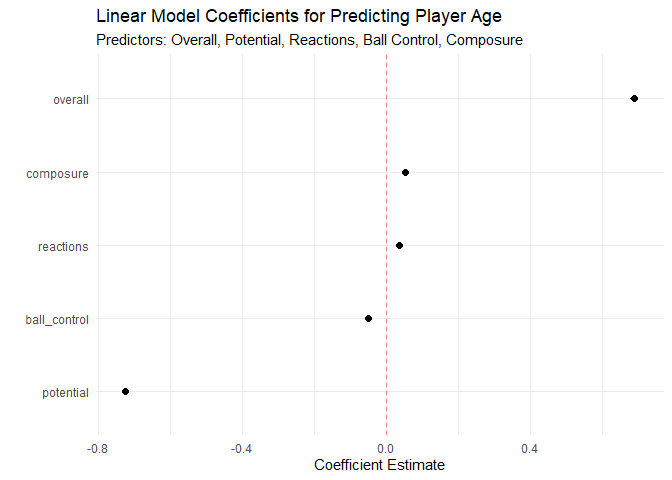

# Data Visualization Project 02

# Data Summaries (Report starts in Visualizations)


``` r
# Cell to read in CSV
library(tidyverse)

fifa <- read_csv("../data/fifa18.csv")
fifa
```

```
## # A tibble: 17,076 × 40
##    name        nationality club    age overall potential acceleration aggression
##    <chr>       <chr>       <chr> <dbl>   <dbl>     <dbl>        <dbl>      <dbl>
##  1 Cristiano … Portugal    Real…    32      94        94           89         63
##  2 L. Messi    Argentina   FC B…    30      93        93           92         48
##  3 Neymar      Brazil      Pari…    25      92        94           94         56
##  4 L. Suárez   Uruguay     FC B…    30      92        92           88         78
##  5 M. Neuer    Germany     FC B…    31      92        92           58         29
##  6 R. Lewando… Poland      FC B…    28      91        91           79         80
##  7 De Gea      Spain       Manc…    26      90        92           57         38
##  8 E. Hazard   Belgium     Chel…    26      90        91           93         54
##  9 T. Kroos    Germany     Real…    27      90        90           60         60
## 10 G. Higuaín  Argentina   Juve…    29      90        90           78         50
## # ℹ 17,066 more rows
## # ℹ 32 more variables: agility <dbl>, balance <dbl>, ball_control <dbl>,
## #   composure <dbl>, crossing <dbl>, curve <dbl>, dribbling <dbl>,
## #   finishing <dbl>, free_kick_accuracy <dbl>, gk_diving <dbl>,
## #   gk_handling <dbl>, gk_kicking <dbl>, gk_positioning <dbl>,
## #   gk_reflexes <dbl>, heading_accuracy <dbl>, interceptions <dbl>,
## #   jumping <dbl>, long_passing <dbl>, long_shots <dbl>, marking <dbl>, …
```


``` r
summary(fifa)
```

```
##      name           nationality            club                age       
##  Length:17076       Length:17076       Length:17076       Min.   :16.00  
##  Class :character   Class :character   Class :character   1st Qu.:21.00  
##  Mode  :character   Mode  :character   Mode  :character   Median :25.00  
##                                                           Mean   :25.11  
##                                                           3rd Qu.:28.00  
##                                                           Max.   :47.00  
##     overall        potential      acceleration     aggression       agility    
##  Min.   :46.00   Min.   :46.00   Min.   :11.00   Min.   :11.00   Min.   :14.0  
##  1st Qu.:62.00   1st Qu.:67.00   1st Qu.:56.00   1st Qu.:43.00   1st Qu.:55.0  
##  Median :66.00   Median :71.00   Median :67.00   Median :59.00   Median :65.0  
##  Mean   :66.18   Mean   :71.16   Mean   :64.48   Mean   :55.75   Mean   :63.3  
##  3rd Qu.:71.00   3rd Qu.:75.00   3rd Qu.:75.00   3rd Qu.:69.00   3rd Qu.:74.0  
##  Max.   :94.00   Max.   :94.00   Max.   :96.00   Max.   :96.00   Max.   :96.0  
##     balance       ball_control     composure        crossing    
##  Min.   :11.00   Min.   : 8.00   Min.   : 5.00   Min.   : 5.00  
##  1st Qu.:55.00   1st Qu.:53.00   1st Qu.:51.00   1st Qu.:38.00  
##  Median :66.00   Median :63.00   Median :60.00   Median :54.00  
##  Mean   :63.76   Mean   :58.06   Mean   :57.85   Mean   :49.73  
##  3rd Qu.:74.00   3rd Qu.:69.00   3rd Qu.:67.00   3rd Qu.:64.00  
##  Max.   :96.00   Max.   :95.00   Max.   :96.00   Max.   :91.00  
##      curve         dribbling    finishing     free_kick_accuracy
##  Min.   : 6.00   Min.   : 2   Min.   : 2.00   Min.   : 4.0      
##  1st Qu.:34.00   1st Qu.:48   1st Qu.:29.00   1st Qu.:31.0      
##  Median :48.00   Median :60   Median :48.00   Median :42.0      
##  Mean   :47.25   Mean   :55   Mean   :45.23   Mean   :43.1      
##  3rd Qu.:62.00   3rd Qu.:68   3rd Qu.:61.00   3rd Qu.:57.0      
##  Max.   :92.00   Max.   :97   Max.   :95.00   Max.   :93.0      
##    gk_diving      gk_handling     gk_kicking    gk_positioning   gk_reflexes   
##  Min.   : 1.00   Min.   : 1.0   Min.   : 1.00   Min.   : 1.00   Min.   : 1.00  
##  1st Qu.: 8.00   1st Qu.: 8.0   1st Qu.: 8.00   1st Qu.: 8.00   1st Qu.: 8.00  
##  Median :11.00   Median :11.0   Median :11.00   Median :11.00   Median :11.00  
##  Mean   :16.73   Mean   :16.5   Mean   :16.37   Mean   :16.49   Mean   :16.86  
##  3rd Qu.:14.00   3rd Qu.:14.0   3rd Qu.:14.00   3rd Qu.:14.00   3rd Qu.:14.00  
##  Max.   :91.00   Max.   :91.0   Max.   :95.00   Max.   :91.00   Max.   :90.00  
##  heading_accuracy interceptions     jumping       long_passing  
##  Min.   : 4.00    Min.   : 4.0   Min.   :15.00   Min.   : 7.00  
##  1st Qu.:44.00    1st Qu.:26.0   1st Qu.:58.00   1st Qu.:42.00  
##  Median :55.00    Median :52.0   Median :66.00   Median :56.00  
##  Mean   :52.27    Mean   :46.5   Mean   :64.87   Mean   :52.39  
##  3rd Qu.:64.00    3rd Qu.:64.0   3rd Qu.:73.00   3rd Qu.:64.00  
##  Max.   :94.00    Max.   :92.0   Max.   :95.00   Max.   :93.00  
##    long_shots       marking        penalties      positioning   
##  Min.   : 3.00   Min.   : 4.00   Min.   : 5.00   Min.   : 2.00  
##  1st Qu.:33.00   1st Qu.:22.00   1st Qu.:39.00   1st Qu.:38.00  
##  Median :51.00   Median :48.00   Median :50.00   Median :54.00  
##  Mean   :47.15   Mean   :44.04   Mean   :48.93   Mean   :49.58  
##  3rd Qu.:62.00   3rd Qu.:63.00   3rd Qu.:61.00   3rd Qu.:64.00  
##  Max.   :92.00   Max.   :92.00   Max.   :92.00   Max.   :95.00  
##    reactions     short_passing     shot_power    sliding_tackle 
##  Min.   :28.00   Min.   :10.00   Min.   : 3.00   Min.   : 4.00  
##  1st Qu.:55.00   1st Qu.:53.00   1st Qu.:46.00   1st Qu.:24.00  
##  Median :62.00   Median :62.00   Median :59.00   Median :51.00  
##  Mean   :61.84   Mean   :58.26   Mean   :55.62   Mean   :45.53  
##  3rd Qu.:68.00   3rd Qu.:68.00   3rd Qu.:68.00   3rd Qu.:64.00  
##  Max.   :96.00   Max.   :92.00   Max.   :94.00   Max.   :91.00  
##   sprint_speed      stamina      standing_tackle    strength    
##  Min.   :11.00   Min.   :12.00   Min.   : 4.00   Min.   :20.00  
##  1st Qu.:57.00   1st Qu.:56.00   1st Qu.:26.00   1st Qu.:58.00  
##  Median :67.00   Median :66.00   Median :54.00   Median :66.00  
##  Mean   :64.74   Mean   :63.15   Mean   :47.38   Mean   :65.27  
##  3rd Qu.:75.00   3rd Qu.:74.00   3rd Qu.:66.00   3rd Qu.:74.00  
##  Max.   :96.00   Max.   :95.00   Max.   :92.00   Max.   :98.00  
##      vision         volleys     
##  Min.   :10.00   Min.   : 4.00  
##  1st Qu.:43.00   1st Qu.:30.00  
##  Median :54.00   Median :44.00  
##  Mean   :52.94   Mean   :43.16  
##  3rd Qu.:64.00   3rd Qu.:57.00  
##  Max.   :94.00   Max.   :91.00
```


``` r
# Summarize number of players per country
player_counts_country <- fifa %>%
  group_by(nationality) %>%
  summarize(players = n())

player_counts_country
```

```
## # A tibble: 162 × 2
##    nationality       players
##    <chr>               <int>
##  1 Afghanistan             3
##  2 Albania                34
##  3 Algeria                57
##  4 Angola                 15
##  5 Antigua & Barbuda       4
##  6 Argentina             938
##  7 Armenia                14
##  8 Australia             220
##  9 Austria               263
## 10 Azerbaijan              6
## # ℹ 152 more rows
```


``` r
# Need to map and group countries according to their CIA World Factbook name
country_mapping <- c(
  "Wales" = "United Kingdom",
  "England" = "United Kingdom",
  "Northern Ireland" = "United Kingdom",
  "Scotland" = "United Kingdom",
  "Republic of Ireland" = "Ireland",
  "Bosnia Herzegovina" = "Bosnia and Herzegovina",
  "Ivory Coast" = "Côte d'Ivoire",
  "Korea Republic" = "South Korea",
  "Korea DPR" = "North Korea",
  "DR Congo" = "Democratic Republic of the Congo",
  "Congo" = "Republic of the Congo",
  "Cape Verde" = "Cabo Verde",
  "FYR Macedonia" = "North Macedonia",
  "Guinea Bissau" = "Guinea-Bissau",
  "Curacao" = "Curaçao",
  "Gambia" = "The Gambia",
  "Trinidad & Tobago" = "Trinidad and Tobago",
  "Central African Rep." = "Central African Republic",
  "St Kitts Nevis" = "Saint Kitts and Nevis",
  "China PR" = "China",
  "Antigua & Barbuda" = "Antigua and Barbuda",
  "São Tomé & Príncipe" = "Sao Tome and Principe",
  "Swaziland" = "Eswatini",
  "St Lucia" = "Saint Lucia",
  "Brunei Darussalam" = "Brunei"
)

player_counts_country <- player_counts_country %>%
  mutate(nationality_fixed = recode(nationality, !!!country_mapping, .default = nationality))

player_counts_country
```

```
## # A tibble: 162 × 3
##    nationality       players nationality_fixed  
##    <chr>               <int> <chr>              
##  1 Afghanistan             3 Afghanistan        
##  2 Albania                34 Albania            
##  3 Algeria                57 Algeria            
##  4 Angola                 15 Angola             
##  5 Antigua & Barbuda       4 Antigua and Barbuda
##  6 Argentina             938 Argentina          
##  7 Armenia                14 Armenia            
##  8 Australia             220 Australia          
##  9 Austria               263 Austria            
## 10 Azerbaijan              6 Azerbaijan         
## # ℹ 152 more rows
```


``` r
# Summarize player counts by nationality_fixed and display top countries
summary_by_fixed_nationality <- player_counts_country %>%
  group_by(nationality_fixed) %>%
  summarize(total_players = sum(players, na.rm = TRUE)) %>%
  arrange(desc(total_players))

print(summary_by_fixed_nationality)
```

```
## # A tibble: 159 × 2
##    nationality_fixed total_players
##    <chr>                     <int>
##  1 United Kingdom             2004
##  2 Germany                    1101
##  3 Spain                       989
##  4 France                      942
##  5 Argentina                   938
##  6 Italy                       796
##  7 Brazil                      785
##  8 Colombia                    578
##  9 Japan                       442
## 10 Netherlands                 415
## # ℹ 149 more rows
```


``` r
# Visualization to see clubs that may have a higher potential than their average rating
# Most clubs have like ~20-30 players so size isn't too crucial

# Get club-level data stats
club_summary <- fifa %>%
  filter(!is.na(club)) %>% # Exclude players with no club affiliation
  group_by(club) %>%
  summarize(
    avg_overall = mean(overall),
    avg_potential = mean(potential),
    avg_age = mean(age),
    num_players = n())

club_summary
```

```
## # A tibble: 647 × 5
##    club                 avg_overall avg_potential avg_age num_players
##    <chr>                      <dbl>         <dbl>   <dbl>       <int>
##  1 1. FC Heidenheim            66.5          71.2    24.6          26
##  2 1. FC Kaiserslautern        64.6          72.5    22.4          28
##  3 1. FC Köln                  72.7          78.2    24.2          30
##  4 1. FC Magdeburg             65.0          68.9    25.4          24
##  5 1. FC Nürnberg              67.8          72.7    25.1          26
##  6 1. FC Union Berlin          68.1          73.4    25.4          27
##  7 1. FSV Mainz 05             71.8          77.9    24.2          30
##  8 AC Ajaccio                  63.8          69.7    25.7          22
##  9 AC Horsens                  58.5          65.3    24.2          24
## 10 AD Alcorcón                 67.5          69.5    28.4          25
## # ℹ 637 more rows
```


``` r
# Get top 10 clubs by average overall rating
top_10_clubs <- club_summary %>%
  arrange(desc(avg_overall)) %>%
  head(10)

fifa_top_10_clubs <- fifa %>%
  filter(club %in% top_10_clubs$club) %>%
  mutate(club = factor(club, levels = top_10_clubs$club))

fifa_top_10_clubs
```

```
## # A tibble: 263 × 40
##    name        nationality club    age overall potential acceleration aggression
##    <chr>       <chr>       <fct> <dbl>   <dbl>     <dbl>        <dbl>      <dbl>
##  1 Cristiano … Portugal    Real…    32      94        94           89         63
##  2 L. Messi    Argentina   FC B…    30      93        93           92         48
##  3 Neymar      Brazil      Pari…    25      92        94           94         56
##  4 L. Suárez   Uruguay     FC B…    30      92        92           88         78
##  5 M. Neuer    Germany     FC B…    31      92        92           58         29
##  6 R. Lewando… Poland      FC B…    28      91        91           79         80
##  7 De Gea      Spain       Manc…    26      90        92           57         38
##  8 E. Hazard   Belgium     Chel…    26      90        91           93         54
##  9 T. Kroos    Germany     Real…    27      90        90           60         60
## 10 G. Higuaín  Argentina   Juve…    29      90        90           78         50
## # ℹ 253 more rows
## # ℹ 32 more variables: agility <dbl>, balance <dbl>, ball_control <dbl>,
## #   composure <dbl>, crossing <dbl>, curve <dbl>, dribbling <dbl>,
## #   finishing <dbl>, free_kick_accuracy <dbl>, gk_diving <dbl>,
## #   gk_handling <dbl>, gk_kicking <dbl>, gk_positioning <dbl>,
## #   gk_reflexes <dbl>, heading_accuracy <dbl>, interceptions <dbl>,
## #   jumping <dbl>, long_passing <dbl>, long_shots <dbl>, marking <dbl>, …
```


``` r
# Get bottom 10 clubs by average overall rating
bottom_10_clubs <- club_summary %>%
  arrange(avg_overall) %>%
  head(10)

fifa_bottom_10_clubs <- fifa %>%
  filter(club %in% bottom_10_clubs$club) %>%
  mutate(club = factor(club, levels = bottom_10_clubs$club))

fifa_bottom_10_clubs
```

```
## # A tibble: 220 × 40
##    name        nationality club    age overall potential acceleration aggression
##    <chr>       <chr>       <fct> <dbl>   <dbl>     <dbl>        <dbl>      <dbl>
##  1 C. Grant    England     Crew…    22      67        77           65         70
##  2 S. Supple   Republic o… Bohe…    30      65        66           44         24
##  3 B. McNamee  Republic o… Derr…    25      64        69           77         60
##  4 P. McCourt  Northern I… Finn…    33      64        64           63         45
##  5 P. Olsen    Denmark     FC H…    23      63        72           65         70
##  6 O. Akharraz Denmark     FC H…    26      63        64           75         70
##  7 S. Henriks… Denmark     FC H…    25      63        69           63         67
##  8 J. Russell  Republic o… Slig…    32      62        62           60         65
##  9 G. McCabe   Republic o… Bray…    28      62        62           69         78
## 10 A. McEneff  Republic o… Derr…    21      62        73           74         57
## # ℹ 210 more rows
## # ℹ 32 more variables: agility <dbl>, balance <dbl>, ball_control <dbl>,
## #   composure <dbl>, crossing <dbl>, curve <dbl>, dribbling <dbl>,
## #   finishing <dbl>, free_kick_accuracy <dbl>, gk_diving <dbl>,
## #   gk_handling <dbl>, gk_kicking <dbl>, gk_positioning <dbl>,
## #   gk_reflexes <dbl>, heading_accuracy <dbl>, interceptions <dbl>,
## #   jumping <dbl>, long_passing <dbl>, long_shots <dbl>, marking <dbl>, …
```


``` r
# The corrplot library seemed better than ggplot for plotting correlograms
library(corrplot)

# Select numeric, relevant attributes
# Wanted to do more but correlogram became hard to read
stats_for_corr <- fifa %>% 
  select(
    overall,
    # Key Mental & Skill Attributes
    reactions, composure, ball_control, dribbling, 
    short_passing, long_passing, vision, 
    # Key Attacking Attributes
    finishing, shot_power,
    # Key Physical Attributes
    sprint_speed, stamina, strength,
    # Key Defensive Attributes
    interceptions, standing_tackle
  )

# Calculate the correlation matrix
cor_matrix <- cor(stats_for_corr)

cor_matrix
```

```
##                   overall reactions composure ball_control   dribbling
## overall         1.0000000 0.8405868 0.6328339   0.45331233  0.35693375
## reactions       0.8405868 1.0000000 0.5961539   0.42975548  0.35122830
## composure       0.6328339 0.5961539 1.0000000   0.76292720  0.67853465
## ball_control    0.4533123 0.4297555 0.7629272   1.00000000  0.93249404
## dribbling       0.3569338 0.3512283 0.6785347   0.93249404  1.00000000
## short_passing   0.4892529 0.4645146 0.7573087   0.90534275  0.83658119
## long_passing    0.4750142 0.4492372 0.6941433   0.78417432  0.71219041
## vision          0.4798794 0.4828623 0.6339855   0.72242841  0.72953045
## finishing       0.3211279 0.3196648 0.5863084   0.78525540  0.82126321
## shot_power      0.4291481 0.4067108 0.6981511   0.82817705  0.79627078
## sprint_speed    0.2226327 0.1965703 0.4432773   0.66391545  0.72497008
## stamina         0.3577581 0.3555562 0.6050021   0.72003783  0.67354432
## strength        0.3565539 0.2902927 0.2686833   0.07390367 -0.05460101
## interceptions   0.3281852 0.3317113 0.4520705   0.39933658  0.27252644
## standing_tackle 0.2532510 0.2418202 0.4209350   0.39516199  0.27369127
##                 short_passing long_passing      vision   finishing shot_power
## overall             0.4892529    0.4750142  0.47987936  0.32112790  0.4291481
## reactions           0.4645146    0.4492372  0.48286230  0.31966484  0.4067108
## composure           0.7573087    0.6941433  0.63398547  0.58630840  0.6981511
## ball_control        0.9053427    0.7841743  0.72242841  0.78525540  0.8281770
## dribbling           0.8365812    0.7121904  0.72953045  0.82126321  0.7962708
## short_passing       1.0000000    0.8958517  0.72033585  0.65906656  0.7691737
## long_passing        0.8958517    1.0000000  0.69256705  0.50512121  0.6702368
## vision              0.7203358    0.6925670  1.00000000  0.68998729  0.6661786
## finishing           0.6590666    0.5051212  0.68998729  1.00000000  0.7982070
## shot_power          0.7691737    0.6702368  0.66617858  0.79820702  1.0000000
## sprint_speed        0.5548619    0.4250748  0.42840757  0.58729612  0.5463466
## stamina             0.7066439    0.6262737  0.46965104  0.49903125  0.6183495
## strength            0.1130154    0.1063152 -0.05156498 -0.02180742  0.1665751
## interceptions       0.5231407    0.5846853  0.17674099 -0.03348333  0.2708881
## standing_tackle     0.5174621    0.5713678  0.13761929 -0.05039683  0.2589002
##                 sprint_speed   stamina    strength interceptions
## overall           0.22263266 0.3577581  0.35655391    0.32818524
## reactions         0.19657025 0.3555562  0.29029265    0.33171134
## composure         0.44327727 0.6050021  0.26868327    0.45207046
## ball_control      0.66391545 0.7200378  0.07390367    0.39933658
## dribbling         0.72497008 0.6735443 -0.05460101    0.27252644
## short_passing     0.55486191 0.7066439  0.11301537    0.52314073
## long_passing      0.42507484 0.6262737  0.10631523    0.58468532
## vision            0.42840757 0.4696510 -0.05156498    0.17674099
## finishing         0.58729612 0.4990312 -0.02180742   -0.03348333
## shot_power        0.54634665 0.6183495  0.16657514    0.27088806
## sprint_speed      1.00000000 0.6201044 -0.08614343    0.16667760
## stamina           0.62010441 1.0000000  0.24927074    0.57170809
## strength         -0.08614343 0.2492707  1.00000000    0.35946709
## interceptions     0.16667760 0.5717081  0.35946709    1.00000000
## standing_tackle   0.17233173 0.5618930  0.33528873    0.93472999
##                 standing_tackle
## overall              0.25325096
## reactions            0.24182020
## composure            0.42093495
## ball_control         0.39516199
## dribbling            0.27369127
## short_passing        0.51746213
## long_passing         0.57136783
## vision               0.13761929
## finishing           -0.05039683
## shot_power           0.25890019
## sprint_speed         0.17233173
## stamina              0.56189296
## strength             0.33528873
## interceptions        0.93472999
## standing_tackle      1.00000000
```


# Data Visualization


> Soccer!!! I-I mean, football!!!

Saying soccer in some parts of the world might get you whisked away by a mob of angry fans, but for the purposes of this report, we will fly in the face of said angry fans and continue to call the game soccer. Soccer, as it relates to this report, is the focus of the fifa18.csv dataset, which contains a list of roughly 17,000 players and their stats from the game of the same name (FIFA 18). Some of these stats correlate to the player's real world counterparts, such as nationality or club, while others are more game specific such as sprint_speed or ball_control.

Soccer, as with almost any sport, is a vessel for two of (almost) everyone's favorite things: nationalism, and winning. As such, in the context of FIFA 18, let's say we want to win. Before we want to win, let's see what nationalities possess the greatest number of players, to determine if we could build out an all-American dream team.

## Spatial Visualization

Below is a choropleth graph of the world, with countries colored by the number of players that belong to that nation:


``` r
library(sf)
# Load world shapefile from Natural Earth
# https://www.naturalearthdata.com/downloads/110m-cultural-vectors/
world_shapes <- read_sf("../data/ne_110m_admin_0_countries/ne_110m_admin_0_countries.shp")
```


``` r
# Join our players with their fixed nationality names on the CIAWF names
world_players <- left_join(world_shapes, summary_by_fixed_nationality, by = c("NAME_CIAWF" = "nationality_fixed"))
```


``` r
# Spatial visualization for player nationality
# There were some issues joining the tables together, countries like Barbados that exist in the FIFA set but not the shapefile are not listed
# Thankfully the issues only impacted smaller countries with a smaller number of players

ggplot() +
  geom_sf(data = world_players, aes(
    fill = total_players
  )) +
  coord_sf(crs = "+proj=natearth2") +
  scale_fill_viridis_c() +
  labs(
    title = "Countries with Highest Count of FIFA Players",
    subtitle = "Gray Countries are Not Represented",
    caption = "Sourced from: fifa18.csv",
    fill = "# of Players"
  ) + theme_void()
```

<!-- -->

A couple things to note about the above graph. Countries that are listed in gray either had no players belonging to them in the FIFA dataset, or were missing from the shapefile that was used. One example that comes to mind is Barbados, as it has 1 player in the FIFA dataset, but does not appear in the shapefile. Additionally, I strove to ensure that all countries were properly represented, but one challenge I had with this graph was effectively mapping the nationalities from the fifa dataset to the countries as they appeared in the shapefile. There were no ISO_A3 codes like in the assignment with the shapefile, so the compromise I struck was joining the dataset based on the country names as they appeared in the CIA world factbook (NAME_CIAWF). I created mappings for the countries in the data summaries to help them line up with their CIA name, and joining them together gave the resulting visualization.

For the graph itself, we can see far and away that Great Britain has the greatest proportion of Fifa players. Other countries of note are Germany, Spain, France, Argentina, and Brazil. Unfortunately for us, while there appears to be a modest amount of American Fifa players, they are dwarfed by the sheer number of players from Europe and South America. So, most likely, while we can still build an American dream team, our selection of players may be more limited than if we embraced globalism and opted for a multinational mix of players.

## Interactive Visualization

Forget nationalism, what we want (as with any sport) is to win, and while there are a lot of players in this dataset, one way we can visualize where the best players are is by breaking down the clubs they belong to. The visualization below is interactive, and displays each club based on the average of its overall rating, vs the average of its overall potential.


``` r
# Interactive plot where we can see clubs with their average overall rating vs potential rating
p_club <- ggplot(club_summary, 
             aes(x = avg_overall, 
                 y = avg_potential, 
                 color = avg_age,
                 size = num_players,
                 text = paste("Club:", club,
                              "<br>Avg Overall:", round(avg_overall, 1),
                              "<br>Avg Potential:", round(avg_potential, 1),
                              "<br>Avg Age:", round(avg_age, 1),
                              "<br>Players:", num_players))) +
  geom_point(alpha = 0.7) +
  scale_color_viridis_c() +
  scale_size_continuous(range = c(0.5, 2)) +
  labs(
    title = "Club Average Overall Rating vs. Average Potential",
    subtitle = "Sized by Number of Players, Colored by Average Age",
    caption = "Sourced from: fifa18.csv",
    x = "Average Overall Rating",
    y = "Average Potential Rating",
    color = "Avg. Age",
    size = "# of Players"
  ) +
  theme_minimal()

# Convert ggplot object to a plotly object and store it
interactive_club_plot <- plotly::ggplotly(p_club, tooltip = "text")

interactive_club_plot
```

```{=html}
<div class="plotly html-widget html-fill-item" id="htmlwidget-b3f2b25b6a52269648d0" style="width:672px;height:480px;"></div>
<script type="application/json" data-for="htmlwidget-b3f2b25b6a52269648d0">{"x":{"data":[{"x":[66.538461538461533,64.642857142857139,72.666666666666671,64.958333333333329,67.807692307692307,68.111111111111114,71.799999999999997,63.81818181818182,58.5,67.480000000000004,66.07692307692308,69.607142857142861,59.920000000000002,61.148148148148145,63.791666666666664,65.299999999999997,73.36666666666666,67.615384615384613,70.58620689655173,69,61.370370370370374,61.549999999999997,62.086956521739133,64.375,57.791666666666664,63,73.241379310344826,68.34615384615384,68.516129032258064,58.862068965517238,61.93333333333333,59.931034482758619,63.857142857142854,68.620689655172413,64.200000000000003,66.299999999999997,61.555555555555557,61.166666666666664,63.5,61.06666666666667,66.86666666666666,64.931034482758619,58.700000000000003,62.925925925925924,68.818181818181813,64.962962962962962,70.551724137931032,69.18518518518519,62.857142857142854,62.74074074074074,75.757575757575751,64.466666666666669,63.535714285714285,64.222222222222229,66.428571428571431,69.299999999999997,68.450000000000003,71,71.178571428571431,75.92307692307692,68.222222222222229,65.083333333333329,68.107142857142861,62.74074074074074,66.900000000000006,62.928571428571431,75.875,65.5,68.400000000000006,68.150000000000006,64.307692307692307,65.173913043478265,64.200000000000003,64.607142857142861,65.178571428571431,67.724137931034477,58.142857142857146,62.413793103448278,75,64.074074074074076,68.5,75.375,68.86666666666666,63.928571428571431,59.392857142857146,68.266666666666666,70.678571428571431,55.391304347826086,71.700000000000003,64.033333333333331,75.705882352941174,73.137931034482762,72.25,64.304347826086953,70.3125,60.857142857142854,56.238095238095241,64.857142857142861,62.799999999999997,69.642857142857139,63.041666666666664,66.692307692307693,60.703703703703702,64.319999999999993,67.25,69.965517241379317,64.959999999999994,63.178571428571431,66.079999999999998,70,65.642857142857139,70.200000000000003,70.111111111111114,66.862068965517238,70.049999999999997,72.833333333333329,66.107142857142861,65.63333333333334,66.962962962962962,72.900000000000006,64.928571428571431,66.400000000000006,67.833333333333329,72.299999999999997,69.15384615384616,67.719999999999999,68.222222222222229,67.833333333333329,70.400000000000006,71.541666666666671,59.695652173913047,66.793103448275858,59.458333333333336,64.033333333333331,70.259259259259252,62.5,62.366666666666667,64.481481481481481,61.892857142857146,63,62.642857142857146,78.15384615384616,58.518518518518519,62.666666666666664,60.821428571428569,65.620689655172413,71.033333333333331,60.655172413793103,63.521739130434781,68.482758620689651,67.033333333333331,68.714285714285708,69.65384615384616,64.851851851851848,66.428571428571431,70.692307692307693,67.931034482758619,67.862068965517238,67.599999999999994,71.650000000000006,70.700000000000003,60.058823529411768,74.5,66.888888888888886,65.86363636363636,67.461538461538467,70.25,57.086956521739133,62.035714285714285,60.321428571428569,62.518518518518519,59.739130434782609,65.928571428571431,54.555555555555557,66.233333333333334,68.739130434782609,72.549999999999997,70.18518518518519,66.400000000000006,67.517241379310349,65.275862068965523,65.58620689655173,66.611111111111114,62.607142857142854,66.111111111111114,71.5,65.178571428571431,71.193548387096769,62.857142857142854,66,68.166666666666671,56.608695652173914,69.65517241379311,67.799999999999997,64.583333333333329,60.607142857142854,54.759999999999998,59.347826086956523,60.535714285714285,65.242424242424249,67.037037037037038,72.333333333333329,63.517241379310342,69.827586206896555,60.785714285714285,67.777777777777771,67.15384615384616,59.5,74.727272727272734,71.599999999999994,65.034482758620683,65.227272727272734,59,64.444444444444443,61.758620689655174,61.208333333333336,66.266666666666666,70.575757575757578,82.560000000000002,66.689655172413794,68.560000000000002,79.42307692307692,59.807692307692307,63.866666666666667,63.814814814814817,67.347826086956516,56.46153846153846,67.566666666666663,69.758620689655174,68.259259259259252,60.541666666666664,67.439999999999998,62.629629629629626,61.444444444444443,68.84210526315789,64.857142857142861,70.064516129032256,60.57692307692308,68.566666666666663,75.966666666666669,67.115384615384613,66.703703703703709,62,74.869565217391298,66.107142857142861,64.740740740740748,62.413793103448278,61.925925925925924,67,59.375,65.666666666666671,67.296296296296291,66.920000000000002,64.666666666666671,68.862068965517238,61.74074074074074,64.34615384615384,61.208333333333336,63,72.81481481481481,69.310344827586206,71.15384615384616,55.200000000000003,71.3125,60.142857142857146,71.5,62.964285714285715,58.333333333333336,66.5,67.125,68.36666666666666,62.960000000000001,60.074074074074076,73.038461538461533,54.039999999999999,62.666666666666664,62.892857142857146,72,67.433333333333337,70.645161290322577,59.823529411764703,64.785714285714292,68,71.482758620689651,71.900000000000006,65.81481481481481,69.333333333333329,62.592592592592595,58.75,69.629629629629633,73.049999999999997,67.233333333333334,60.928571428571431,59.705882352941174,68.333333333333329,60.200000000000003,61.666666666666664,59.350000000000001,69.28125,59.296296296296298,63.909090909090907,70.060606060606062,62.952380952380949,62.464285714285715,69.964285714285708,66.107142857142861,72,62.869565217391305,60.958333333333336,60.366666666666667,64,65,66.878787878787875,68.13333333333334,64.909090909090907,62.944444444444443,62.208333333333336,61.730769230769234,63.892857142857146,70.555555555555557,65.964285714285708,69.428571428571431,76.719999999999999,66.933333333333337,64.875,64.319999999999993,66.392857142857139,66.392857142857139,63.928571428571431,81.65384615384616,61.291666666666664,60.033333333333331,70.321428571428569,64.75,69,66.642857142857139,65.642857142857139,68.285714285714292,66.857142857142861,63.851851851851855,68.583333333333329,63.481481481481481,65.640000000000001,64.833333333333329,67.25,65.900000000000006,69.571428571428569,61.035714285714285,61.458333333333336,59.925925925925924,67,62.130434782608695,68.708333333333329,62.666666666666664,64.07692307692308,65,73.09375,62.962962962962962,66.115384615384613,67.074074074074076,67.461538461538467,68.518518518518519,72,71.1875,61.714285714285715,55.636363636363633,60.130434782608695,76.148148148148152,64.533333333333331,71.448275862068968,65.464285714285708,61,61.888888888888886,64.900000000000006,65.959999999999994,74.121212121212125,78.214285714285708,61.571428571428569,66.700000000000003,63.280000000000001,63.736842105263158,68.86666666666666,75.41379310344827,62.93333333333333,62.06666666666667,64.439999999999998,64.222222222222229,67.642857142857139,71.280000000000001,69.862068965517238,64.277777777777771,57.607142857142854,67.428571428571431,58.535714285714285,71.40625,63.93333333333333,77.65384615384616,67.482758620689651,66.173913043478265,66.384615384615387,65.25,60.166666666666664,70.451612903225808,65.5,59.208333333333336,60.714285714285715,68.370370370370367,67.625,61.642857142857146,63.769230769230766,64.708333333333329,71.862068965517238,63.541666666666664,62.208333333333336,56.766666666666666,63.692307692307693,73.142857142857139,69.19047619047619,74.680000000000007,59.866666666666667,66.392857142857139,65.928571428571431,70.269230769230774,63.678571428571431,72.259259259259252,65.640000000000001,71.615384615384613,66.689655172413794,66.178571428571431,70,63.600000000000001,77.964285714285708,65,60.785714285714285,62.439999999999998,63.285714285714285,63.344827586206897,66.599999999999994,61.333333333333336,65.482758620689651,62.399999999999999,62.06666666666667,64.739130434782609,63.96153846153846,60.392857142857146,66.851851851851848,65.964285714285708,62.518518518518519,65.571428571428569,66.551724137931032,67.666666666666671,66.65517241379311,71.59375,71.96875,72.787878787878782,66.57692307692308,67.566666666666663,75,73.200000000000003,69.75,62.880000000000003,67.678571428571431,70.103448275862064,68.357142857142861,72.214285714285708,81.719999999999999,67.239999999999995,65.142857142857139,73.96875,69.148148148148152,68.038461538461533,66.933333333333337,68.25,71.678571428571431,61.678571428571431,65.280000000000001,77.370370370370367,66.285714285714292,67.125,61.68,61.346153846153847,63.703703703703702,66.192307692307693,63.153846153846153,69.535714285714292,72.956521739130437,62.260869565217391,69.84375,68.625,60.222222222222221,63.565217391304351,62.444444444444443,73.827586206896555,66.964285714285708,66.259259259259252,63.280000000000001,64.909090909090907,66.481481481481481,64.192307692307693,59.185185185185183,75.821428571428569,70.18518518518519,63.607142857142854,66.599999999999994,62.444444444444443,58.68181818181818,65.241379310344826,63.703703703703702,72.86363636363636,66.349999999999994,62.266666666666666,65.766666666666666,72.159999999999997,65.599999999999994,70.142857142857139,67.150000000000006,64.296296296296291,59.148148148148145,60.153846153846153,63.535714285714285,66.178571428571431,68.849999999999994,73.349999999999994,66.13636363636364,63.833333333333336,72.480000000000004,61.640000000000001,67.407407407407405,64.965517241379317,76.961538461538467,74.142857142857139,56.880000000000003,64.370370370370367,69,62.333333333333336,60.428571428571431,60.07692307692308,65.071428571428569,55.476190476190474,72.400000000000006,59.666666666666664,71.71875,62.307692307692307,66.099999999999994,58.964285714285715,69.821428571428569,64.714285714285708,71.481481481481481,70.5,63.571428571428569,76.142857142857139,67.200000000000003,66.200000000000003,65.928571428571431,60.653846153846153,58.560000000000002,61.296296296296298,64.357142857142861,68.875,65.434782608695656,69,57,70.4375,64.090909090909093,68.666666666666671,66.107142857142861,72.34482758620689,59.079999999999998,65.571428571428569,69.849999999999994,61,72.793103448275858,63.392857142857146,61.678571428571431,66.571428571428569,62.666666666666664,61.241379310344826,66.599999999999994,60.399999999999999,69.642857142857139,67.074074074074076,73.615384615384613,67,73.064516129032256,72.037037037037038,63.833333333333336,72,62.037037037037038,67.068965517241381,68.333333333333329,72.411764705882348,63.692307692307693,61.275862068965516,70.21875,65.357142857142861,73.5,74,72.299999999999997,65.107142857142861,65.882352941176464,64.035714285714292,73.840000000000003,62.966666666666669,65.63636363636364,60.928571428571431,60.666666666666664,61.357142857142854,71.115384615384613,66.807692307692307,61.454545454545453,71.764705882352942,63.571428571428569,62.700000000000003,73.628571428571433,62.178571428571431,62.799999999999997,67.142857142857139,67.099999999999994,69.777777777777771,68.18518518518519,62.730769230769234,64.071428571428569,65.884615384615387,61.321428571428569,73.833333333333329,61.541666666666664,60.240000000000002,70.068965517241381,70.58620689655173,63.039999999999999,64.42307692307692,64.592592592592595,65.296296296296291,62.359999999999999,60.520000000000003,69.299999999999997,60.600000000000001,64.913043478260875,59.761904761904759,62.5,64.037037037037038,70.764705882352942,64.678571428571431,60.875,63.399999999999999,71.115384615384613,63.159999999999997],"y":[71.230769230769226,72.5,78.166666666666671,68.875,72.65384615384616,73.370370370370367,77.900000000000006,69.727272727272734,65.333333333333329,69.480000000000004,70.84615384615384,72.928571428571431,64.439999999999998,66.925925925925924,68.75,72.266666666666666,80.433333333333337,72.5,76,75.629629629629633,68.740740740740748,67.75,68.347826086956516,70.041666666666671,65.833333333333329,67.473684210526315,79.65517241379311,69.807692307692307,71.903225806451616,61.689655172413794,64.200000000000003,65.068965517241381,66.5,71.34482758620689,69,69.066666666666663,65.851851851851848,64.766666666666666,67.5,65.666666666666671,71.266666666666666,68.34482758620689,61.966666666666669,67.407407407407405,72.515151515151516,67.81481481481481,74.206896551724142,72.370370370370367,68.928571428571431,66,81.63636363636364,69.433333333333337,70.5,70.18518518518519,72.5,69.299999999999997,68.450000000000003,74.758620689655174,77.714285714285708,79.57692307692308,71.888888888888886,69.75,72.928571428571431,68.037037037037038,66.900000000000006,68.035714285714292,81.96875,69.678571428571431,68.400000000000006,68.150000000000006,68.692307692307693,68.347826086956516,72.079999999999998,68.071428571428569,73.178571428571431,71.310344827586206,64,71.206896551724142,80.592592592592595,70.333333333333329,73.714285714285708,77.708333333333329,73.233333333333334,71.285714285714292,66.75,71.63333333333334,77.678571428571431,62.347826086956523,77.433333333333337,69.36666666666666,81.705882352941174,79.724137931034477,72.25,66.913043478260875,76.65625,67.714285714285708,59.523809523809526,73.035714285714292,68.5,74.714285714285708,67.916666666666671,73.07692307692308,65.962962962962962,71.560000000000002,71.583333333333329,73.620689655172413,70.280000000000001,67.607142857142861,69.640000000000001,75.400000000000006,67.75,70.200000000000003,72.296296296296291,71.172413793103445,70.049999999999997,75.599999999999994,70.892857142857139,71.799999999999997,71,72.900000000000006,69.178571428571431,66.400000000000006,73.36666666666666,72.299999999999997,71.115384615384613,71.640000000000001,72.333333333333329,71.033333333333331,75.25,75.5,66.739130434782609,70.241379310344826,64.125,69.400000000000006,76.703703703703709,68.86363636363636,66.433333333333337,71,68.571428571428569,69.222222222222229,71.464285714285708,83.07692307692308,66,67.5,67.857142857142861,69.275862068965523,75.933333333333337,65.965517241379317,68.913043478260875,73.482758620689651,72.299999999999997,71.25,73.884615384615387,67.333333333333329,68.642857142857139,76.730769230769226,71.793103448275858,70.862068965517238,67.599999999999994,71.650000000000006,70.700000000000003,67.529411764705884,74.5,71.703703703703709,69.818181818181813,70.730769230769226,70.25,63.173913043478258,68.142857142857139,69.392857142857139,67.333333333333329,65.173913043478265,68.964285714285708,68.555555555555557,72.533333333333331,71.782608695652172,72.549999999999997,75.444444444444443,66.400000000000006,71.827586206896555,70.482758620689651,69.758620689655174,71.277777777777771,67.285714285714292,70.703703703703709,71.5,69.357142857142861,76.032258064516128,66.5,70.099999999999994,72.5,65.347826086956516,73.34482758620689,71.359999999999999,69.5,68.785714285714292,62.039999999999999,64.086956521739125,66.214285714285708,70.848484848484844,72.481481481481481,77.575757575757578,72.517241379310349,74.310344827586206,69.678571428571431,74.148148148148152,73.384615384615387,64.799999999999997,80.424242424242422,71.599999999999994,69.103448275862064,71.63636363636364,66.857142857142861,67.925925925925924,66.620689655172413,68.083333333333329,69.799999999999997,74.787878787878782,85.560000000000002,78.310344827586206,76.719999999999999,84.5,66.461538461538467,70.533333333333331,69.18518518518519,74.043478260869563,65.5,73.533333333333331,75.275862068965523,72.037037037037038,66,72.680000000000007,67.518518518518519,69.925925925925924,72.78947368421052,70.38095238095238,75.225806451612897,68.769230769230774,72.266666666666666,80.36666666666666,75.307692307692307,71.703703703703709,66,80.173913043478265,68.357142857142861,72,71.103448275862064,67.296296296296291,71.629629629629633,66.375,69.238095238095241,73.148148148148152,71.519999999999996,70.833333333333329,73.793103448275858,68.222222222222229,70.84615384615384,67.708333333333329,67.875,76.851851851851848,74.793103448275858,78.230769230769226,62.039999999999999,79.71875,68,71.5,66.178571428571431,65.833333333333329,72.75,69.833333333333329,75.200000000000003,68.120000000000005,65.481481481481481,75.92307692307692,61.799999999999997,68.299999999999997,65,75.785714285714292,70.666666666666671,74.161290322580641,66.470588235294116,70.5,74.200000000000003,77.275862068965523,78.299999999999997,71.037037037037038,73.851851851851848,70.703703703703709,63.178571428571431,72.333333333333329,73.049999999999997,74.266666666666666,66.892857142857139,64.705882352941174,71.259259259259252,67.359999999999999,66.148148148148152,67,75.78125,66.18518518518519,68.63636363636364,74.606060606060609,69.857142857142861,68.821428571428569,74.178571428571431,71.071428571428569,78.571428571428569,67.565217391304344,65.333333333333329,62.43333333333333,68.827586206896555,68.41379310344827,73.454545454545453,73.36666666666666,69.36363636363636,69.722222222222229,69.458333333333329,65.769230769230774,67.357142857142861,75.518518518518519,70.892857142857139,72.75,81.239999999999995,73.433333333333337,67.583333333333329,67.719999999999999,69.392857142857139,69.642857142857139,67.892857142857139,84.038461538461533,66.791666666666671,64.599999999999994,76.428571428571431,72.428571428571431,76.724137931034477,70.607142857142861,72.035714285714292,73,70.535714285714292,67.481481481481481,69.583333333333329,69.703703703703709,70.480000000000004,68,71.458333333333329,68.799999999999997,72.321428571428569,68.321428571428569,65.5,64.222222222222229,71,69.217391304347828,77.958333333333329,67.166666666666671,69.615384615384613,70.555555555555557,78.78125,70.629629629629633,71.538461538461533,71.037037037037038,74.15384615384616,71.481481481481481,77.59375,76.84375,68.476190476190482,61,65.608695652173907,81.888888888888886,67.233333333333334,74.620689655172413,70.071428571428569,67.607142857142861,67.18518518518519,69.36666666666666,71.920000000000002,82.36363636363636,82.821428571428569,65.75,69.566666666666663,68.560000000000002,68.526315789473685,73.900000000000006,81.275862068965523,69.833333333333329,71.266666666666666,66.519999999999996,71.888888888888886,71.25,74.799999999999997,76.034482758620683,68.666666666666671,64.214285714285708,72.285714285714292,65.714285714285708,77.375,71,81.961538461538467,69.965517241379317,69.347826086956516,71.115384615384613,69.25,66.791666666666671,76.354838709677423,70.142857142857139,64,67.142857142857139,73.333333333333329,72.958333333333329,65.428571428571431,68.5,72.666666666666671,79.310344827586206,69.291666666666671,68.166666666666671,60.200000000000003,68.692307692307693,76.392857142857139,78.476190476190482,78.040000000000006,63.666666666666664,70.714285714285708,68.25,72.42307692307692,69.107142857142861,74.888888888888886,70.879999999999995,78.692307692307693,73.517241379310349,70.964285714285708,74.535714285714292,65.650000000000006,83.357142857142861,67.933333333333337,67.357142857142861,68.640000000000001,67.666666666666671,70.58620689655173,72.900000000000006,69,69.241379310344826,66.280000000000001,67.533333333333331,70.347826086956516,67.615384615384613,65.571428571428569,72.111111111111114,70.071428571428569,69.703703703703709,71.464285714285708,68.310344827586206,71.63333333333334,69.793103448275858,79.34375,78.53125,76.818181818181813,71.269230769230774,72.766666666666666,79.037037037037038,77.040000000000006,74.678571428571431,68.239999999999995,74.892857142857139,73.551724137931032,73.5,77.535714285714292,86.480000000000004,73.120000000000005,69.321428571428569,79.5,74.111111111111114,74.269230769230774,72.733333333333334,73.083333333333329,76.75,67.25,70.359999999999999,80.703703703703709,72,72.75,67.280000000000001,67.42307692307692,69.962962962962962,70.5,70.269230769230774,75,77.304347826086953,65.826086956521735,74.40625,74.583333333333329,66.481481481481481,69.217391304347828,67.629629629629633,77.620689655172413,71.571428571428569,72.407407407407405,68.280000000000001,68.545454545454547,71.407407407407405,70.5,65.703703703703709,80.75,74.666666666666671,68.714285714285708,72,66.370370370370367,62.954545454545453,70.241379310344826,69.592592592592595,77.590909090909093,73.299999999999997,66.266666666666666,71.233333333333334,76.760000000000005,68.879999999999995,75.714285714285708,67.150000000000006,68.777777777777771,63.296296296296298,65.57692307692308,66.5,66.75,68.849999999999994,73.349999999999994,71.318181818181813,67.791666666666671,76.879999999999995,68.120000000000005,70.666666666666671,76,80.115384615384613,77.38095238095238,65.200000000000003,70.555555555555557,72.392857142857139,64.555555555555557,68.428571428571431,69.384615384615387,70.75,62.714285714285715,72.400000000000006,67,77.8125,67.038461538461533,71.433333333333337,66.678571428571431,72.964285714285708,70.892857142857139,77.555555555555557,70.5,65.928571428571431,79.678571428571431,71.400000000000006,69.879999999999995,70.964285714285708,65.92307692307692,62.880000000000003,70.629629629629633,70.785714285714292,75.0625,71.478260869565219,74.481481481481481,64.599999999999994,77.03125,69.63636363636364,73.86666666666666,69.285714285714292,77.103448275862064,66.239999999999995,68.285714285714292,69.849999999999994,69.05263157894737,79.034482758620683,71.357142857142861,68.714285714285708,72.821428571428569,66.370370370370367,66.310344827586206,68.166666666666671,65.159999999999997,72.892857142857139,71.370370370370367,78.692307692307693,70.666666666666671,81.516129032258064,78.296296296296291,69.766666666666666,75.42307692307692,67.518518518518519,72.862068965517238,71.541666666666671,76.529411764705884,67.692307692307693,66.034482758620683,77.25,69.678571428571431,73.5,74,72.299999999999997,70.071428571428569,67,70.821428571428569,79.680000000000007,68.799999999999997,69.181818181818187,63.964285714285715,63.100000000000001,67.571428571428569,77.615384615384613,73.192307692307693,67.409090909090907,79.264705882352942,69.714285714285708,67.700000000000003,79.142857142857139,68.821428571428569,66,75.238095238095241,67.099999999999994,75.5,72.074074074074076,70.42307692307692,71.928571428571431,71.5,71.178571428571431,77.566666666666663,65.625,70.799999999999997,75.58620689655173,77.724137931034477,66.879999999999995,70.615384615384613,71.333333333333329,70.444444444444443,65.599999999999994,64.959999999999994,75.733333333333334,66,69.347826086956516,67.80952380952381,66.5,67.962962962962962,75.235294117647058,68.785714285714292,64.5625,67.049999999999997,73.92307692307692,66.599999999999994],"text":["Club: 1. FC Heidenheim <br>Avg Overall: 66.5 <br>Avg Potential: 71.2 <br>Avg Age: 24.6 <br>Players: 26","Club: 1. FC Kaiserslautern <br>Avg Overall: 64.6 <br>Avg Potential: 72.5 <br>Avg Age: 22.4 <br>Players: 28","Club: 1. FC Köln <br>Avg Overall: 72.7 <br>Avg Potential: 78.2 <br>Avg Age: 24.2 <br>Players: 30","Club: 1. FC Magdeburg <br>Avg Overall: 65 <br>Avg Potential: 68.9 <br>Avg Age: 25.4 <br>Players: 24","Club: 1. FC Nürnberg <br>Avg Overall: 67.8 <br>Avg Potential: 72.7 <br>Avg Age: 25.1 <br>Players: 26","Club: 1. FC Union Berlin <br>Avg Overall: 68.1 <br>Avg Potential: 73.4 <br>Avg Age: 25.4 <br>Players: 27","Club: 1. FSV Mainz 05 <br>Avg Overall: 71.8 <br>Avg Potential: 77.9 <br>Avg Age: 24.2 <br>Players: 30","Club: AC Ajaccio <br>Avg Overall: 63.8 <br>Avg Potential: 69.7 <br>Avg Age: 25.7 <br>Players: 22","Club: AC Horsens <br>Avg Overall: 58.5 <br>Avg Potential: 65.3 <br>Avg Age: 24.2 <br>Players: 24","Club: AD Alcorcón <br>Avg Overall: 67.5 <br>Avg Potential: 69.5 <br>Avg Age: 28.4 <br>Players: 25","Club: ADO Den Haag <br>Avg Overall: 66.1 <br>Avg Potential: 70.8 <br>Avg Age: 24.4 <br>Players: 26","Club: AEK Athens <br>Avg Overall: 69.6 <br>Avg Potential: 72.9 <br>Avg Age: 24.9 <br>Players: 28","Club: AFC Eskilstuna <br>Avg Overall: 59.9 <br>Avg Potential: 64.4 <br>Avg Age: 24.4 <br>Players: 25","Club: AFC Wimbledon <br>Avg Overall: 61.1 <br>Avg Potential: 66.9 <br>Avg Age: 24.6 <br>Players: 27","Club: AIK Solna <br>Avg Overall: 63.8 <br>Avg Potential: 68.8 <br>Avg Age: 25.2 <br>Players: 24","Club: AJ Auxerre <br>Avg Overall: 65.3 <br>Avg Potential: 72.3 <br>Avg Age: 23.8 <br>Players: 30","Club: AS Monaco <br>Avg Overall: 73.4 <br>Avg Potential: 80.4 <br>Avg Age: 23.6 <br>Players: 30","Club: AS Nancy Lorraine <br>Avg Overall: 67.6 <br>Avg Potential: 72.5 <br>Avg Age: 26.3 <br>Players: 26","Club: AS Saint-Étienne <br>Avg Overall: 70.6 <br>Avg Potential: 76 <br>Avg Age: 23.9 <br>Players: 29","Club: AZ Alkmaar <br>Avg Overall: 69 <br>Avg Potential: 75.6 <br>Avg Age: 23 <br>Players: 27","Club: Aalborg BK <br>Avg Overall: 61.4 <br>Avg Potential: 68.7 <br>Avg Age: 23.3 <br>Players: 27","Club: Aalesunds FK <br>Avg Overall: 61.5 <br>Avg Potential: 67.8 <br>Avg Age: 23.6 <br>Players: 20","Club: Aarhus GF <br>Avg Overall: 62.1 <br>Avg Potential: 68.3 <br>Avg Age: 24.3 <br>Players: 23","Club: Aberdeen <br>Avg Overall: 64.4 <br>Avg Potential: 70 <br>Avg Age: 24.5 <br>Players: 24","Club: Accrington Stanley <br>Avg Overall: 57.8 <br>Avg Potential: 65.8 <br>Avg Age: 22.5 <br>Players: 24","Club: Adelaide United <br>Avg Overall: 63 <br>Avg Potential: 67.5 <br>Avg Age: 25.4 <br>Players: 19","Club: Ajax <br>Avg Overall: 73.2 <br>Avg Potential: 79.7 <br>Avg Age: 22.1 <br>Players: 29","Club: Akhisar Belediyespor <br>Avg Overall: 68.3 <br>Avg Potential: 69.8 <br>Avg Age: 27.8 <br>Players: 26","Club: Al Ahli <br>Avg Overall: 68.5 <br>Avg Potential: 71.9 <br>Avg Age: 26.1 <br>Players: 31","Club: Al Batin <br>Avg Overall: 58.9 <br>Avg Potential: 61.7 <br>Avg Age: 26.6 <br>Players: 29","Club: Al Faisaly <br>Avg Overall: 61.9 <br>Avg Potential: 64.2 <br>Avg Age: 26.7 <br>Players: 30","Club: Al Fateh <br>Avg Overall: 59.9 <br>Avg Potential: 65.1 <br>Avg Age: 24.1 <br>Players: 29","Club: Al Fayha <br>Avg Overall: 63.9 <br>Avg Potential: 66.5 <br>Avg Age: 26.8 <br>Players: 28","Club: Al Hilal <br>Avg Overall: 68.6 <br>Avg Potential: 71.3 <br>Avg Age: 26.8 <br>Players: 29","Club: Al Ittihad <br>Avg Overall: 64.2 <br>Avg Potential: 69 <br>Avg Age: 24.9 <br>Players: 30","Club: Al Nassr <br>Avg Overall: 66.3 <br>Avg Potential: 69.1 <br>Avg Age: 26.5 <br>Players: 30","Club: Al Qadisiyah <br>Avg Overall: 61.6 <br>Avg Potential: 65.9 <br>Avg Age: 24.4 <br>Players: 27","Club: Al Raed <br>Avg Overall: 61.2 <br>Avg Potential: 64.8 <br>Avg Age: 26.1 <br>Players: 30","Club: Al Shabab <br>Avg Overall: 63.5 <br>Avg Potential: 67.5 <br>Avg Age: 25.7 <br>Players: 30","Club: Al Taawoun <br>Avg Overall: 61.1 <br>Avg Potential: 65.7 <br>Avg Age: 25.5 <br>Players: 30","Club: Alanyaspor <br>Avg Overall: 66.9 <br>Avg Potential: 71.3 <br>Avg Age: 25.7 <br>Players: 30","Club: Albacete Balompié <br>Avg Overall: 64.9 <br>Avg Potential: 68.3 <br>Avg Age: 26.6 <br>Players: 29","Club: Albirex Niigata <br>Avg Overall: 58.7 <br>Avg Potential: 62 <br>Avg Age: 26.5 <br>Players: 30","Club: Alianza Petrolera <br>Avg Overall: 62.9 <br>Avg Potential: 67.4 <br>Avg Age: 24.9 <br>Players: 27","Club: Amiens SC Football <br>Avg Overall: 68.8 <br>Avg Potential: 72.5 <br>Avg Age: 26.4 <br>Players: 33","Club: Amkar Perm <br>Avg Overall: 65 <br>Avg Potential: 67.8 <br>Avg Age: 26.5 <br>Players: 27","Club: Angers SCO <br>Avg Overall: 70.6 <br>Avg Potential: 74.2 <br>Avg Age: 24.7 <br>Players: 29","Club: Antalyaspor <br>Avg Overall: 69.2 <br>Avg Potential: 72.4 <br>Avg Age: 26.9 <br>Players: 27","Club: Argentinos Juniors <br>Avg Overall: 62.9 <br>Avg Potential: 68.9 <br>Avg Age: 24.7 <br>Players: 28","Club: Arka Gdynia <br>Avg Overall: 62.7 <br>Avg Potential: 66 <br>Avg Age: 27.4 <br>Players: 27","Club: Arsenal <br>Avg Overall: 75.8 <br>Avg Potential: 81.6 <br>Avg Age: 24.7 <br>Players: 33","Club: Arsenal Tula <br>Avg Overall: 64.5 <br>Avg Potential: 69.4 <br>Avg Age: 25.2 <br>Players: 30","Club: Arsenal de Sarandí <br>Avg Overall: 63.5 <br>Avg Potential: 70.5 <br>Avg Age: 23.9 <br>Players: 28","Club: Ascoli <br>Avg Overall: 64.2 <br>Avg Potential: 70.2 <br>Avg Age: 24 <br>Players: 27","Club: Asociacion Deportivo Cali <br>Avg Overall: 66.4 <br>Avg Potential: 72.5 <br>Avg Age: 25.2 <br>Players: 28","Club: Associação Atlética Ponte Preta <br>Avg Overall: 69.3 <br>Avg Potential: 69.3 <br>Avg Age: 28.6 <br>Players: 20","Club: Associação Chapecoense de Futebol <br>Avg Overall: 68.4 <br>Avg Potential: 68.4 <br>Avg Age: 30.6 <br>Players: 20","Club: Aston Villa <br>Avg Overall: 71 <br>Avg Potential: 74.8 <br>Avg Age: 26.9 <br>Players: 29","Club: Atalanta <br>Avg Overall: 71.2 <br>Avg Potential: 77.7 <br>Avg Age: 24.1 <br>Players: 28","Club: Athletic Club de Bilbao <br>Avg Overall: 75.9 <br>Avg Potential: 79.6 <br>Avg Age: 25.8 <br>Players: 26","Club: Atiker Konyaspor <br>Avg Overall: 68.2 <br>Avg Potential: 71.9 <br>Avg Age: 25.7 <br>Players: 27","Club: Atlanta United FC <br>Avg Overall: 65.1 <br>Avg Potential: 69.8 <br>Avg Age: 26.5 <br>Players: 24","Club: Atletico Nacional Medellin <br>Avg Overall: 68.1 <br>Avg Potential: 72.9 <br>Avg Age: 26.5 <br>Players: 28","Club: Atlético Bucaramanga <br>Avg Overall: 62.7 <br>Avg Potential: 68 <br>Avg Age: 25.7 <br>Players: 27","Club: Atlético Clube Goianiense <br>Avg Overall: 66.9 <br>Avg Potential: 66.9 <br>Avg Age: 28.8 <br>Players: 20","Club: Atlético Huila <br>Avg Overall: 62.9 <br>Avg Potential: 68 <br>Avg Age: 25.8 <br>Players: 28","Club: Atlético Madrid <br>Avg Overall: 75.9 <br>Avg Potential: 82 <br>Avg Age: 24.8 <br>Players: 32","Club: Atlético Tucumán <br>Avg Overall: 65.5 <br>Avg Potential: 69.7 <br>Avg Age: 26.3 <br>Players: 28","Club: Audax Italiano <br>Avg Overall: 68.4 <br>Avg Potential: 68.4 <br>Avg Age: 28.8 <br>Players: 20","Club: Avaí Futebol Clube <br>Avg Overall: 68.2 <br>Avg Potential: 68.2 <br>Avg Age: 28.6 <br>Players: 20","Club: Avellino <br>Avg Overall: 64.3 <br>Avg Potential: 68.7 <br>Avg Age: 25.7 <br>Players: 26","Club: BK Häcken <br>Avg Overall: 65.2 <br>Avg Potential: 68.3 <br>Avg Age: 27.3 <br>Players: 23","Club: BSC Young Boys <br>Avg Overall: 64.2 <br>Avg Potential: 72.1 <br>Avg Age: 23.8 <br>Players: 25","Club: Bahía Blanca <br>Avg Overall: 64.6 <br>Avg Potential: 68.1 <br>Avg Age: 26.5 <br>Players: 28","Club: Banfield <br>Avg Overall: 65.2 <br>Avg Potential: 73.2 <br>Avg Age: 23.4 <br>Players: 28","Club: Bari <br>Avg Overall: 67.7 <br>Avg Potential: 71.3 <br>Avg Age: 26.6 <br>Players: 29","Club: Barnet <br>Avg Overall: 58.1 <br>Avg Potential: 64 <br>Avg Age: 24.1 <br>Players: 28","Club: Barnsley <br>Avg Overall: 62.4 <br>Avg Potential: 71.2 <br>Avg Age: 22.1 <br>Players: 29","Club: Bayer 04 Leverkusen <br>Avg Overall: 75 <br>Avg Potential: 80.6 <br>Avg Age: 23.8 <br>Players: 27","Club: Belgrano de Córdoba <br>Avg Overall: 64.1 <br>Avg Potential: 70.3 <br>Avg Age: 24.3 <br>Players: 27","Club: Benevento Calcio <br>Avg Overall: 68.5 <br>Avg Potential: 73.7 <br>Avg Age: 24.7 <br>Players: 28","Club: Beşiktaş JK <br>Avg Overall: 75.4 <br>Avg Potential: 77.7 <br>Avg Age: 27.8 <br>Players: 24","Club: Birmingham City <br>Avg Overall: 68.9 <br>Avg Potential: 73.2 <br>Avg Age: 25.9 <br>Players: 30","Club: Blackburn Rovers <br>Avg Overall: 63.9 <br>Avg Potential: 71.3 <br>Avg Age: 24.1 <br>Players: 28","Club: Blackpool <br>Avg Overall: 59.4 <br>Avg Potential: 66.8 <br>Avg Age: 23.8 <br>Players: 28","Club: Boavista FC <br>Avg Overall: 68.3 <br>Avg Potential: 71.6 <br>Avg Age: 25.4 <br>Players: 30","Club: Boca Juniors <br>Avg Overall: 70.7 <br>Avg Potential: 77.7 <br>Avg Age: 24 <br>Players: 28","Club: Bohemian FC <br>Avg Overall: 55.4 <br>Avg Potential: 62.3 <br>Avg Age: 22.7 <br>Players: 23","Club: Bologna <br>Avg Overall: 71.7 <br>Avg Potential: 77.4 <br>Avg Age: 24.8 <br>Players: 30","Club: Bolton Wanderers <br>Avg Overall: 64 <br>Avg Potential: 69.4 <br>Avg Age: 25.4 <br>Players: 30","Club: Borussia Dortmund <br>Avg Overall: 75.7 <br>Avg Potential: 81.7 <br>Avg Age: 24.3 <br>Players: 34","Club: Borussia Mönchengladbach <br>Avg Overall: 73.1 <br>Avg Potential: 79.7 <br>Avg Age: 24.3 <br>Players: 29","Club: Botafogo de Futebol e Regatas <br>Avg Overall: 72.2 <br>Avg Potential: 72.2 <br>Avg Age: 29.2 <br>Players: 20","Club: Bourg en Bresse Péronnas 01 <br>Avg Overall: 64.3 <br>Avg Potential: 66.9 <br>Avg Age: 27.6 <br>Players: 23","Club: Bournemouth <br>Avg Overall: 70.3 <br>Avg Potential: 76.7 <br>Avg Age: 24.9 <br>Players: 32","Club: Bradford City <br>Avg Overall: 60.9 <br>Avg Potential: 67.7 <br>Avg Age: 24 <br>Players: 28","Club: Bray Wanderers <br>Avg Overall: 56.2 <br>Avg Potential: 59.5 <br>Avg Age: 26.2 <br>Players: 21","Club: Brentford <br>Avg Overall: 64.9 <br>Avg Potential: 73 <br>Avg Age: 22.2 <br>Players: 28","Club: Brescia <br>Avg Overall: 62.8 <br>Avg Potential: 68.5 <br>Avg Age: 23.5 <br>Players: 30","Club: Brighton & Hove Albion <br>Avg Overall: 69.6 <br>Avg Potential: 74.7 <br>Avg Age: 25.4 <br>Players: 28","Club: Brisbane Roar <br>Avg Overall: 63 <br>Avg Potential: 67.9 <br>Avg Age: 26.3 <br>Players: 24","Club: Bristol City <br>Avg Overall: 66.7 <br>Avg Potential: 73.1 <br>Avg Age: 24 <br>Players: 26","Club: Bristol Rovers <br>Avg Overall: 60.7 <br>Avg Potential: 66 <br>Avg Age: 23.4 <br>Players: 27","Club: Brøndby IF <br>Avg Overall: 64.3 <br>Avg Potential: 71.6 <br>Avg Age: 23 <br>Players: 25","Club: Burnley <br>Avg Overall: 67.2 <br>Avg Potential: 71.6 <br>Avg Age: 25.3 <br>Players: 24","Club: Bursaspor <br>Avg Overall: 70 <br>Avg Potential: 73.6 <br>Avg Age: 25.8 <br>Players: 29","Club: Burton Albion <br>Avg Overall: 65 <br>Avg Potential: 70.3 <br>Avg Age: 25.5 <br>Players: 25","Club: Bury <br>Avg Overall: 63.2 <br>Avg Potential: 67.6 <br>Avg Age: 26.1 <br>Players: 28","Club: C.D. Leonesa S.A.D. <br>Avg Overall: 66.1 <br>Avg Potential: 69.6 <br>Avg Age: 26 <br>Players: 25","Club: CA Osasuna <br>Avg Overall: 70 <br>Avg Potential: 75.4 <br>Avg Age: 25.3 <br>Players: 30","Club: CD America de Cali <br>Avg Overall: 65.6 <br>Avg Potential: 67.8 <br>Avg Age: 27.8 <br>Players: 28","Club: CD Antofagasta <br>Avg Overall: 70.2 <br>Avg Potential: 70.2 <br>Avg Age: 29.4 <br>Players: 20","Club: CD Aves <br>Avg Overall: 70.1 <br>Avg Potential: 72.3 <br>Avg Age: 28.2 <br>Players: 27","Club: CD Feirense <br>Avg Overall: 66.9 <br>Avg Potential: 71.2 <br>Avg Age: 25.1 <br>Players: 29","Club: CD Huachipato <br>Avg Overall: 70 <br>Avg Potential: 70 <br>Avg Age: 29.8 <br>Players: 20","Club: CD Leganés <br>Avg Overall: 72.8 <br>Avg Potential: 75.6 <br>Avg Age: 26.6 <br>Players: 30","Club: CD Los Millionarios Bogota <br>Avg Overall: 66.1 <br>Avg Potential: 70.9 <br>Avg Age: 25.6 <br>Players: 28","Club: CD Lugo <br>Avg Overall: 65.6 <br>Avg Potential: 71.8 <br>Avg Age: 24.3 <br>Players: 30","Club: CD Numancia <br>Avg Overall: 67 <br>Avg Potential: 71 <br>Avg Age: 25.4 <br>Players: 27","Club: CD O'Higgins <br>Avg Overall: 72.9 <br>Avg Potential: 72.9 <br>Avg Age: 27 <br>Players: 20","Club: CD Once Caldas Manizales <br>Avg Overall: 64.9 <br>Avg Potential: 69.2 <br>Avg Age: 26 <br>Players: 28","Club: CD Palestino <br>Avg Overall: 66.4 <br>Avg Potential: 66.4 <br>Avg Age: 28 <br>Players: 20","Club: CD Tenerife <br>Avg Overall: 67.8 <br>Avg Potential: 73.4 <br>Avg Age: 25.8 <br>Players: 30","Club: CD Universidad de Concepción <br>Avg Overall: 72.3 <br>Avg Potential: 72.3 <br>Avg Age: 29.8 <br>Players: 20","Club: CF Os Belenenses <br>Avg Overall: 69.2 <br>Avg Potential: 71.1 <br>Avg Age: 26.6 <br>Players: 26","Club: CF Reus Deportiu <br>Avg Overall: 67.7 <br>Avg Potential: 71.6 <br>Avg Age: 26.4 <br>Players: 25","Club: CPD Junior Barranquilla <br>Avg Overall: 68.2 <br>Avg Potential: 72.3 <br>Avg Age: 26.1 <br>Players: 27","Club: CS Marítimo <br>Avg Overall: 67.8 <br>Avg Potential: 71 <br>Avg Age: 25.5 <br>Players: 30","Club: CSKA Moscow <br>Avg Overall: 70.4 <br>Avg Potential: 75.2 <br>Avg Age: 25.8 <br>Players: 20","Club: Cagliari <br>Avg Overall: 71.5 <br>Avg Potential: 75.5 <br>Avg Age: 27 <br>Players: 24","Club: Cambridge United <br>Avg Overall: 59.7 <br>Avg Potential: 66.7 <br>Avg Age: 24.2 <br>Players: 23","Club: Cardiff City <br>Avg Overall: 66.8 <br>Avg Potential: 70.2 <br>Avg Age: 26.7 <br>Players: 29","Club: Carlisle United <br>Avg Overall: 59.5 <br>Avg Potential: 64.1 <br>Avg Age: 24.9 <br>Players: 24","Club: Carpi <br>Avg Overall: 64 <br>Avg Potential: 69.4 <br>Avg Age: 23.4 <br>Players: 30","Club: Celtic <br>Avg Overall: 70.3 <br>Avg Potential: 76.7 <br>Avg Age: 23.9 <br>Players: 27","Club: Central Coast Mariners <br>Avg Overall: 62.5 <br>Avg Potential: 68.9 <br>Avg Age: 24.2 <br>Players: 22","Club: Cerezo Osaka <br>Avg Overall: 62.4 <br>Avg Potential: 66.4 <br>Avg Age: 26 <br>Players: 30","Club: Cesena <br>Avg Overall: 64.5 <br>Avg Potential: 71 <br>Avg Age: 24.3 <br>Players: 27","Club: Chacarita Juniors <br>Avg Overall: 61.9 <br>Avg Potential: 68.6 <br>Avg Age: 23.8 <br>Players: 28","Club: Chamois Niortais FC <br>Avg Overall: 63 <br>Avg Potential: 69.2 <br>Avg Age: 24.3 <br>Players: 27","Club: Charlton Athletic <br>Avg Overall: 62.6 <br>Avg Potential: 71.5 <br>Avg Age: 23.3 <br>Players: 28","Club: Chelsea <br>Avg Overall: 78.2 <br>Avg Potential: 83.1 <br>Avg Age: 25.2 <br>Players: 26","Club: Cheltenham Town <br>Avg Overall: 58.5 <br>Avg Potential: 66 <br>Avg Age: 23.1 <br>Players: 27","Club: Chemnitzer FC <br>Avg Overall: 62.7 <br>Avg Potential: 67.5 <br>Avg Age: 23.8 <br>Players: 24","Club: Chesterfield <br>Avg Overall: 60.8 <br>Avg Potential: 67.9 <br>Avg Age: 23.2 <br>Players: 28","Club: Chicago Fire Soccer Club <br>Avg Overall: 65.6 <br>Avg Potential: 69.3 <br>Avg Age: 25.8 <br>Players: 29","Club: Chievo Verona <br>Avg Overall: 71 <br>Avg Potential: 75.9 <br>Avg Age: 26.8 <br>Players: 30","Club: Cittadella <br>Avg Overall: 60.7 <br>Avg Potential: 66 <br>Avg Age: 24.5 <br>Players: 29","Club: Clermont Foot 63 <br>Avg Overall: 63.5 <br>Avg Potential: 68.9 <br>Avg Age: 24.6 <br>Players: 23","Club: Club América <br>Avg Overall: 68.5 <br>Avg Potential: 73.5 <br>Avg Age: 24.4 <br>Players: 29","Club: Club Atlas <br>Avg Overall: 67 <br>Avg Potential: 72.3 <br>Avg Age: 24.6 <br>Players: 30","Club: Club Atlético Huracán <br>Avg Overall: 68.7 <br>Avg Potential: 71.2 <br>Avg Age: 28.9 <br>Players: 28","Club: Club Atlético Lanús <br>Avg Overall: 69.7 <br>Avg Potential: 73.9 <br>Avg Age: 26.1 <br>Players: 26","Club: Club Atlético Patronato <br>Avg Overall: 64.9 <br>Avg Potential: 67.3 <br>Avg Age: 27.9 <br>Players: 27","Club: Club Atlético Tigre <br>Avg Overall: 66.4 <br>Avg Potential: 68.6 <br>Avg Age: 28.2 <br>Players: 28","Club: Club Brugge KV <br>Avg Overall: 70.7 <br>Avg Potential: 76.7 <br>Avg Age: 24.2 <br>Players: 26","Club: Club León <br>Avg Overall: 67.9 <br>Avg Potential: 71.8 <br>Avg Age: 26 <br>Players: 29","Club: Club Tijuana <br>Avg Overall: 67.9 <br>Avg Potential: 70.9 <br>Avg Age: 25.9 <br>Players: 29","Club: Club de Deportes Temuco <br>Avg Overall: 67.6 <br>Avg Potential: 67.6 <br>Avg Age: 28.8 <br>Players: 20","Club: Clube Atlético Mineiro <br>Avg Overall: 71.7 <br>Avg Potential: 71.7 <br>Avg Age: 27.6 <br>Players: 20","Club: Clube Atlético Paranaense <br>Avg Overall: 70.7 <br>Avg Potential: 70.7 <br>Avg Age: 30 <br>Players: 20","Club: Colchester United <br>Avg Overall: 60.1 <br>Avg Potential: 67.5 <br>Avg Age: 23.4 <br>Players: 17","Club: Colo-Colo <br>Avg Overall: 74.5 <br>Avg Potential: 74.5 <br>Avg Age: 28.2 <br>Players: 20","Club: Colon de Santa Fe <br>Avg Overall: 66.9 <br>Avg Potential: 71.7 <br>Avg Age: 25.7 <br>Players: 27","Club: Colorado Rapids <br>Avg Overall: 65.9 <br>Avg Potential: 69.8 <br>Avg Age: 25.7 <br>Players: 22","Club: Columbus Crew SC <br>Avg Overall: 67.5 <br>Avg Potential: 70.7 <br>Avg Age: 25.2 <br>Players: 26","Club: Coritiba Foot Ball Club <br>Avg Overall: 70.2 <br>Avg Potential: 70.2 <br>Avg Age: 29.2 <br>Players: 20","Club: Cork City <br>Avg Overall: 57.1 <br>Avg Potential: 63.2 <br>Avg Age: 24.6 <br>Players: 23","Club: Corporación Club Deportivo Tuluá <br>Avg Overall: 62 <br>Avg Potential: 68.1 <br>Avg Age: 24.9 <br>Players: 28","Club: Coventry City <br>Avg Overall: 60.3 <br>Avg Potential: 69.4 <br>Avg Age: 23.2 <br>Players: 28","Club: Cracovia <br>Avg Overall: 62.5 <br>Avg Potential: 67.3 <br>Avg Age: 24.6 <br>Players: 27","Club: Crawley Town <br>Avg Overall: 59.7 <br>Avg Potential: 65.2 <br>Avg Age: 25.1 <br>Players: 23","Club: Cremonese <br>Avg Overall: 65.9 <br>Avg Potential: 69 <br>Avg Age: 27.3 <br>Players: 28","Club: Crewe Alexandra <br>Avg Overall: 54.6 <br>Avg Potential: 68.6 <br>Avg Age: 19.8 <br>Players: 9","Club: Crotone <br>Avg Overall: 66.2 <br>Avg Potential: 72.5 <br>Avg Age: 23.7 <br>Players: 30","Club: Cruz Azul <br>Avg Overall: 68.7 <br>Avg Potential: 71.8 <br>Avg Age: 26.4 <br>Players: 23","Club: Cruzeiro <br>Avg Overall: 72.6 <br>Avg Potential: 72.6 <br>Avg Age: 28.4 <br>Players: 20","Club: Crystal Palace <br>Avg Overall: 70.2 <br>Avg Potential: 75.4 <br>Avg Age: 25.4 <br>Players: 27","Club: Curicó Unido <br>Avg Overall: 66.4 <br>Avg Potential: 66.4 <br>Avg Age: 29.4 <br>Players: 20","Club: Cádiz C.F. <br>Avg Overall: 67.5 <br>Avg Potential: 71.8 <br>Avg Age: 25.9 <br>Players: 29","Club: Córdoba CF <br>Avg Overall: 65.3 <br>Avg Potential: 70.5 <br>Avg Age: 24.6 <br>Players: 29","Club: D.C. United <br>Avg Overall: 65.6 <br>Avg Potential: 69.8 <br>Avg Age: 25.8 <br>Players: 29","Club: DSC Arminia Bielefeld <br>Avg Overall: 66.6 <br>Avg Potential: 71.3 <br>Avg Age: 24.9 <br>Players: 18","Club: Daegu FC <br>Avg Overall: 62.6 <br>Avg Potential: 67.3 <br>Avg Age: 24.7 <br>Players: 28","Club: Defensa y Justicia <br>Avg Overall: 66.1 <br>Avg Potential: 70.7 <br>Avg Age: 25 <br>Players: 27","Club: Deportes Iquique <br>Avg Overall: 71.5 <br>Avg Potential: 71.5 <br>Avg Age: 29.4 <br>Players: 20","Club: Deportes Tolima <br>Avg Overall: 65.2 <br>Avg Potential: 69.4 <br>Avg Age: 25.5 <br>Players: 28","Club: Deportivo Alavés <br>Avg Overall: 71.2 <br>Avg Potential: 76 <br>Avg Age: 24 <br>Players: 31","Club: Deportivo Pasto <br>Avg Overall: 62.9 <br>Avg Potential: 66.5 <br>Avg Age: 27 <br>Players: 28","Club: Deportivo Toluca <br>Avg Overall: 66 <br>Avg Potential: 70.1 <br>Avg Age: 26 <br>Players: 30","Club: Derby County <br>Avg Overall: 68.2 <br>Avg Potential: 72.5 <br>Avg Age: 26.5 <br>Players: 30","Club: Derry City <br>Avg Overall: 56.6 <br>Avg Potential: 65.3 <br>Avg Age: 22.9 <br>Players: 23","Club: Dijon FCO <br>Avg Overall: 69.7 <br>Avg Potential: 73.3 <br>Avg Age: 26 <br>Players: 29","Club: Dinamo Moscow <br>Avg Overall: 67.8 <br>Avg Potential: 71.4 <br>Avg Age: 26 <br>Players: 25","Club: Djurgårdens IF <br>Avg Overall: 64.6 <br>Avg Potential: 69.5 <br>Avg Age: 25.2 <br>Players: 24","Club: Doncaster Rovers <br>Avg Overall: 60.6 <br>Avg Potential: 68.8 <br>Avg Age: 23.4 <br>Players: 28","Club: Drogheda United <br>Avg Overall: 54.8 <br>Avg Potential: 62 <br>Avg Age: 23.3 <br>Players: 25","Club: Dundalk <br>Avg Overall: 59.3 <br>Avg Potential: 64.1 <br>Avg Age: 25.1 <br>Players: 23","Club: Dundee FC <br>Avg Overall: 60.5 <br>Avg Potential: 66.2 <br>Avg Age: 24.6 <br>Players: 28","Club: ES Troyes AC <br>Avg Overall: 65.2 <br>Avg Potential: 70.8 <br>Avg Age: 24.8 <br>Players: 33","Club: Eintracht Braunschweig <br>Avg Overall: 67 <br>Avg Potential: 72.5 <br>Avg Age: 24.3 <br>Players: 27","Club: Eintracht Frankfurt <br>Avg Overall: 72.3 <br>Avg Potential: 77.6 <br>Avg Age: 24.8 <br>Players: 33","Club: Empoli <br>Avg Overall: 63.5 <br>Avg Potential: 72.5 <br>Avg Age: 22.6 <br>Players: 29","Club: En Avant de Guingamp <br>Avg Overall: 69.8 <br>Avg Potential: 74.3 <br>Avg Age: 25.2 <br>Players: 29","Club: Envigado FC <br>Avg Overall: 60.8 <br>Avg Potential: 69.7 <br>Avg Age: 22.2 <br>Players: 28","Club: Estoril Praia <br>Avg Overall: 67.8 <br>Avg Potential: 74.1 <br>Avg Age: 23.6 <br>Players: 27","Club: Estudiantes de La Plata <br>Avg Overall: 67.2 <br>Avg Potential: 73.4 <br>Avg Age: 25.9 <br>Players: 26","Club: Ettifaq FC <br>Avg Overall: 59.5 <br>Avg Potential: 64.8 <br>Avg Age: 24.4 <br>Players: 30","Club: Everton <br>Avg Overall: 74.7 <br>Avg Potential: 80.4 <br>Avg Age: 25.2 <br>Players: 33","Club: Everton de Viña del Mar <br>Avg Overall: 71.6 <br>Avg Potential: 71.6 <br>Avg Age: 29 <br>Players: 20","Club: Evkur Yeni Malatyaspor <br>Avg Overall: 65 <br>Avg Potential: 69.1 <br>Avg Age: 25.5 <br>Players: 29","Club: Excelsior <br>Avg Overall: 65.2 <br>Avg Potential: 71.6 <br>Avg Age: 23.3 <br>Players: 22","Club: Exeter City <br>Avg Overall: 59 <br>Avg Potential: 66.9 <br>Avg Age: 24 <br>Players: 28","Club: F.B.C. Unione Venezia <br>Avg Overall: 64.4 <br>Avg Potential: 67.9 <br>Avg Age: 26.5 <br>Players: 27","Club: F.C. Tokyo <br>Avg Overall: 61.8 <br>Avg Potential: 66.6 <br>Avg Age: 25.9 <br>Players: 29","Club: FC Admira Wacker Mödling <br>Avg Overall: 61.2 <br>Avg Potential: 68.1 <br>Avg Age: 22.9 <br>Players: 24","Club: FC Anzhi Makhachkala <br>Avg Overall: 66.3 <br>Avg Potential: 69.8 <br>Avg Age: 25.8 <br>Players: 30","Club: FC Augsburg <br>Avg Overall: 70.6 <br>Avg Potential: 74.8 <br>Avg Age: 25.3 <br>Players: 33","Club: FC Barcelona <br>Avg Overall: 82.6 <br>Avg Potential: 85.6 <br>Avg Age: 26.5 <br>Players: 25","Club: FC Barcelona B <br>Avg Overall: 66.7 <br>Avg Potential: 78.3 <br>Avg Age: 20.4 <br>Players: 29","Club: FC Basel <br>Avg Overall: 68.6 <br>Avg Potential: 76.7 <br>Avg Age: 23.8 <br>Players: 25","Club: FC Bayern Munich <br>Avg Overall: 79.4 <br>Avg Potential: 84.5 <br>Avg Age: 25.1 <br>Players: 26","Club: FC Carl Zeiss Jena <br>Avg Overall: 59.8 <br>Avg Potential: 66.5 <br>Avg Age: 23.2 <br>Players: 26","Club: FC Dallas <br>Avg Overall: 63.9 <br>Avg Potential: 70.5 <br>Avg Age: 23.5 <br>Players: 15","Club: FC Erzgebirge Aue <br>Avg Overall: 63.8 <br>Avg Potential: 69.2 <br>Avg Age: 24.8 <br>Players: 27","Club: FC Groningen <br>Avg Overall: 67.3 <br>Avg Potential: 74 <br>Avg Age: 23 <br>Players: 23","Club: FC Helsingør <br>Avg Overall: 56.5 <br>Avg Potential: 65.5 <br>Avg Age: 22.8 <br>Players: 26","Club: FC Ingolstadt 04 <br>Avg Overall: 67.6 <br>Avg Potential: 73.5 <br>Avg Age: 24.3 <br>Players: 30","Club: FC Krasnodar <br>Avg Overall: 69.8 <br>Avg Potential: 75.3 <br>Avg Age: 24.6 <br>Players: 29","Club: FC København <br>Avg Overall: 68.3 <br>Avg Potential: 72 <br>Avg Age: 26.5 <br>Players: 27","Club: FC Lausanne-Sports <br>Avg Overall: 60.5 <br>Avg Potential: 66 <br>Avg Age: 25.1 <br>Players: 24","Club: FC Lorient <br>Avg Overall: 67.4 <br>Avg Potential: 72.7 <br>Avg Age: 25.3 <br>Players: 25","Club: FC Lugano <br>Avg Overall: 62.6 <br>Avg Potential: 67.5 <br>Avg Age: 25.1 <br>Players: 27","Club: FC Luzern <br>Avg Overall: 61.4 <br>Avg Potential: 69.9 <br>Avg Age: 23.3 <br>Players: 27","Club: FC Metz <br>Avg Overall: 68.8 <br>Avg Potential: 72.8 <br>Avg Age: 25.6 <br>Players: 19","Club: FC Midtjylland <br>Avg Overall: 64.9 <br>Avg Potential: 70.4 <br>Avg Age: 24.5 <br>Players: 21","Club: FC Nantes <br>Avg Overall: 70.1 <br>Avg Potential: 75.2 <br>Avg Age: 23.4 <br>Players: 31","Club: FC Nordsjælland <br>Avg Overall: 60.6 <br>Avg Potential: 68.8 <br>Avg Age: 22 <br>Players: 26","Club: FC Paços de Ferreira <br>Avg Overall: 68.6 <br>Avg Potential: 72.3 <br>Avg Age: 25.3 <br>Players: 30","Club: FC Porto <br>Avg Overall: 76 <br>Avg Potential: 80.4 <br>Avg Age: 24.8 <br>Players: 30","Club: FC Red Bull Salzburg <br>Avg Overall: 67.1 <br>Avg Potential: 75.3 <br>Avg Age: 23.1 <br>Players: 26","Club: FC Rostov <br>Avg Overall: 66.7 <br>Avg Potential: 71.7 <br>Avg Age: 25.4 <br>Players: 27","Club: FC SKA-Energiya Khabarovsk <br>Avg Overall: 62 <br>Avg Potential: 66 <br>Avg Age: 25.9 <br>Players: 27","Club: FC Schalke 04 <br>Avg Overall: 74.9 <br>Avg Potential: 80.2 <br>Avg Age: 24.5 <br>Players: 23","Club: FC Seoul <br>Avg Overall: 66.1 <br>Avg Potential: 68.4 <br>Avg Age: 27.9 <br>Players: 28","Club: FC Sion <br>Avg Overall: 64.7 <br>Avg Potential: 72 <br>Avg Age: 24.3 <br>Players: 27","Club: FC Sochaux-Montbéliard <br>Avg Overall: 62.4 <br>Avg Potential: 71.1 <br>Avg Age: 22.8 <br>Players: 29","Club: FC St. Gallen <br>Avg Overall: 61.9 <br>Avg Potential: 67.3 <br>Avg Age: 24.1 <br>Players: 27","Club: FC St. Pauli <br>Avg Overall: 67 <br>Avg Potential: 71.6 <br>Avg Age: 25.1 <br>Players: 27","Club: FC Thun <br>Avg Overall: 59.4 <br>Avg Potential: 66.4 <br>Avg Age: 24 <br>Players: 24","Club: FC Tosno <br>Avg Overall: 65.7 <br>Avg Potential: 69.2 <br>Avg Age: 25.8 <br>Players: 21","Club: FC Twente <br>Avg Overall: 67.3 <br>Avg Potential: 73.1 <br>Avg Age: 23.1 <br>Players: 27","Club: FC Ufa <br>Avg Overall: 66.9 <br>Avg Potential: 71.5 <br>Avg Age: 25.9 <br>Players: 25","Club: FC Ural <br>Avg Overall: 64.7 <br>Avg Potential: 70.8 <br>Avg Age: 25 <br>Players: 30","Club: FC Utrecht <br>Avg Overall: 68.9 <br>Avg Potential: 73.8 <br>Avg Age: 23.7 <br>Players: 29","Club: FC Zürich <br>Avg Overall: 61.7 <br>Avg Potential: 68.2 <br>Avg Age: 24.3 <br>Players: 27","Club: FK Austria Wien <br>Avg Overall: 64.3 <br>Avg Potential: 70.8 <br>Avg Age: 23.5 <br>Players: 26","Club: FK Haugesund <br>Avg Overall: 61.2 <br>Avg Potential: 67.7 <br>Avg Age: 22.5 <br>Players: 24","Club: FSV Zwickau <br>Avg Overall: 63 <br>Avg Potential: 67.9 <br>Avg Age: 25 <br>Players: 24","Club: Fenerbahçe SK <br>Avg Overall: 72.8 <br>Avg Potential: 76.9 <br>Avg Age: 26.9 <br>Players: 27","Club: Ferrara (SPAL) <br>Avg Overall: 69.3 <br>Avg Potential: 74.8 <br>Avg Age: 25.2 <br>Players: 29","Club: Feyenoord <br>Avg Overall: 71.2 <br>Avg Potential: 78.2 <br>Avg Age: 23.3 <br>Players: 26","Club: Finn Harps <br>Avg Overall: 55.2 <br>Avg Potential: 62 <br>Avg Age: 23.6 <br>Players: 25","Club: Fiorentina <br>Avg Overall: 71.3 <br>Avg Potential: 79.7 <br>Avg Age: 22.9 <br>Players: 32","Club: Fleetwood Town <br>Avg Overall: 60.1 <br>Avg Potential: 68 <br>Avg Age: 23.1 <br>Players: 28","Club: Fluminense Football Club <br>Avg Overall: 71.5 <br>Avg Potential: 71.5 <br>Avg Age: 28.6 <br>Players: 20","Club: Foggia <br>Avg Overall: 63 <br>Avg Potential: 66.2 <br>Avg Age: 26.5 <br>Players: 28","Club: Forest Green <br>Avg Overall: 58.3 <br>Avg Potential: 65.8 <br>Avg Age: 23 <br>Players: 24","Club: Fortuna Düsseldorf <br>Avg Overall: 66.5 <br>Avg Potential: 72.8 <br>Avg Age: 24.5 <br>Players: 28","Club: Frosinone <br>Avg Overall: 67.1 <br>Avg Potential: 69.8 <br>Avg Age: 26.9 <br>Players: 24","Club: Fulham <br>Avg Overall: 68.4 <br>Avg Potential: 75.2 <br>Avg Age: 23.7 <br>Players: 30","Club: GFC Ajaccio <br>Avg Overall: 63 <br>Avg Potential: 68.1 <br>Avg Age: 25.4 <br>Players: 25","Club: GIF Sundsvall <br>Avg Overall: 60.1 <br>Avg Potential: 65.5 <br>Avg Age: 23.7 <br>Players: 27","Club: Galatasaray SK <br>Avg Overall: 73 <br>Avg Potential: 75.9 <br>Avg Age: 27.1 <br>Players: 26","Club: Galway United <br>Avg Overall: 54 <br>Avg Potential: 61.8 <br>Avg Age: 22 <br>Players: 25","Club: Gamba Osaka <br>Avg Overall: 62.7 <br>Avg Potential: 68.3 <br>Avg Age: 25.2 <br>Players: 30","Club: Gangwon FC <br>Avg Overall: 62.9 <br>Avg Potential: 65 <br>Avg Age: 27.4 <br>Players: 28","Club: Genoa <br>Avg Overall: 72 <br>Avg Potential: 75.8 <br>Avg Age: 26.6 <br>Players: 28","Club: Gençlerbirliği SK <br>Avg Overall: 67.4 <br>Avg Potential: 70.7 <br>Avg Age: 25.6 <br>Players: 30","Club: Getafe CF <br>Avg Overall: 70.6 <br>Avg Potential: 74.2 <br>Avg Age: 26.2 <br>Players: 31","Club: Gillingham <br>Avg Overall: 59.8 <br>Avg Potential: 66.5 <br>Avg Age: 22.8 <br>Players: 17","Club: Gimnasia y Esgrima La Plata <br>Avg Overall: 64.8 <br>Avg Potential: 70.5 <br>Avg Age: 24.1 <br>Players: 28","Club: Gimnàstic de Tarragona <br>Avg Overall: 68 <br>Avg Potential: 74.2 <br>Avg Age: 24.2 <br>Players: 30","Club: Girona CF <br>Avg Overall: 71.5 <br>Avg Potential: 77.3 <br>Avg Age: 24.5 <br>Players: 29","Club: Girondins de Bordeaux <br>Avg Overall: 71.9 <br>Avg Potential: 78.3 <br>Avg Age: 24 <br>Players: 20","Club: Godoy Cruz <br>Avg Overall: 65.8 <br>Avg Potential: 71 <br>Avg Age: 24.3 <br>Players: 27","Club: Granada CF <br>Avg Overall: 69.3 <br>Avg Potential: 73.9 <br>Avg Age: 25.2 <br>Players: 27","Club: Grasshopper Club Zürich <br>Avg Overall: 62.6 <br>Avg Potential: 70.7 <br>Avg Age: 23.3 <br>Players: 27","Club: Grimsby Town <br>Avg Overall: 58.8 <br>Avg Potential: 63.2 <br>Avg Age: 25.8 <br>Players: 28","Club: Grupo Desportivo de Chaves <br>Avg Overall: 69.6 <br>Avg Potential: 72.3 <br>Avg Age: 26 <br>Players: 27","Club: Grêmio Foot-Ball Porto Alegrense <br>Avg Overall: 73 <br>Avg Potential: 73 <br>Avg Age: 30 <br>Players: 20","Club: Guadalajara <br>Avg Overall: 67.2 <br>Avg Potential: 74.3 <br>Avg Age: 23.6 <br>Players: 30","Club: GwangJu FC <br>Avg Overall: 60.9 <br>Avg Potential: 66.9 <br>Avg Age: 24.1 <br>Players: 28","Club: Górnik Zabrze <br>Avg Overall: 59.7 <br>Avg Potential: 64.7 <br>Avg Age: 24.5 <br>Players: 17","Club: Göztepe <br>Avg Overall: 68.3 <br>Avg Potential: 71.3 <br>Avg Age: 26.8 <br>Players: 27","Club: HJK Helsinki <br>Avg Overall: 60.2 <br>Avg Potential: 67.4 <br>Avg Age: 23.7 <br>Players: 25","Club: Hallescher FC <br>Avg Overall: 61.7 <br>Avg Potential: 66.1 <br>Avg Age: 23.6 <br>Players: 27","Club: Halmstads BK <br>Avg Overall: 59.4 <br>Avg Potential: 67 <br>Avg Age: 22.4 <br>Players: 20","Club: Hamburger SV <br>Avg Overall: 69.3 <br>Avg Potential: 75.8 <br>Avg Age: 23.5 <br>Players: 32","Club: Hamilton Academical FC <br>Avg Overall: 59.3 <br>Avg Potential: 66.2 <br>Avg Age: 24.3 <br>Players: 27","Club: Hammarby IF <br>Avg Overall: 63.9 <br>Avg Potential: 68.6 <br>Avg Age: 25.5 <br>Players: 22","Club: Hannover 96 <br>Avg Overall: 70.1 <br>Avg Potential: 74.6 <br>Avg Age: 24.4 <br>Players: 33","Club: Hansa Rostock <br>Avg Overall: 63 <br>Avg Potential: 69.9 <br>Avg Age: 23.7 <br>Players: 21","Club: Heart of Midlothian <br>Avg Overall: 62.5 <br>Avg Potential: 68.8 <br>Avg Age: 25.2 <br>Players: 28","Club: Hellas Verona <br>Avg Overall: 70 <br>Avg Potential: 74.2 <br>Avg Age: 25.7 <br>Players: 28","Club: Heracles Almelo <br>Avg Overall: 66.1 <br>Avg Potential: 71.1 <br>Avg Age: 23.9 <br>Players: 28","Club: Hertha BSC Berlin <br>Avg Overall: 72 <br>Avg Potential: 78.6 <br>Avg Age: 24.1 <br>Players: 28","Club: Hibernian <br>Avg Overall: 62.9 <br>Avg Potential: 67.6 <br>Avg Age: 25.5 <br>Players: 23","Club: Hobro IK <br>Avg Overall: 61 <br>Avg Potential: 65.3 <br>Avg Age: 25.8 <br>Players: 24","Club: Hokkaido Consadole Sapporo <br>Avg Overall: 60.4 <br>Avg Potential: 62.4 <br>Avg Age: 29 <br>Players: 30","Club: Holstein Kiel <br>Avg Overall: 64 <br>Avg Potential: 68.8 <br>Avg Age: 24.9 <br>Players: 29","Club: Houston Dynamo <br>Avg Overall: 65 <br>Avg Potential: 68.4 <br>Avg Age: 26.8 <br>Players: 29","Club: Huddersfield Town <br>Avg Overall: 66.9 <br>Avg Potential: 73.5 <br>Avg Age: 24.4 <br>Players: 33","Club: Hull City <br>Avg Overall: 68.1 <br>Avg Potential: 73.4 <br>Avg Age: 25.1 <br>Players: 30","Club: IF Elfsborg <br>Avg Overall: 64.9 <br>Avg Potential: 69.4 <br>Avg Age: 25.7 <br>Players: 22","Club: IFK Göteborg <br>Avg Overall: 62.9 <br>Avg Potential: 69.7 <br>Avg Age: 24.7 <br>Players: 18","Club: IFK Norrköping <br>Avg Overall: 62.2 <br>Avg Potential: 69.5 <br>Avg Age: 23.8 <br>Players: 24","Club: IK Sirius <br>Avg Overall: 61.7 <br>Avg Potential: 65.8 <br>Avg Age: 25.7 <br>Players: 26","Club: Incheon United FC <br>Avg Overall: 63.9 <br>Avg Potential: 67.4 <br>Avg Age: 25.6 <br>Players: 28","Club: Independiente <br>Avg Overall: 70.6 <br>Avg Potential: 75.5 <br>Avg Age: 26 <br>Players: 27","Club: Independiente Medellín <br>Avg Overall: 66 <br>Avg Potential: 70.9 <br>Avg Age: 26.1 <br>Players: 28","Club: Independiente Santa Fe <br>Avg Overall: 69.4 <br>Avg Potential: 72.8 <br>Avg Age: 27.2 <br>Players: 28","Club: Inter <br>Avg Overall: 76.7 <br>Avg Potential: 81.2 <br>Avg Age: 25.8 <br>Players: 25","Club: Ipswich Town <br>Avg Overall: 66.9 <br>Avg Potential: 73.4 <br>Avg Age: 23.8 <br>Players: 30","Club: Jagiellonia Białystok <br>Avg Overall: 64.9 <br>Avg Potential: 67.6 <br>Avg Age: 26 <br>Players: 24","Club: Jaguares Fútbol Club <br>Avg Overall: 64.3 <br>Avg Potential: 67.7 <br>Avg Age: 27 <br>Players: 25","Club: Jeju United FC <br>Avg Overall: 66.4 <br>Avg Potential: 69.4 <br>Avg Age: 26.3 <br>Players: 28","Club: Jeonbuk Hyundai Motors <br>Avg Overall: 66.4 <br>Avg Potential: 69.6 <br>Avg Age: 26.9 <br>Players: 28","Club: Jeonnam Dragons <br>Avg Overall: 63.9 <br>Avg Potential: 67.9 <br>Avg Age: 25.9 <br>Players: 28","Club: Juventus <br>Avg Overall: 81.7 <br>Avg Potential: 84 <br>Avg Age: 27.8 <br>Players: 26","Club: Jönköpings Södra IF <br>Avg Overall: 61.3 <br>Avg Potential: 66.8 <br>Avg Age: 25.2 <br>Players: 24","Club: Júbilo Iwata <br>Avg Overall: 60 <br>Avg Potential: 64.6 <br>Avg Age: 26.4 <br>Players: 30","Club: KAA Gent <br>Avg Overall: 70.3 <br>Avg Potential: 76.4 <br>Avg Age: 23.5 <br>Players: 28","Club: KAS Eupen <br>Avg Overall: 64.8 <br>Avg Potential: 72.4 <br>Avg Age: 23.3 <br>Players: 28","Club: KRC Genk <br>Avg Overall: 69 <br>Avg Potential: 76.7 <br>Avg Age: 22.3 <br>Players: 29","Club: KV Kortrijk <br>Avg Overall: 66.6 <br>Avg Potential: 70.6 <br>Avg Age: 25.7 <br>Players: 28","Club: KV Mechelen <br>Avg Overall: 65.6 <br>Avg Potential: 72 <br>Avg Age: 23.1 <br>Players: 28","Club: KV Oostende <br>Avg Overall: 68.3 <br>Avg Potential: 73 <br>Avg Age: 25 <br>Players: 28","Club: Kaizer Chiefs <br>Avg Overall: 66.9 <br>Avg Potential: 70.5 <br>Avg Age: 25.7 <br>Players: 28","Club: Kalmar FF <br>Avg Overall: 63.9 <br>Avg Potential: 67.5 <br>Avg Age: 26.1 <br>Players: 27","Club: Kardemir Karabükspor <br>Avg Overall: 68.6 <br>Avg Potential: 69.6 <br>Avg Age: 28.2 <br>Players: 24","Club: Karlsruher SC <br>Avg Overall: 63.5 <br>Avg Potential: 69.7 <br>Avg Age: 24.3 <br>Players: 27","Club: Kashima Antlers <br>Avg Overall: 65.6 <br>Avg Potential: 70.5 <br>Avg Age: 26.1 <br>Players: 25","Club: Kashiwa Reysol <br>Avg Overall: 64.8 <br>Avg Potential: 68 <br>Avg Age: 26.1 <br>Players: 18","Club: Kasimpaşa SK <br>Avg Overall: 67.2 <br>Avg Potential: 71.5 <br>Avg Age: 24.6 <br>Players: 24","Club: Kawasaki Frontale <br>Avg Overall: 65.9 <br>Avg Potential: 68.8 <br>Avg Age: 26.7 <br>Players: 30","Club: Kayserispor <br>Avg Overall: 69.6 <br>Avg Potential: 72.3 <br>Avg Age: 26.9 <br>Players: 28","Club: Kilmarnock <br>Avg Overall: 61 <br>Avg Potential: 68.3 <br>Avg Age: 24.4 <br>Players: 28","Club: Korona Kielce <br>Avg Overall: 61.5 <br>Avg Potential: 65.5 <br>Avg Age: 24.8 <br>Players: 24","Club: Kristiansund BK <br>Avg Overall: 59.9 <br>Avg Potential: 64.2 <br>Avg Age: 25.3 <br>Players: 27","Club: LA Galaxy <br>Avg Overall: 67 <br>Avg Potential: 71 <br>Avg Age: 25.7 <br>Players: 29","Club: LASK Linz <br>Avg Overall: 62.1 <br>Avg Potential: 69.2 <br>Avg Age: 23.9 <br>Players: 23","Club: LOSC Lille <br>Avg Overall: 68.7 <br>Avg Potential: 78 <br>Avg Age: 21 <br>Players: 24","Club: La Berrichonne de Châteauroux <br>Avg Overall: 62.7 <br>Avg Potential: 67.2 <br>Avg Age: 25.2 <br>Players: 30","Club: La Equidad <br>Avg Overall: 64.1 <br>Avg Potential: 69.6 <br>Avg Age: 26.3 <br>Players: 26","Club: La Spezia <br>Avg Overall: 65 <br>Avg Potential: 70.6 <br>Avg Age: 25.1 <br>Players: 27","Club: Lazio <br>Avg Overall: 73.1 <br>Avg Potential: 78.8 <br>Avg Age: 24.9 <br>Players: 32","Club: Le Havre AC <br>Avg Overall: 63 <br>Avg Potential: 70.6 <br>Avg Age: 23.1 <br>Players: 27","Club: Lech Poznań <br>Avg Overall: 66.1 <br>Avg Potential: 71.5 <br>Avg Age: 25.4 <br>Players: 26","Club: Lechia Gdańsk <br>Avg Overall: 67.1 <br>Avg Potential: 71 <br>Avg Age: 26.4 <br>Players: 27","Club: Leeds United <br>Avg Overall: 67.5 <br>Avg Potential: 74.2 <br>Avg Age: 23.8 <br>Players: 26","Club: Legia Warszawa <br>Avg Overall: 68.5 <br>Avg Potential: 71.5 <br>Avg Age: 27.3 <br>Players: 27","Club: Leicester City <br>Avg Overall: 72 <br>Avg Potential: 77.6 <br>Avg Age: 24.9 <br>Players: 32","Club: Levante UD <br>Avg Overall: 71.2 <br>Avg Potential: 76.8 <br>Avg Age: 24.1 <br>Players: 32","Club: Lillestrøm SK <br>Avg Overall: 61.7 <br>Avg Potential: 68.5 <br>Avg Age: 24.2 <br>Players: 21","Club: Limerick FC <br>Avg Overall: 55.6 <br>Avg Potential: 61 <br>Avg Age: 24.3 <br>Players: 22","Club: Lincoln City <br>Avg Overall: 60.1 <br>Avg Potential: 65.6 <br>Avg Age: 25.5 <br>Players: 23","Club: Liverpool <br>Avg Overall: 76.1 <br>Avg Potential: 81.9 <br>Avg Age: 24.2 <br>Players: 27","Club: Lobos de la BUAP <br>Avg Overall: 64.5 <br>Avg Potential: 67.2 <br>Avg Age: 27.3 <br>Players: 30","Club: Lokomotiv Moscow <br>Avg Overall: 71.4 <br>Avg Potential: 74.6 <br>Avg Age: 26.6 <br>Players: 29","Club: Lorca Deportiva CF <br>Avg Overall: 65.5 <br>Avg Potential: 70.1 <br>Avg Age: 26.1 <br>Players: 28","Club: Luton Town <br>Avg Overall: 61 <br>Avg Potential: 67.6 <br>Avg Age: 24 <br>Players: 28","Club: Lyngby BK <br>Avg Overall: 61.9 <br>Avg Potential: 67.2 <br>Avg Age: 26.1 <br>Players: 27","Club: MSV Duisburg <br>Avg Overall: 64.9 <br>Avg Potential: 69.4 <br>Avg Age: 25.5 <br>Players: 30","Club: Malmö FF <br>Avg Overall: 66 <br>Avg Potential: 71.9 <br>Avg Age: 23.8 <br>Players: 25","Club: Manchester City <br>Avg Overall: 74.1 <br>Avg Potential: 82.4 <br>Avg Age: 23.5 <br>Players: 33","Club: Manchester United <br>Avg Overall: 78.2 <br>Avg Potential: 82.8 <br>Avg Age: 25 <br>Players: 28","Club: Mansfield Town <br>Avg Overall: 61.6 <br>Avg Potential: 65.8 <br>Avg Age: 25 <br>Players: 28","Club: Medicana Sivasspor <br>Avg Overall: 66.7 <br>Avg Potential: 69.6 <br>Avg Age: 26.3 <br>Players: 30","Club: Melbourne City <br>Avg Overall: 63.3 <br>Avg Potential: 68.6 <br>Avg Age: 25.7 <br>Players: 25","Club: Melbourne Victory <br>Avg Overall: 63.7 <br>Avg Potential: 68.5 <br>Avg Age: 25 <br>Players: 19","Club: Middlesbrough <br>Avg Overall: 68.9 <br>Avg Potential: 73.9 <br>Avg Age: 25.1 <br>Players: 30","Club: Milan <br>Avg Overall: 75.4 <br>Avg Potential: 81.3 <br>Avg Age: 24.3 <br>Players: 29","Club: Millwall <br>Avg Overall: 62.9 <br>Avg Potential: 69.8 <br>Avg Age: 23.7 <br>Players: 30","Club: Milton Keynes Dons <br>Avg Overall: 62.1 <br>Avg Potential: 71.3 <br>Avg Age: 22.5 <br>Players: 15","Club: Minnesota Thunder <br>Avg Overall: 64.4 <br>Avg Potential: 66.5 <br>Avg Age: 26.7 <br>Players: 25","Club: Molde FK <br>Avg Overall: 64.2 <br>Avg Potential: 71.9 <br>Avg Age: 23.1 <br>Players: 27","Club: Monarcas Morelia <br>Avg Overall: 67.6 <br>Avg Potential: 71.2 <br>Avg Age: 26.8 <br>Players: 28","Club: Monterrey <br>Avg Overall: 71.3 <br>Avg Potential: 74.8 <br>Avg Age: 26.2 <br>Players: 25","Club: Montpellier Hérault SC <br>Avg Overall: 69.9 <br>Avg Potential: 76 <br>Avg Age: 24.8 <br>Players: 29","Club: Montreal Impact <br>Avg Overall: 64.3 <br>Avg Potential: 68.7 <br>Avg Age: 25.8 <br>Players: 18","Club: Morecambe <br>Avg Overall: 57.6 <br>Avg Potential: 64.2 <br>Avg Age: 23.9 <br>Players: 28","Club: Moreirense FC <br>Avg Overall: 67.4 <br>Avg Potential: 72.3 <br>Avg Age: 23.7 <br>Players: 28","Club: Motherwell <br>Avg Overall: 58.5 <br>Avg Potential: 65.7 <br>Avg Age: 22.9 <br>Players: 28","Club: Málaga CF <br>Avg Overall: 71.4 <br>Avg Potential: 77.4 <br>Avg Age: 24.2 <br>Players: 32","Club: NAC Breda <br>Avg Overall: 63.9 <br>Avg Potential: 71 <br>Avg Age: 22.4 <br>Players: 30","Club: Napoli <br>Avg Overall: 77.7 <br>Avg Potential: 82 <br>Avg Age: 25.8 <br>Players: 26","Club: Necaxa <br>Avg Overall: 67.5 <br>Avg Potential: 70 <br>Avg Age: 26.6 <br>Players: 29","Club: New England Revolution <br>Avg Overall: 66.2 <br>Avg Potential: 69.3 <br>Avg Age: 26.6 <br>Players: 23","Club: New York City Football Club <br>Avg Overall: 66.4 <br>Avg Potential: 71.1 <br>Avg Age: 25.6 <br>Players: 26","Club: New York Red Bulls <br>Avg Overall: 65.2 <br>Avg Potential: 69.2 <br>Avg Age: 25.4 <br>Players: 28","Club: Newcastle Jets <br>Avg Overall: 60.2 <br>Avg Potential: 66.8 <br>Avg Age: 23.7 <br>Players: 24","Club: Newcastle United <br>Avg Overall: 70.5 <br>Avg Potential: 76.4 <br>Avg Age: 24.1 <br>Players: 31","Club: Newell's Old Boys <br>Avg Overall: 65.5 <br>Avg Potential: 70.1 <br>Avg Age: 25.7 <br>Players: 28","Club: Newport County <br>Avg Overall: 59.2 <br>Avg Potential: 64 <br>Avg Age: 25 <br>Players: 24","Club: Northampton Town <br>Avg Overall: 60.7 <br>Avg Potential: 67.1 <br>Avg Age: 24.4 <br>Players: 7","Club: Norwich City <br>Avg Overall: 68.4 <br>Avg Potential: 73.3 <br>Avg Age: 25.4 <br>Players: 27","Club: Nottingham Forest <br>Avg Overall: 67.6 <br>Avg Potential: 73 <br>Avg Age: 25.1 <br>Players: 24","Club: Notts County <br>Avg Overall: 61.6 <br>Avg Potential: 65.4 <br>Avg Age: 27.8 <br>Players: 28","Club: Novara <br>Avg Overall: 63.8 <br>Avg Potential: 68.5 <br>Avg Age: 24.8 <br>Players: 26","Club: Nîmes Olympique <br>Avg Overall: 64.7 <br>Avg Potential: 72.7 <br>Avg Age: 22.8 <br>Players: 24","Club: OGC Nice <br>Avg Overall: 71.9 <br>Avg Potential: 79.3 <br>Avg Age: 23.4 <br>Players: 29","Club: Odds BK <br>Avg Overall: 63.5 <br>Avg Potential: 69.3 <br>Avg Age: 25.1 <br>Players: 24","Club: Odense Boldklub <br>Avg Overall: 62.2 <br>Avg Potential: 68.2 <br>Avg Age: 24.4 <br>Players: 24","Club: Ohod Club <br>Avg Overall: 56.8 <br>Avg Potential: 60.2 <br>Avg Age: 25.5 <br>Players: 30","Club: Oldham Athletic <br>Avg Overall: 63.7 <br>Avg Potential: 68.7 <br>Avg Age: 25.1 <br>Players: 26","Club: Olympiakos CFP <br>Avg Overall: 73.1 <br>Avg Potential: 76.4 <br>Avg Age: 25.8 <br>Players: 28","Club: Olympique Lyonnais <br>Avg Overall: 69.2 <br>Avg Potential: 78.5 <br>Avg Age: 21.5 <br>Players: 21","Club: Olympique de Marseille <br>Avg Overall: 74.7 <br>Avg Potential: 78 <br>Avg Age: 26.6 <br>Players: 25","Club: Omiya Ardija <br>Avg Overall: 59.9 <br>Avg Potential: 63.7 <br>Avg Age: 26.7 <br>Players: 30","Club: Orlando City Soccer Club <br>Avg Overall: 66.4 <br>Avg Potential: 70.7 <br>Avg Age: 25.6 <br>Players: 28","Club: Orlando Pirates <br>Avg Overall: 65.9 <br>Avg Potential: 68.2 <br>Avg Age: 26.7 <br>Players: 28","Club: Osmanlıspor <br>Avg Overall: 70.3 <br>Avg Potential: 72.4 <br>Avg Age: 26.9 <br>Players: 26","Club: Oxford United <br>Avg Overall: 63.7 <br>Avg Potential: 69.1 <br>Avg Age: 25.8 <br>Players: 28","Club: PAOK Thessaloniki <br>Avg Overall: 72.3 <br>Avg Potential: 74.9 <br>Avg Age: 26.6 <br>Players: 27","Club: PEC Zwolle <br>Avg Overall: 65.6 <br>Avg Potential: 70.9 <br>Avg Age: 23.9 <br>Players: 25","Club: PSV <br>Avg Overall: 71.6 <br>Avg Potential: 78.7 <br>Avg Age: 22.1 <br>Players: 26","Club: Pachuca <br>Avg Overall: 66.7 <br>Avg Potential: 73.5 <br>Avg Age: 24.2 <br>Players: 29","Club: Palermo <br>Avg Overall: 66.2 <br>Avg Potential: 71 <br>Avg Age: 24.8 <br>Players: 28","Club: Panathinaikos FC <br>Avg Overall: 70 <br>Avg Potential: 74.5 <br>Avg Age: 24.4 <br>Players: 28","Club: Paris FC <br>Avg Overall: 63.6 <br>Avg Potential: 65.7 <br>Avg Age: 27.6 <br>Players: 20","Club: Paris Saint-Germain <br>Avg Overall: 78 <br>Avg Potential: 83.4 <br>Avg Age: 24.4 <br>Players: 28","Club: Parma <br>Avg Overall: 65 <br>Avg Potential: 67.9 <br>Avg Age: 27.7 <br>Players: 30","Club: Partick Thistle F.C. <br>Avg Overall: 60.8 <br>Avg Potential: 67.4 <br>Avg Age: 24.1 <br>Players: 28","Club: Patriotas Boyacá FC <br>Avg Overall: 62.4 <br>Avg Potential: 68.6 <br>Avg Age: 23.7 <br>Players: 25","Club: Perth Glory <br>Avg Overall: 63.3 <br>Avg Potential: 67.7 <br>Avg Age: 26 <br>Players: 21","Club: Perugia <br>Avg Overall: 63.3 <br>Avg Potential: 70.6 <br>Avg Age: 24 <br>Players: 29","Club: Pescara <br>Avg Overall: 66.6 <br>Avg Potential: 72.9 <br>Avg Age: 25 <br>Players: 30","Club: Peterborough United <br>Avg Overall: 61.3 <br>Avg Potential: 69 <br>Avg Age: 23.7 <br>Players: 24","Club: Philadelphia Union <br>Avg Overall: 65.5 <br>Avg Potential: 69.2 <br>Avg Age: 26.3 <br>Players: 29","Club: Piast Gliwice <br>Avg Overall: 62.4 <br>Avg Potential: 66.3 <br>Avg Age: 25.4 <br>Players: 25","Club: Plymouth Argyle <br>Avg Overall: 62.1 <br>Avg Potential: 67.5 <br>Avg Age: 24.7 <br>Players: 15","Club: Pogoń Szczecin <br>Avg Overall: 64.7 <br>Avg Potential: 70.3 <br>Avg Age: 24.4 <br>Players: 23","Club: Pohang Steelers <br>Avg Overall: 64 <br>Avg Potential: 67.6 <br>Avg Age: 26.1 <br>Players: 26","Club: Port Vale <br>Avg Overall: 60.4 <br>Avg Potential: 65.6 <br>Avg Age: 25.9 <br>Players: 28","Club: Portimonense SC <br>Avg Overall: 66.9 <br>Avg Potential: 72.1 <br>Avg Age: 24.3 <br>Players: 27","Club: Portland Timbers <br>Avg Overall: 66 <br>Avg Potential: 70.1 <br>Avg Age: 25.7 <br>Players: 28","Club: Portsmouth <br>Avg Overall: 62.5 <br>Avg Potential: 69.7 <br>Avg Age: 23.3 <br>Players: 27","Club: Preston North End <br>Avg Overall: 65.6 <br>Avg Potential: 71.5 <br>Avg Age: 24.2 <br>Players: 28","Club: Puebla <br>Avg Overall: 66.6 <br>Avg Potential: 68.3 <br>Avg Age: 28.7 <br>Players: 29","Club: Queens Park Rangers <br>Avg Overall: 67.7 <br>Avg Potential: 71.6 <br>Avg Age: 24.9 <br>Players: 30","Club: Querétaro <br>Avg Overall: 66.7 <br>Avg Potential: 69.8 <br>Avg Age: 26.4 <br>Players: 29","Club: RB Leipzig <br>Avg Overall: 71.6 <br>Avg Potential: 79.3 <br>Avg Age: 22.5 <br>Players: 32","Club: RC Celta de Vigo <br>Avg Overall: 72 <br>Avg Potential: 78.5 <br>Avg Age: 23.7 <br>Players: 32","Club: RC Deportivo de La Coruña <br>Avg Overall: 72.8 <br>Avg Potential: 76.8 <br>Avg Age: 25.5 <br>Players: 33","Club: RC Lens <br>Avg Overall: 66.6 <br>Avg Potential: 71.3 <br>Avg Age: 24.5 <br>Players: 26","Club: RC Strasbourg <br>Avg Overall: 67.6 <br>Avg Potential: 72.8 <br>Avg Age: 25.4 <br>Players: 30","Club: RCD Espanyol <br>Avg Overall: 75 <br>Avg Potential: 79 <br>Avg Age: 25.4 <br>Players: 27","Club: RSC Anderlecht <br>Avg Overall: 73.2 <br>Avg Potential: 77 <br>Avg Age: 25.4 <br>Players: 25","Club: Racing Club de Avellaneda <br>Avg Overall: 69.8 <br>Avg Potential: 74.7 <br>Avg Age: 26.1 <br>Players: 28","Club: Randers FC <br>Avg Overall: 62.9 <br>Avg Potential: 68.2 <br>Avg Age: 24.7 <br>Players: 25","Club: Rangers <br>Avg Overall: 67.7 <br>Avg Potential: 74.9 <br>Avg Age: 24.5 <br>Players: 28","Club: Rayo Vallecano <br>Avg Overall: 70.1 <br>Avg Potential: 73.6 <br>Avg Age: 27.3 <br>Players: 29","Club: Reading <br>Avg Overall: 68.4 <br>Avg Potential: 73.5 <br>Avg Age: 25.2 <br>Players: 28","Club: Real Betis Balompié <br>Avg Overall: 72.2 <br>Avg Potential: 77.5 <br>Avg Age: 24.8 <br>Players: 28","Club: Real Madrid CF <br>Avg Overall: 81.7 <br>Avg Potential: 86.5 <br>Avg Age: 24.8 <br>Players: 25","Club: Real Oviedo <br>Avg Overall: 67.2 <br>Avg Potential: 73.1 <br>Avg Age: 25.2 <br>Players: 25","Club: Real Salt Lake <br>Avg Overall: 65.1 <br>Avg Potential: 69.3 <br>Avg Age: 26.4 <br>Players: 28","Club: Real Sociedad <br>Avg Overall: 74 <br>Avg Potential: 79.5 <br>Avg Age: 24.6 <br>Players: 32","Club: Real Sporting de Gijón <br>Avg Overall: 69.1 <br>Avg Potential: 74.1 <br>Avg Age: 24.5 <br>Players: 27","Club: Real Valladolid <br>Avg Overall: 68 <br>Avg Potential: 74.3 <br>Avg Age: 24.2 <br>Players: 26","Club: Real Zaragoza <br>Avg Overall: 66.9 <br>Avg Potential: 72.7 <br>Avg Age: 24.3 <br>Players: 30","Club: Rio Ave FC <br>Avg Overall: 68.2 <br>Avg Potential: 73.1 <br>Avg Age: 24.4 <br>Players: 24","Club: River Plate <br>Avg Overall: 71.7 <br>Avg Potential: 76.8 <br>Avg Age: 26.3 <br>Players: 28","Club: Rochdale <br>Avg Overall: 61.7 <br>Avg Potential: 67.2 <br>Avg Age: 24.8 <br>Players: 28","Club: Roda JC Kerkrade <br>Avg Overall: 65.3 <br>Avg Potential: 70.4 <br>Avg Age: 24.1 <br>Players: 25","Club: Roma <br>Avg Overall: 77.4 <br>Avg Potential: 80.7 <br>Avg Age: 26 <br>Players: 27","Club: Rosario Central <br>Avg Overall: 66.3 <br>Avg Potential: 72 <br>Avg Age: 25 <br>Players: 28","Club: Rosenborg BK <br>Avg Overall: 67.1 <br>Avg Potential: 72.8 <br>Avg Age: 24.5 <br>Players: 24","Club: Ross County FC <br>Avg Overall: 61.7 <br>Avg Potential: 67.3 <br>Avg Age: 24.6 <br>Players: 25","Club: Rot-Weiß Erfurt <br>Avg Overall: 61.3 <br>Avg Potential: 67.4 <br>Avg Age: 23.9 <br>Players: 26","Club: Rotherham United <br>Avg Overall: 63.7 <br>Avg Potential: 70 <br>Avg Age: 24.3 <br>Players: 27","Club: Royal Antwerp FC <br>Avg Overall: 66.2 <br>Avg Potential: 70.5 <br>Avg Age: 24.8 <br>Players: 26","Club: Royal Excel Mouscron <br>Avg Overall: 63.2 <br>Avg Potential: 70.3 <br>Avg Age: 22.8 <br>Players: 26","Club: Rubin Kazan <br>Avg Overall: 69.5 <br>Avg Potential: 75 <br>Avg Age: 25.9 <br>Players: 28","Club: SC Braga <br>Avg Overall: 73 <br>Avg Potential: 77.3 <br>Avg Age: 24 <br>Players: 23","Club: SC Fortuna Köln <br>Avg Overall: 62.3 <br>Avg Potential: 65.8 <br>Avg Age: 25.4 <br>Players: 23","Club: SC Freiburg <br>Avg Overall: 69.8 <br>Avg Potential: 74.4 <br>Avg Age: 24.7 <br>Players: 32","Club: SC Heerenveen <br>Avg Overall: 68.6 <br>Avg Potential: 74.6 <br>Avg Age: 23 <br>Players: 24","Club: SC Paderborn 07 <br>Avg Overall: 60.2 <br>Avg Potential: 66.5 <br>Avg Age: 23.9 <br>Players: 27","Club: SC Preußen Münster <br>Avg Overall: 63.6 <br>Avg Potential: 69.2 <br>Avg Age: 23.9 <br>Players: 23","Club: SCR Altach <br>Avg Overall: 62.4 <br>Avg Potential: 67.6 <br>Avg Age: 24.5 <br>Players: 27","Club: SD Eibar <br>Avg Overall: 73.8 <br>Avg Potential: 77.6 <br>Avg Age: 26.2 <br>Players: 29","Club: SD Huesca <br>Avg Overall: 67 <br>Avg Potential: 71.6 <br>Avg Age: 25.5 <br>Players: 28","Club: SG Dynamo Dresden <br>Avg Overall: 66.3 <br>Avg Potential: 72.4 <br>Avg Age: 24 <br>Players: 27","Club: SG Sonnenhof Großaspach <br>Avg Overall: 63.3 <br>Avg Potential: 68.3 <br>Avg Age: 24 <br>Players: 25","Club: SK Brann <br>Avg Overall: 64.9 <br>Avg Potential: 68.5 <br>Avg Age: 26.3 <br>Players: 22","Club: SK Rapid Wien <br>Avg Overall: 66.5 <br>Avg Potential: 71.4 <br>Avg Age: 24 <br>Players: 27","Club: SK Sturm Graz <br>Avg Overall: 64.2 <br>Avg Potential: 70.5 <br>Avg Age: 23.8 <br>Players: 26","Club: SKN St. Pölten <br>Avg Overall: 59.2 <br>Avg Potential: 65.7 <br>Avg Age: 23.3 <br>Players: 27","Club: SL Benfica <br>Avg Overall: 75.8 <br>Avg Potential: 80.8 <br>Avg Age: 25.5 <br>Players: 28","Club: SM Caen <br>Avg Overall: 70.2 <br>Avg Potential: 74.7 <br>Avg Age: 25.6 <br>Players: 27","Club: SSV Jahn Regensburg <br>Avg Overall: 63.6 <br>Avg Potential: 68.7 <br>Avg Age: 24.6 <br>Players: 28","Club: SV Darmstadt 98 <br>Avg Overall: 66.6 <br>Avg Potential: 72 <br>Avg Age: 24.8 <br>Players: 30","Club: SV Mattersburg <br>Avg Overall: 62.4 <br>Avg Potential: 66.4 <br>Avg Age: 25.8 <br>Players: 27","Club: SV Meppen <br>Avg Overall: 58.7 <br>Avg Potential: 63 <br>Avg Age: 25.2 <br>Players: 22","Club: SV Sandhausen <br>Avg Overall: 65.2 <br>Avg Potential: 70.2 <br>Avg Age: 24.8 <br>Players: 29","Club: SV Wehen Wiesbaden <br>Avg Overall: 63.7 <br>Avg Potential: 69.6 <br>Avg Age: 24.4 <br>Players: 27","Club: SV Werder Bremen <br>Avg Overall: 72.9 <br>Avg Potential: 77.6 <br>Avg Age: 25.6 <br>Players: 22","Club: SV Zulte-Waregem <br>Avg Overall: 66.3 <br>Avg Potential: 73.3 <br>Avg Age: 23.1 <br>Players: 20","Club: Sagan Tosu <br>Avg Overall: 62.3 <br>Avg Potential: 66.3 <br>Avg Age: 25.5 <br>Players: 15","Club: Salernitana <br>Avg Overall: 65.8 <br>Avg Potential: 71.2 <br>Avg Age: 24.9 <br>Players: 30","Club: Sampdoria <br>Avg Overall: 72.2 <br>Avg Potential: 76.8 <br>Avg Age: 25.1 <br>Players: 25","Club: San Jose Earthquakes <br>Avg Overall: 65.6 <br>Avg Potential: 68.9 <br>Avg Age: 26 <br>Players: 25","Club: San Lorenzo de Almagro <br>Avg Overall: 70.1 <br>Avg Potential: 75.7 <br>Avg Age: 26.4 <br>Players: 28","Club: San Luis de Quillota <br>Avg Overall: 67.2 <br>Avg Potential: 67.2 <br>Avg Age: 29.6 <br>Players: 20","Club: San Martín de San Juan <br>Avg Overall: 64.3 <br>Avg Potential: 68.8 <br>Avg Age: 26.1 <br>Players: 27","Club: Sandecja Nowy Sącz <br>Avg Overall: 59.1 <br>Avg Potential: 63.3 <br>Avg Age: 26.4 <br>Players: 27","Club: Sandefjord Fotball <br>Avg Overall: 60.2 <br>Avg Potential: 65.6 <br>Avg Age: 24.5 <br>Players: 26","Club: Sanfrecce Hiroshima <br>Avg Overall: 63.5 <br>Avg Potential: 66.5 <br>Avg Age: 27.5 <br>Players: 28","Club: Sangju Sangmu FC <br>Avg Overall: 66.2 <br>Avg Potential: 66.8 <br>Avg Age: 27.5 <br>Players: 28","Club: Santiago Wanderers <br>Avg Overall: 68.8 <br>Avg Potential: 68.8 <br>Avg Age: 29 <br>Players: 20","Club: Santos Futebol Clube <br>Avg Overall: 73.3 <br>Avg Potential: 73.3 <br>Avg Age: 29.8 <br>Players: 20","Club: Santos Laguna <br>Avg Overall: 66.1 <br>Avg Potential: 71.3 <br>Avg Age: 23.5 <br>Players: 22","Club: Sarpsborg 08 FF <br>Avg Overall: 63.8 <br>Avg Potential: 67.8 <br>Avg Age: 25.5 <br>Players: 24","Club: Sassuolo <br>Avg Overall: 72.5 <br>Avg Potential: 76.9 <br>Avg Age: 26 <br>Players: 25","Club: Scunthorpe United <br>Avg Overall: 61.6 <br>Avg Potential: 68.1 <br>Avg Age: 23.8 <br>Players: 25","Club: Seattle Sounders FC <br>Avg Overall: 67.4 <br>Avg Potential: 70.7 <br>Avg Age: 26.2 <br>Players: 27","Club: Sevilla Atlético <br>Avg Overall: 65 <br>Avg Potential: 76 <br>Avg Age: 19.8 <br>Players: 29","Club: Sevilla FC <br>Avg Overall: 77 <br>Avg Potential: 80.1 <br>Avg Age: 26 <br>Players: 26","Club: Shakhtar Donetsk <br>Avg Overall: 74.1 <br>Avg Potential: 77.4 <br>Avg Age: 26.3 <br>Players: 21","Club: Shamrock Rovers <br>Avg Overall: 56.9 <br>Avg Potential: 65.2 <br>Avg Age: 23.2 <br>Players: 25","Club: Sheffield United <br>Avg Overall: 64.4 <br>Avg Potential: 70.6 <br>Avg Age: 24.7 <br>Players: 27","Club: Sheffield Wednesday <br>Avg Overall: 69 <br>Avg Potential: 72.4 <br>Avg Age: 26.5 <br>Players: 28","Club: Shimizu S-Pulse <br>Avg Overall: 62.3 <br>Avg Potential: 64.6 <br>Avg Age: 26.8 <br>Players: 27","Club: Shrewsbury <br>Avg Overall: 60.4 <br>Avg Potential: 68.4 <br>Avg Age: 23.9 <br>Players: 28","Club: Silkeborg IF <br>Avg Overall: 60.1 <br>Avg Potential: 69.4 <br>Avg Age: 23.5 <br>Players: 26","Club: Sint-Truidense VV <br>Avg Overall: 65.1 <br>Avg Potential: 70.8 <br>Avg Age: 23.3 <br>Players: 28","Club: Sligo Rovers <br>Avg Overall: 55.5 <br>Avg Potential: 62.7 <br>Avg Age: 23.1 <br>Players: 21","Club: Sociedade Esportiva Palmeiras <br>Avg Overall: 72.4 <br>Avg Potential: 72.4 <br>Avg Age: 28.4 <br>Players: 20","Club: Sogndal <br>Avg Overall: 59.7 <br>Avg Potential: 67 <br>Avg Age: 23.1 <br>Players: 27","Club: Southampton <br>Avg Overall: 71.7 <br>Avg Potential: 77.8 <br>Avg Age: 24.2 <br>Players: 32","Club: Southend United <br>Avg Overall: 62.3 <br>Avg Potential: 67 <br>Avg Age: 25.9 <br>Players: 26","Club: SpVgg Greuther Fürth <br>Avg Overall: 66.1 <br>Avg Potential: 71.4 <br>Avg Age: 24 <br>Players: 30","Club: SpVgg Unterhaching <br>Avg Overall: 59 <br>Avg Potential: 66.7 <br>Avg Age: 23.1 <br>Players: 28","Club: Sparta Praha <br>Avg Overall: 69.8 <br>Avg Potential: 73 <br>Avg Age: 27.1 <br>Players: 28","Club: Sparta Rotterdam <br>Avg Overall: 64.7 <br>Avg Potential: 70.9 <br>Avg Age: 23.4 <br>Players: 28","Club: Spartak Moscow <br>Avg Overall: 71.5 <br>Avg Potential: 77.6 <br>Avg Age: 24.4 <br>Players: 27","Club: Sport Club do Recife <br>Avg Overall: 70.5 <br>Avg Potential: 70.5 <br>Avg Age: 29.4 <br>Players: 20","Club: Sportfreunde Lotte <br>Avg Overall: 63.6 <br>Avg Potential: 65.9 <br>Avg Age: 26.2 <br>Players: 28","Club: Sporting CP <br>Avg Overall: 76.1 <br>Avg Potential: 79.7 <br>Avg Age: 25.6 <br>Players: 28","Club: Sporting Charleroi <br>Avg Overall: 67.2 <br>Avg Potential: 71.4 <br>Avg Age: 25.3 <br>Players: 25","Club: Sporting Kansas City <br>Avg Overall: 66.2 <br>Avg Potential: 69.9 <br>Avg Age: 25.9 <br>Players: 25","Club: Sporting Lokeren <br>Avg Overall: 65.9 <br>Avg Potential: 71 <br>Avg Age: 24.6 <br>Players: 28","Club: St. Johnstone FC <br>Avg Overall: 60.7 <br>Avg Potential: 65.9 <br>Avg Age: 25.8 <br>Players: 26","Club: St. Patrick's Athletic <br>Avg Overall: 58.6 <br>Avg Potential: 62.9 <br>Avg Age: 26.4 <br>Players: 25","Club: Stabæk Fotball <br>Avg Overall: 61.3 <br>Avg Potential: 70.6 <br>Avg Age: 22.1 <br>Players: 27","Club: Stade Brestois 29 <br>Avg Overall: 64.4 <br>Avg Potential: 70.8 <br>Avg Age: 24.4 <br>Players: 28","Club: Stade Rennais FC <br>Avg Overall: 68.9 <br>Avg Potential: 75.1 <br>Avg Age: 23.6 <br>Players: 32","Club: Stade de Reims <br>Avg Overall: 65.4 <br>Avg Potential: 71.5 <br>Avg Age: 24 <br>Players: 23","Club: Standard de Liège <br>Avg Overall: 69 <br>Avg Potential: 74.5 <br>Avg Age: 24.2 <br>Players: 27","Club: Stevenage <br>Avg Overall: 57 <br>Avg Potential: 64.6 <br>Avg Age: 22.7 <br>Players: 25","Club: Stoke City <br>Avg Overall: 70.4 <br>Avg Potential: 77 <br>Avg Age: 24.7 <br>Players: 32","Club: Strømsgodset IF <br>Avg Overall: 64.1 <br>Avg Potential: 69.6 <br>Avg Age: 24.6 <br>Players: 22","Club: Sunderland <br>Avg Overall: 68.7 <br>Avg Potential: 73.9 <br>Avg Age: 25 <br>Players: 30","Club: Suwon Samsung Bluewings <br>Avg Overall: 66.1 <br>Avg Potential: 69.3 <br>Avg Age: 26.5 <br>Players: 28","Club: Swansea City <br>Avg Overall: 72.3 <br>Avg Potential: 77.1 <br>Avg Age: 25.8 <br>Players: 29","Club: Swindon Town <br>Avg Overall: 59.1 <br>Avg Potential: 66.2 <br>Avg Age: 23.6 <br>Players: 25","Club: Sydney FC <br>Avg Overall: 65.6 <br>Avg Potential: 68.3 <br>Avg Age: 27.3 <br>Players: 21","Club: São Paulo Futebol Clube <br>Avg Overall: 69.8 <br>Avg Potential: 69.8 <br>Avg Age: 28.2 <br>Players: 20","Club: SønderjyskE <br>Avg Overall: 61 <br>Avg Potential: 69.1 <br>Avg Age: 23.5 <br>Players: 19","Club: TSG 1899 Hoffenheim <br>Avg Overall: 72.8 <br>Avg Potential: 79 <br>Avg Age: 23.8 <br>Players: 29","Club: Talleres de Cordoba <br>Avg Overall: 63.4 <br>Avg Potential: 71.4 <br>Avg Age: 23.8 <br>Players: 28","Club: Temperley <br>Avg Overall: 61.7 <br>Avg Potential: 68.7 <br>Avg Age: 23.9 <br>Players: 28","Club: Terek Grozny <br>Avg Overall: 66.6 <br>Avg Potential: 72.8 <br>Avg Age: 23.9 <br>Players: 28","Club: Termalica Bruk-Bet Nieciecza <br>Avg Overall: 62.7 <br>Avg Potential: 66.4 <br>Avg Age: 25.1 <br>Players: 27","Club: Ternana <br>Avg Overall: 61.2 <br>Avg Potential: 66.3 <br>Avg Age: 24.4 <br>Players: 29","Club: Tiburones Rojos de Veracruz <br>Avg Overall: 66.6 <br>Avg Potential: 68.2 <br>Avg Age: 27.9 <br>Players: 30","Club: Tigres FC <br>Avg Overall: 60.4 <br>Avg Potential: 65.2 <br>Avg Age: 25.2 <br>Players: 25","Club: Tigres U.A.N.L. <br>Avg Overall: 69.6 <br>Avg Potential: 72.9 <br>Avg Age: 26.6 <br>Players: 28","Club: Tondela <br>Avg Overall: 67.1 <br>Avg Potential: 71.4 <br>Avg Age: 25.2 <br>Players: 27","Club: Torino <br>Avg Overall: 73.6 <br>Avg Potential: 78.7 <br>Avg Age: 24.9 <br>Players: 26","Club: Toronto FC <br>Avg Overall: 67 <br>Avg Potential: 70.7 <br>Avg Age: 26.2 <br>Players: 24","Club: Tottenham Hotspur <br>Avg Overall: 73.1 <br>Avg Potential: 81.5 <br>Avg Age: 22.9 <br>Players: 31","Club: Toulouse FC <br>Avg Overall: 72 <br>Avg Potential: 78.3 <br>Avg Age: 23.6 <br>Players: 27","Club: Tours FC <br>Avg Overall: 63.8 <br>Avg Potential: 69.8 <br>Avg Age: 23.9 <br>Players: 30","Club: Trabzonspor <br>Avg Overall: 72 <br>Avg Potential: 75.4 <br>Avg Age: 26.1 <br>Players: 26","Club: Tromsø IL <br>Avg Overall: 62 <br>Avg Potential: 67.5 <br>Avg Age: 25 <br>Players: 27","Club: U.N.A.M. <br>Avg Overall: 67.1 <br>Avg Potential: 72.9 <br>Avg Age: 24.1 <br>Players: 29","Club: UD Almería <br>Avg Overall: 68.3 <br>Avg Potential: 71.5 <br>Avg Age: 26.3 <br>Players: 24","Club: UD Las Palmas <br>Avg Overall: 72.4 <br>Avg Potential: 76.5 <br>Avg Age: 25.5 <br>Players: 34","Club: US Orléans Loiret Football <br>Avg Overall: 63.7 <br>Avg Potential: 67.7 <br>Avg Age: 26.2 <br>Players: 26","Club: US Quevilly-Rouen <br>Avg Overall: 61.3 <br>Avg Potential: 66 <br>Avg Age: 25.2 <br>Players: 29","Club: Udinese <br>Avg Overall: 70.2 <br>Avg Potential: 77.2 <br>Avg Age: 23.9 <br>Players: 32","Club: Ulsan Hyundai Horang-i <br>Avg Overall: 65.4 <br>Avg Potential: 69.7 <br>Avg Age: 25.7 <br>Players: 28","Club: Universidad Católica <br>Avg Overall: 73.5 <br>Avg Potential: 73.5 <br>Avg Age: 28.4 <br>Players: 20","Club: Universidad de Chile <br>Avg Overall: 74 <br>Avg Potential: 74 <br>Avg Age: 29.6 <br>Players: 20","Club: Unión Española <br>Avg Overall: 72.3 <br>Avg Potential: 72.3 <br>Avg Age: 29.4 <br>Players: 20","Club: Unión de Santa Fe <br>Avg Overall: 65.1 <br>Avg Potential: 70.1 <br>Avg Age: 24.7 <br>Players: 28","Club: Urawa Red Diamonds <br>Avg Overall: 65.9 <br>Avg Potential: 67 <br>Avg Age: 28.2 <br>Players: 17","Club: VVV-Venlo <br>Avg Overall: 64 <br>Avg Potential: 70.8 <br>Avg Age: 22.7 <br>Players: 28","Club: Valencia CF <br>Avg Overall: 73.8 <br>Avg Potential: 79.7 <br>Avg Age: 23.2 <br>Players: 25","Club: Valenciennes FC <br>Avg Overall: 63 <br>Avg Potential: 68.8 <br>Avg Age: 25.3 <br>Players: 30","Club: Vancouver Whitecaps FC <br>Avg Overall: 65.6 <br>Avg Potential: 69.2 <br>Avg Age: 25.4 <br>Players: 11","Club: Vegalta Sendai <br>Avg Overall: 60.9 <br>Avg Potential: 64 <br>Avg Age: 26.3 <br>Players: 28","Club: Ventforet Kofu <br>Avg Overall: 60.7 <br>Avg Potential: 63.1 <br>Avg Age: 27.7 <br>Players: 30","Club: Vercelli <br>Avg Overall: 61.4 <br>Avg Potential: 67.6 <br>Avg Age: 24.4 <br>Players: 28","Club: VfB Stuttgart <br>Avg Overall: 71.1 <br>Avg Potential: 77.6 <br>Avg Age: 23.7 <br>Players: 26","Club: VfL Bochum <br>Avg Overall: 66.8 <br>Avg Potential: 73.2 <br>Avg Age: 24.3 <br>Players: 26","Club: VfL Osnabrück <br>Avg Overall: 61.5 <br>Avg Potential: 67.4 <br>Avg Age: 24.6 <br>Players: 22","Club: VfL Wolfsburg <br>Avg Overall: 71.8 <br>Avg Potential: 79.3 <br>Avg Age: 23.2 <br>Players: 34","Club: VfR Aalen <br>Avg Overall: 63.6 <br>Avg Potential: 69.7 <br>Avg Age: 24 <br>Players: 21","Club: Viking FK <br>Avg Overall: 62.7 <br>Avg Potential: 67.7 <br>Avg Age: 25 <br>Players: 20","Club: Villarreal CF <br>Avg Overall: 73.6 <br>Avg Potential: 79.1 <br>Avg Age: 24.7 <br>Players: 35","Club: Virtus Entella <br>Avg Overall: 62.2 <br>Avg Potential: 68.8 <br>Avg Age: 24.4 <br>Players: 28","Club: Vissel Kobe <br>Avg Overall: 62.8 <br>Avg Potential: 66 <br>Avg Age: 26.9 <br>Players: 30","Club: Vitesse <br>Avg Overall: 67.1 <br>Avg Potential: 75.2 <br>Avg Age: 22.8 <br>Players: 21","Club: Vitória <br>Avg Overall: 67.1 <br>Avg Potential: 67.1 <br>Avg Age: 28.2 <br>Players: 20","Club: Vitória Guimarães <br>Avg Overall: 69.8 <br>Avg Potential: 75.5 <br>Avg Age: 23.9 <br>Players: 18","Club: Vitória Setúbal <br>Avg Overall: 68.2 <br>Avg Potential: 72.1 <br>Avg Age: 25.1 <br>Players: 27","Club: Vålerenga Fotball <br>Avg Overall: 62.7 <br>Avg Potential: 70.4 <br>Avg Age: 23.9 <br>Players: 26","Club: Vélez Sarsfield <br>Avg Overall: 64.1 <br>Avg Potential: 71.9 <br>Avg Age: 23.3 <br>Players: 28","Club: Waasland-Beveren <br>Avg Overall: 65.9 <br>Avg Potential: 71.5 <br>Avg Age: 23.1 <br>Players: 26","Club: Walsall <br>Avg Overall: 61.3 <br>Avg Potential: 71.2 <br>Avg Age: 22.1 <br>Players: 28","Club: Watford <br>Avg Overall: 73.8 <br>Avg Potential: 77.6 <br>Avg Age: 26.1 <br>Players: 30","Club: Wellington Phoenix <br>Avg Overall: 61.5 <br>Avg Potential: 65.6 <br>Avg Age: 25.4 <br>Players: 24","Club: Werder Bremen II <br>Avg Overall: 60.2 <br>Avg Potential: 70.8 <br>Avg Age: 21.4 <br>Players: 25","Club: West Bromwich Albion <br>Avg Overall: 70.1 <br>Avg Potential: 75.6 <br>Avg Age: 25.8 <br>Players: 29","Club: West Ham United <br>Avg Overall: 70.6 <br>Avg Potential: 77.7 <br>Avg Age: 23.6 <br>Players: 29","Club: Western Sydney Wanderers <br>Avg Overall: 63 <br>Avg Potential: 66.9 <br>Avg Age: 25.9 <br>Players: 25","Club: Wigan Athletic <br>Avg Overall: 64.4 <br>Avg Potential: 70.6 <br>Avg Age: 24.8 <br>Players: 26","Club: Willem II <br>Avg Overall: 64.6 <br>Avg Potential: 71.3 <br>Avg Age: 22.7 <br>Players: 27","Club: Wisła Kraków <br>Avg Overall: 65.3 <br>Avg Potential: 70.4 <br>Avg Age: 25.6 <br>Players: 27","Club: Wisła Płock <br>Avg Overall: 62.4 <br>Avg Potential: 65.6 <br>Avg Age: 26 <br>Players: 25","Club: Wolfsberger AC <br>Avg Overall: 60.5 <br>Avg Potential: 65 <br>Avg Age: 25.5 <br>Players: 25","Club: Wolverhampton Wanderers <br>Avg Overall: 69.3 <br>Avg Potential: 75.7 <br>Avg Age: 23.6 <br>Players: 30","Club: Wycombe Wanderers <br>Avg Overall: 60.6 <br>Avg Potential: 66 <br>Avg Age: 27.1 <br>Players: 25","Club: Würzburger FV <br>Avg Overall: 64.9 <br>Avg Potential: 69.3 <br>Avg Age: 24 <br>Players: 23","Club: Yeovil Town <br>Avg Overall: 59.8 <br>Avg Potential: 67.8 <br>Avg Age: 23.1 <br>Players: 21","Club: Yokohama F. Marinos <br>Avg Overall: 62.5 <br>Avg Potential: 66.5 <br>Avg Age: 25.5 <br>Players: 26","Club: Zagłębie Lubin <br>Avg Overall: 64 <br>Avg Potential: 68 <br>Avg Age: 25.4 <br>Players: 27","Club: Zenit St. Petersburg <br>Avg Overall: 70.8 <br>Avg Potential: 75.2 <br>Avg Age: 25.4 <br>Players: 17","Club: Águilas Doradas <br>Avg Overall: 64.7 <br>Avg Potential: 68.8 <br>Avg Age: 26.1 <br>Players: 28","Club: Örebro SK <br>Avg Overall: 60.9 <br>Avg Potential: 64.6 <br>Avg Age: 25.2 <br>Players: 16","Club: Östersunds FK <br>Avg Overall: 63.4 <br>Avg Potential: 67 <br>Avg Age: 25.7 <br>Players: 20","Club: İstanbul Başakşehir FK <br>Avg Overall: 71.1 <br>Avg Potential: 73.9 <br>Avg Age: 28 <br>Players: 26","Club: Śląsk Wrocław <br>Avg Overall: 63.2 <br>Avg Potential: 66.6 <br>Avg Age: 26.7 <br>Players: 25"],"type":"scatter","mode":"markers","marker":{"autocolorscale":false,"color":["rgba(44,131,140,1)","rgba(63,79,137,1)","rgba(42,121,142,1)","rgba(42,149,136,1)","rgba(43,141,138,1)","rgba(42,148,137,1)","rgba(42,122,142,1)","rgba(41,155,135,1)","rgba(42,121,142,1)","rgba(120,208,83,1)","rgba(43,126,141,1)","rgba(44,136,139,1)","rgba(43,126,141,1)","rgba(44,131,140,1)","rgba(43,143,138,1)","rgba(49,113,141,1)","rgba(51,109,141,1)","rgba(37,169,131,1)","rgba(47,115,141,1)","rgba(59,94,139,1)","rgba(56,100,139,1)","rgba(51,109,141,1)","rgba(43,123,141,1)","rgba(43,129,140,1)","rgba(62,83,137,1)","rgba(42,149,136,1)","rgba(65,71,135,1)","rgba(106,198,97,1)","rgba(36,165,133,1)","rgba(56,174,126,1)","rgba(61,175,124,1)","rgba(43,119,142,1)","rgba(68,178,121,1)","rgba(69,178,121,1)","rgba(44,137,139,1)","rgba(49,172,128,1)","rgba(43,126,141,1)","rgba(36,165,133,1)","rgba(40,155,135,1)","rgba(42,150,136,1)","rgba(41,154,135,1)","rgba(56,174,126,1)","rgba(53,173,127,1)","rgba(44,136,139,1)","rgba(46,171,129,1)","rgba(52,173,127,1)","rgba(44,133,140,1)","rgba(70,179,120,1)","rgba(44,132,140,1)","rgba(90,188,109,1)","rgba(44,134,139,1)","rgba(43,145,137,1)","rgba(47,114,141,1)","rgba(45,117,142,1)","rgba(43,144,137,1)","rgba(134,211,79,1)","rgba(253,231,37,1)","rgba(72,180,119,1)","rgba(42,120,142,1)","rgba(39,158,134,1)","rgba(41,154,135,1)","rgba(51,172,127,1)","rgba(54,173,127,1)","rgba(40,156,135,1)","rgba(148,213,76,1)","rgba(39,158,134,1)","rgba(44,135,139,1)","rgba(38,169,131,1)","rgba(148,213,76,1)","rgba(134,211,79,1)","rgba(40,155,135,1)","rgba(88,187,110,1)","rgba(49,112,141,1)","rgba(49,172,128,1)","rgba(54,104,140,1)","rgba(54,173,126,1)","rgba(42,121,142,1)","rgba(64,73,136,1)","rgba(48,113,141,1)","rgba(43,124,141,1)","rgba(44,132,140,1)","rgba(104,197,99,1)","rgba(39,160,134,1)","rgba(42,120,142,1)","rgba(48,113,141,1)","rgba(42,149,136,1)","rgba(44,117,142,1)","rgba(62,85,137,1)","rgba(44,136,139,1)","rgba(42,148,136,1)","rgba(43,124,141,1)","rgba(43,124,141,1)","rgba(173,218,69,1)","rgba(98,193,103,1)","rgba(44,138,139,1)","rgba(45,117,142,1)","rgba(34,167,132,1)","rgba(64,74,136,1)","rgba(53,106,140,1)","rgba(42,148,136,1)","rgba(39,169,131,1)","rgba(44,118,142,1)","rgba(55,103,140,1)","rgba(59,94,139,1)","rgba(43,146,137,1)","rgba(40,156,135,1)","rgba(42,150,136,1)","rgba(36,165,133,1)","rgba(38,161,134,1)","rgba(43,147,137,1)","rgba(105,197,98,1)","rgba(185,220,66,1)","rgba(116,205,87,1)","rgba(43,143,138,1)","rgba(209,224,58,1)","rgba(57,174,125,1)","rgba(41,153,135,1)","rgba(43,123,141,1)","rgba(42,148,137,1)","rgba(76,182,117,1)","rgba(38,161,134,1)","rgba(110,201,93,1)","rgba(39,158,134,1)","rgba(209,224,58,1)","rgba(56,174,126,1)","rgba(45,170,129,1)","rgba(37,164,133,1)","rgba(42,151,136,1)","rgba(40,156,135,1)","rgba(75,181,118,1)","rgba(42,121,142,1)","rgba(60,175,124,1)","rgba(44,137,139,1)","rgba(54,104,140,1)","rgba(48,114,141,1)","rgba(42,122,142,1)","rgba(37,163,133,1)","rgba(43,123,141,1)","rgba(49,112,141,1)","rgba(43,124,141,1)","rgba(56,101,140,1)","rgba(43,144,137,1)","rgba(58,96,139,1)","rgba(48,114,141,1)","rgba(56,100,139,1)","rgba(40,157,135,1)","rgba(66,177,122,1)","rgba(43,129,140,1)","rgba(44,131,140,1)","rgba(43,127,141,1)","rgba(44,131,140,1)","rgba(156,215,74,1)","rgba(36,164,133,1)","rgba(108,199,95,1)","rgba(117,205,86,1)","rgba(43,123,142,1)","rgba(38,161,134,1)","rgba(38,160,134,1)","rgba(148,213,76,1)","rgba(98,193,103,1)","rgba(220,226,54,1)","rgba(55,102,140,1)","rgba(116,204,88,1)","rgba(40,155,135,1)","rgba(40,156,135,1)","rgba(43,144,137,1)","rgba(173,218,69,1)","rgba(44,131,140,1)","rgba(44,137,139,1)","rgba(57,99,139,1)","rgba(43,130,140,1)","rgba(43,141,138,1)","rgba(87,187,111,1)","rgba(68,1,84,1)","rgba(50,111,141,1)","rgba(47,171,129,1)","rgba(121,208,82,1)","rgba(42,149,136,1)","rgba(185,220,66,1)","rgba(39,160,134,1)","rgba(43,130,140,1)","rgba(40,157,135,1)","rgba(44,137,139,1)","rgba(44,133,140,1)","rgba(43,140,138,1)","rgba(185,220,66,1)","rgba(42,151,136,1)","rgba(44,117,142,1)","rgba(75,181,118,1)","rgba(38,162,133,1)","rgba(49,172,128,1)","rgba(60,91,138,1)","rgba(38,162,133,1)","rgba(38,162,133,1)","rgba(43,144,137,1)","rgba(54,104,140,1)","rgba(56,100,140,1)","rgba(43,141,138,1)","rgba(43,130,140,1)","rgba(44,136,139,1)","rgba(43,124,141,1)","rgba(44,136,139,1)","rgba(62,83,137,1)","rgba(43,144,137,1)","rgba(64,75,136,1)","rgba(52,108,140,1)","rgba(38,160,134,1)","rgba(43,126,141,1)","rgba(43,144,137,1)","rgba(161,215,73,1)","rgba(42,151,136,1)","rgba(56,101,140,1)","rgba(44,117,142,1)","rgba(50,172,128,1)","rgba(38,160,134,1)","rgba(60,92,138,1)","rgba(39,158,134,1)","rgba(43,147,137,1)","rgba(53,173,127,1)","rgba(70,26,98,1)","rgba(49,112,141,1)","rgba(43,141,138,1)","rgba(57,99,139,1)","rgba(54,105,140,1)","rgba(44,135,139,1)","rgba(59,95,139,1)","rgba(60,90,138,1)","rgba(43,124,141,1)","rgba(43,130,140,1)","rgba(50,172,128,1)","rgba(43,142,138,1)","rgba(43,146,137,1)","rgba(43,142,138,1)","rgba(56,101,140,1)","rgba(41,152,136,1)","rgba(43,129,140,1)","rgba(55,103,140,1)","rgba(65,69,135,1)","rgba(43,147,137,1)","rgba(44,134,139,1)","rgba(58,96,139,1)","rgba(42,149,136,1)","rgba(39,159,134,1)","rgba(43,128,141,1)","rgba(106,198,97,1)","rgba(43,125,141,1)","rgba(61,89,138,1)","rgba(42,120,142,1)","rgba(43,142,138,1)","rgba(45,116,142,1)","rgba(39,158,134,1)","rgba(58,96,139,1)","rgba(39,159,134,1)","rgba(43,140,138,1)","rgba(50,111,141,1)","rgba(43,124,141,1)","rgba(53,107,140,1)","rgba(62,83,137,1)","rgba(44,139,138,1)","rgba(70,179,120,1)","rgba(43,143,138,1)","rgba(56,101,140,1)","rgba(51,109,141,1)","rgba(60,91,138,1)","rgba(58,97,139,1)","rgba(134,211,79,1)","rgba(54,173,127,1)","rgba(59,94,139,1)","rgba(43,128,141,1)","rgba(71,179,120,1)","rgba(51,110,141,1)","rgba(42,148,136,1)","rgba(51,110,141,1)","rgba(81,184,114,1)","rgba(65,70,135,1)","rgba(43,143,138,1)","rgba(92,190,107,1)","rgba(56,174,126,1)","rgba(41,152,136,1)","rgba(35,167,132,1)","rgba(61,88,138,1)","rgba(42,120,142,1)","rgba(43,123,142,1)","rgba(43,129,140,1)","rgba(44,117,142,1)","rgba(43,125,141,1)","rgba(43,144,137,1)","rgba(56,100,139,1)","rgba(40,156,135,1)","rgba(37,163,133,1)","rgba(220,226,54,1)","rgba(52,108,141,1)","rgba(42,121,142,1)","rgba(43,128,141,1)","rgba(66,177,122,1)","rgba(50,111,141,1)","rgba(51,109,141,1)","rgba(64,78,136,1)","rgba(53,106,140,1)","rgba(43,124,141,1)","rgba(41,152,136,1)","rgba(43,127,141,1)","rgba(51,110,141,1)","rgba(43,144,137,1)","rgba(40,155,135,1)","rgba(47,114,141,1)","rgba(42,120,142,1)","rgba(42,151,136,1)","rgba(40,157,135,1)","rgba(163,216,72,1)","rgba(44,138,139,1)","rgba(69,178,121,1)","rgba(43,126,141,1)","rgba(43,142,138,1)","rgba(40,156,135,1)","rgba(44,132,140,1)","rgba(49,112,141,1)","rgba(40,156,135,1)","rgba(41,152,136,1)","rgba(38,162,133,1)","rgba(36,164,133,1)","rgba(85,186,112,1)","rgba(39,158,134,1)","rgba(49,113,141,1)","rgba(37,163,133,1)","rgba(78,182,116,1)","rgba(35,168,132,1)","rgba(72,179,119,1)","rgba(39,159,134,1)","rgba(103,196,99,1)","rgba(43,144,137,1)","rgba(42,170,130,1)","rgba(53,106,140,1)","rgba(56,101,140,1)","rgba(64,76,136,1)","rgba(40,155,135,1)","rgba(58,96,139,1)","rgba(43,140,138,1)","rgba(40,155,135,1)","rgba(36,165,133,1)","rgba(116,205,88,1)","rgba(43,124,141,1)","rgba(37,164,133,1)","rgba(36,164,133,1)","rgba(44,131,140,1)","rgba(63,176,123,1)","rgba(70,179,120,1)","rgba(43,126,141,1)","rgba(44,136,139,1)","rgba(43,147,137,1)","rgba(40,155,135,1)","rgba(47,114,141,1)","rgba(69,45,113,1)","rgba(43,145,137,1)","rgba(34,168,132,1)","rgba(43,142,138,1)","rgba(44,138,139,1)","rgba(58,97,139,1)","rgba(42,149,136,1)","rgba(42,170,130,1)","rgba(48,113,141,1)","rgba(86,186,111,1)","rgba(44,138,139,1)","rgba(43,119,142,1)","rgba(42,122,142,1)","rgba(43,124,141,1)","rgba(42,151,136,1)","rgba(42,122,142,1)","rgba(87,187,111,1)","rgba(56,174,126,1)","rgba(36,164,133,1)","rgba(44,118,142,1)","rgba(37,164,133,1)","rgba(42,151,136,1)","rgba(48,114,141,1)","rgba(54,105,140,1)","rgba(43,140,138,1)","rgba(43,140,138,1)","rgba(37,169,131,1)","rgba(41,155,135,1)","rgba(43,140,138,1)","rgba(43,143,138,1)","rgba(43,124,141,1)","rgba(51,110,141,1)","rgba(63,81,137,1)","rgba(64,176,123,1)","rgba(58,97,139,1)","rgba(68,178,121,1)","rgba(34,167,132,1)","rgba(44,134,139,1)","rgba(40,157,135,1)","rgba(46,116,141,1)","rgba(50,111,141,1)","rgba(60,90,138,1)","rgba(42,122,142,1)","rgba(63,78,136,1)","rgba(39,158,134,1)","rgba(58,174,125,1)","rgba(55,173,126,1)","rgba(41,153,135,1)","rgba(42,149,136,1)","rgba(50,111,141,1)","rgba(43,119,142,1)","rgba(40,155,135,1)","rgba(43,140,138,1)","rgba(43,127,141,1)","rgba(42,149,136,1)","rgba(43,141,138,1)","rgba(103,196,100,1)","rgba(44,136,139,1)","rgba(60,90,138,1)","rgba(55,103,140,1)","rgba(43,141,138,1)","rgba(43,126,141,1)","rgba(42,150,136,1)","rgba(43,142,138,1)","rgba(40,156,135,1)","rgba(68,57,125,1)","rgba(57,174,125,1)","rgba(64,177,123,1)","rgba(41,154,135,1)","rgba(63,176,123,1)","rgba(71,179,119,1)","rgba(39,158,134,1)","rgba(59,175,125,1)","rgba(47,115,141,1)","rgba(64,72,136,1)","rgba(43,123,141,1)","rgba(44,134,139,1)","rgba(43,126,141,1)","rgba(98,193,103,1)","rgba(43,126,141,1)","rgba(102,195,100,1)","rgba(43,119,142,1)","rgba(51,110,141,1)","rgba(38,162,133,1)","rgba(45,117,142,1)","rgba(43,140,138,1)","rgba(50,111,141,1)","rgba(34,168,132,1)","rgba(42,148,136,1)","rgba(44,132,140,1)","rgba(43,127,141,1)","rgba(36,164,133,1)","rgba(38,160,134,1)","rgba(43,124,141,1)","rgba(41,155,135,1)","rgba(56,102,140,1)","rgba(42,122,142,1)","rgba(138,212,78,1)","rgba(44,138,139,1)","rgba(46,171,129,1)","rgba(63,82,137,1)","rgba(50,110,141,1)","rgba(41,152,136,1)","rgba(43,129,140,1)","rgba(42,148,136,1)","rgba(42,149,136,1)","rgba(42,148,136,1)","rgba(37,163,133,1)","rgba(44,133,140,1)","rgba(43,128,141,1)","rgba(88,187,110,1)","rgba(43,144,137,1)","rgba(44,135,139,1)","rgba(44,135,139,1)","rgba(43,143,138,1)","rgba(41,170,130,1)","rgba(44,131,140,1)","rgba(43,129,140,1)","rgba(42,121,142,1)","rgba(43,123,141,1)","rgba(43,127,141,1)","rgba(35,168,132,1)","rgba(44,134,139,1)","rgba(43,119,142,1)","rgba(37,163,133,1)","rgba(43,140,138,1)","rgba(43,128,141,1)","rgba(43,130,140,1)","rgba(47,115,141,1)","rgba(43,123,141,1)","rgba(44,134,139,1)","rgba(61,88,138,1)","rgba(38,160,134,1)","rgba(44,119,142,1)","rgba(42,148,137,1)","rgba(44,133,140,1)","rgba(59,95,139,1)","rgba(48,114,141,1)","rgba(46,115,141,1)","rgba(43,129,140,1)","rgba(35,166,133,1)","rgba(42,150,136,1)","rgba(44,117,142,1)","rgba(44,117,142,1)","rgba(34,168,132,1)","rgba(44,118,142,1)","rgba(48,114,141,1)","rgba(56,102,140,1)","rgba(41,151,136,1)","rgba(41,154,135,1)","rgba(43,130,140,1)","rgba(44,136,139,1)","rgba(39,158,134,1)","rgba(43,145,137,1)","rgba(44,136,139,1)","rgba(43,127,141,1)","rgba(41,154,135,1)","rgba(58,96,139,1)","rgba(42,150,136,1)","rgba(44,137,139,1)","rgba(43,141,138,1)","rgba(38,161,134,1)","rgba(47,171,129,1)","rgba(197,222,62,1)","rgba(36,165,133,1)","rgba(42,170,130,1)","rgba(43,128,141,1)","rgba(96,192,105,1)","rgba(93,190,106,1)","rgba(161,215,73,1)","rgba(209,224,58,1)","rgba(53,107,140,1)","rgba(42,150,136,1)","rgba(38,161,134,1)","rgba(49,113,141,1)","rgba(35,167,132,1)","rgba(68,2,84,1)","rgba(37,163,133,1)","rgba(35,168,132,1)","rgba(57,99,139,1)","rgba(44,133,140,1)","rgba(54,173,127,1)","rgba(66,177,122,1)","rgba(47,115,141,1)","rgba(53,107,140,1)","rgba(56,101,140,1)","rgba(58,97,139,1)","rgba(121,208,82,1)","rgba(58,97,139,1)","rgba(43,123,141,1)","rgba(38,160,134,1)","rgba(45,117,142,1)","rgba(58,96,139,1)","rgba(81,184,115,1)","rgba(55,103,140,1)","rgba(43,127,141,1)","rgba(185,220,66,1)","rgba(35,166,133,1)","rgba(41,152,136,1)","rgba(43,147,137,1)","rgba(38,160,134,1)","rgba(43,130,140,1)","rgba(40,157,135,1)","rgba(47,171,129,1)","rgba(64,73,136,1)","rgba(43,126,141,1)","rgba(52,107,140,1)","rgba(44,119,142,1)","rgba(43,123,142,1)","rgba(62,86,138,1)","rgba(44,132,140,1)","rgba(44,132,140,1)","rgba(43,140,138,1)","rgba(49,172,128,1)","rgba(40,157,135,1)","rgba(51,109,141,1)","rgba(89,188,109,1)","rgba(116,204,88,1)","rgba(54,105,140,1)","rgba(48,113,141,1)","rgba(49,112,141,1)","rgba(47,115,141,1)","rgba(47,115,141,1)","rgba(43,141,138,1)","rgba(43,127,141,1)","rgba(106,198,97,1)","rgba(43,143,138,1)","rgba(60,175,124,1)","rgba(43,144,137,1)","rgba(44,138,139,1)","rgba(36,166,133,1)","rgba(60,92,138,1)","rgba(52,108,140,1)","rgba(47,115,141,1)","rgba(37,164,133,1)","rgba(43,140,138,1)","rgba(42,121,142,1)","rgba(36,168,132,1)","rgba(42,151,136,1)","rgba(35,167,132,1)","rgba(43,143,138,1)","rgba(47,115,141,1)","rgba(40,155,135,1)","rgba(121,208,82,1)","rgba(197,222,62,1)","rgba(185,220,66,1)","rgba(44,133,140,1)","rgba(115,204,88,1)","rgba(62,86,138,1)","rgba(57,99,139,1)","rgba(43,146,137,1)","rgba(42,148,137,1)","rgba(38,169,131,1)","rgba(101,195,101,1)","rgba(43,125,141,1)","rgba(50,111,141,1)","rgba(43,124,141,1)","rgba(43,131,140,1)","rgba(57,98,139,1)","rgba(43,119,142,1)","rgba(43,140,138,1)","rgba(44,134,139,1)","rgba(43,126,141,1)","rgba(72,180,119,1)","rgba(61,88,138,1)","rgba(116,204,88,1)","rgba(46,116,142,1)","rgba(43,142,138,1)","rgba(46,116,141,1)","rgba(56,101,140,1)","rgba(58,97,139,1)","rgba(64,73,136,1)","rgba(37,163,133,1)","rgba(42,149,136,1)","rgba(68,54,122,1)","rgba(39,158,134,1)","rgba(52,109,141,1)","rgba(39,159,134,1)","rgba(44,134,139,1)","rgba(61,88,138,1)","rgba(41,154,135,1)","rgba(38,161,134,1)","rgba(42,151,136,1)","rgba(52,108,141,1)","rgba(81,184,114,1)","rgba(44,119,142,1)","rgba(58,97,139,1)","rgba(41,152,136,1)","rgba(42,148,137,1)","rgba(42,149,136,1)","rgba(37,163,133,1)","rgba(43,144,137,1)","rgba(40,155,135,1)","rgba(110,201,93,1)","rgba(62,176,124,1)"],"opacity":0.69999999999999996,"size":[6.5598678673582524,6.7995141001952435,7.0279954044564983,6.3072400014272869,6.5598678673582524,6.6811894756262369,7.0279954044564983,6.0392601526945509,6.3072400014272869,6.4353093112664306,6.5598678673582524,6.7995141001952435,6.4353093112664306,6.6811894756262369,6.3072400014272869,7.0279954044564983,7.0279954044564983,6.5598678673582524,6.9150534449456789,6.6811894756262369,6.6811894756262369,5.7527346739043912,6.1753452057739144,6.3072400014272869,6.3072400014272869,5.60118616464365,6.9150534449456789,6.5598678673582524,7.1385076522538347,6.9150534449456789,7.0279954044564983,6.9150534449456789,6.7995141001952435,6.9150534449456789,7.0279954044564983,7.0279954044564983,6.6811894756262369,7.0279954044564983,7.0279954044564983,7.0279954044564983,7.0279954044564983,6.9150534449456789,7.0279954044564983,6.6811894756262369,7.3528296094078023,6.6811894756262369,6.9150534449456789,6.6811894756262369,6.7995141001952435,6.6811894756262369,7.3528296094078023,7.0279954044564983,6.7995141001952435,6.6811894756262369,6.7995141001952435,5.7527346739043912,5.7527346739043912,6.9150534449456789,6.7995141001952435,6.5598678673582524,6.6811894756262369,6.3072400014272869,6.7995141001952435,6.6811894756262369,5.7527346739043912,6.7995141001952435,7.2467405623355043,6.7995141001952435,5.7527346739043912,5.7527346739043912,6.5598678673582524,6.1753452057739144,6.4353093112664306,6.7995141001952435,6.7995141001952435,6.9150534449456789,6.7995141001952435,6.9150534449456789,6.6811894756262369,6.6811894756262369,6.7995141001952435,6.3072400014272869,7.0279954044564983,6.7995141001952435,6.7995141001952435,7.0279954044564983,6.7995141001952435,6.1753452057739144,7.0279954044564983,7.0279954044564983,7.4568973572016963,6.9150534449456789,5.7527346739043912,6.1753452057739144,7.2467405623355043,6.7995141001952435,5.8985581295615308,6.7995141001952435,7.0279954044564983,6.7995141001952435,6.3072400014272869,6.5598678673582524,6.6811894756262369,6.4353093112664306,6.3072400014272869,6.9150534449456789,6.4353093112664306,6.7995141001952435,6.4353093112664306,7.0279954044564983,6.7995141001952435,5.7527346739043912,6.6811894756262369,6.9150534449456789,5.7527346739043912,7.0279954044564983,6.7995141001952435,7.0279954044564983,6.6811894756262369,5.7527346739043912,6.7995141001952435,5.7527346739043912,7.0279954044564983,5.7527346739043912,6.5598678673582524,6.4353093112664306,6.6811894756262369,7.0279954044564983,5.7527346739043912,6.3072400014272869,6.1753452057739144,6.9150534449456789,6.3072400014272869,7.0279954044564983,6.6811894756262369,6.0392601526945509,7.0279954044564983,6.6811894756262369,6.7995141001952435,6.6811894756262369,6.7995141001952435,6.5598678673582524,6.6811894756262369,6.3072400014272869,6.7995141001952435,6.9150534449456789,7.0279954044564983,6.9150534449456789,6.1753452057739144,6.9150534449456789,7.0279954044564983,6.7995141001952435,6.5598678673582524,6.6811894756262369,6.7995141001952435,6.5598678673582524,6.9150534449456789,6.9150534449456789,5.7527346739043912,5.7527346739043912,5.7527346739043912,5.2778133807904073,5.7527346739043912,6.6811894756262369,6.0392601526945509,6.5598678673582524,5.7527346739043912,6.1753452057739144,6.7995141001952435,6.7995141001952435,6.6811894756262369,6.1753452057739144,6.7995141001952435,3.4049456234405167,7.0279954044564983,6.1753452057739144,5.7527346739043912,6.6811894756262369,5.7527346739043912,6.9150534449456789,6.9150534449456789,6.9150534449456789,5.4431801793713888,6.7995141001952435,6.6811894756262369,5.7527346739043912,6.7995141001952435,7.1385076522538347,6.7995141001952435,7.0279954044564983,7.0279954044564983,6.1753452057739144,6.9150534449456789,6.4353093112664306,6.3072400014272869,6.7995141001952435,6.4353093112664306,6.1753452057739144,6.7995141001952435,7.3528296094078023,6.6811894756262369,7.3528296094078023,6.9150534449456789,6.9150534449456789,6.7995141001952435,6.6811894756262369,6.5598678673582524,7.0279954044564983,7.3528296094078023,5.7527346739043912,6.9150534449456789,6.0392601526945509,6.7995141001952435,6.6811894756262369,6.9150534449456789,6.3072400014272869,7.0279954044564983,7.3528296094078023,6.4353093112664306,6.9150534449456789,6.4353093112664306,6.5598678673582524,6.5598678673582524,4.9201274673534741,6.6811894756262369,6.1753452057739144,6.5598678673582524,7.0279954044564983,6.9150534449456789,6.6811894756262369,6.3072400014272869,6.4353093112664306,6.6811894756262369,6.6811894756262369,5.60118616464365,5.8985581295615308,7.1385076522538347,6.5598678673582524,7.0279954044564983,7.0279954044564983,6.5598678673582524,6.6811894756262369,6.6811894756262369,6.1753452057739144,6.7995141001952435,6.6811894756262369,6.9150534449456789,6.6811894756262369,6.6811894756262369,6.3072400014272869,5.8985581295615308,6.6811894756262369,6.4353093112664306,7.0279954044564983,6.9150534449456789,6.6811894756262369,6.5598678673582524,6.3072400014272869,6.3072400014272869,6.6811894756262369,6.9150534449456789,6.5598678673582524,6.4353093112664306,7.2467405623355043,6.7995141001952435,5.7527346739043912,6.7995141001952435,6.3072400014272869,6.7995141001952435,6.3072400014272869,7.0279954044564983,6.4353093112664306,6.6811894756262369,6.5598678673582524,6.4353093112664306,7.0279954044564983,6.7995141001952435,6.7995141001952435,7.0279954044564983,7.1385076522538347,5.2778133807904073,6.7995141001952435,7.0279954044564983,6.9150534449456789,5.7527346739043912,6.6811894756262369,6.6811894756262369,6.6811894756262369,6.7995141001952435,6.6811894756262369,5.7527346739043912,7.0279954044564983,6.7995141001952435,5.2778133807904073,6.6811894756262369,6.4353093112664306,6.6811894756262369,5.7527346739043912,7.2467405623355043,6.6811894756262369,6.0392601526945509,7.3528296094078023,5.8985581295615308,6.7995141001952435,6.7995141001952435,6.7995141001952435,6.7995141001952435,6.1753452057739144,6.3072400014272869,7.0279954044564983,6.9150534449456789,6.9150534449456789,7.3528296094078023,7.0279954044564983,6.0392601526945509,5.4431801793713888,6.3072400014272869,6.5598678673582524,6.7995141001952435,6.6811894756262369,6.7995141001952435,6.7995141001952435,6.4353093112664306,7.0279954044564983,6.3072400014272869,6.4353093112664306,6.7995141001952435,6.7995141001952435,6.7995141001952435,6.5598678673582524,6.3072400014272869,7.0279954044564983,6.7995141001952435,6.7995141001952435,6.9150534449456789,6.7995141001952435,6.7995141001952435,6.7995141001952435,6.7995141001952435,6.6811894756262369,6.3072400014272869,6.6811894756262369,6.4353093112664306,5.4431801793713888,6.3072400014272869,7.0279954044564983,6.7995141001952435,6.7995141001952435,6.3072400014272869,6.6811894756262369,6.9150534449456789,6.1753452057739144,6.3072400014272869,7.0279954044564983,6.5598678673582524,6.6811894756262369,7.2467405623355043,6.6811894756262369,6.5598678673582524,6.6811894756262369,6.5598678673582524,6.6811894756262369,7.2467405623355043,7.2467405623355043,5.8985581295615308,6.0392601526945509,6.1753452057739144,6.6811894756262369,7.0279954044564983,6.9150534449456789,6.7995141001952435,6.7995141001952435,6.6811894756262369,7.0279954044564983,6.4353093112664306,7.3528296094078023,6.7995141001952435,6.7995141001952435,7.0279954044564983,6.4353093112664306,5.60118616464365,7.0279954044564983,6.9150534449456789,7.0279954044564983,4.9201274673534741,6.4353093112664306,6.6811894756262369,6.7995141001952435,6.4353093112664306,6.9150534449456789,5.4431801793713888,6.7995141001952435,6.7995141001952435,6.7995141001952435,7.2467405623355043,7.0279954044564983,6.5598678673582524,6.9150534449456789,6.1753452057739144,6.5598678673582524,6.7995141001952435,6.3072400014272869,7.1385076522538347,6.7995141001952435,6.3072400014272869,1.8897637795275593,6.6811894756262369,6.3072400014272869,6.7995141001952435,6.5598678673582524,6.3072400014272869,6.9150534449456789,6.3072400014272869,6.3072400014272869,7.0279954044564983,6.5598678673582524,6.7995141001952435,5.8985581295615308,6.4353093112664306,7.0279954044564983,6.7995141001952435,6.7995141001952435,6.5598678673582524,6.7995141001952435,6.6811894756262369,6.4353093112664306,6.5598678673582524,6.9150534449456789,6.7995141001952435,6.7995141001952435,5.7527346739043912,6.7995141001952435,7.0279954044564983,6.7995141001952435,6.4353093112664306,5.8985581295615308,6.9150534449456789,7.0279954044564983,6.3072400014272869,6.9150534449456789,6.4353093112664306,4.9201274673534741,6.1753452057739144,6.5598678673582524,6.7995141001952435,6.6811894756262369,6.7995141001952435,6.6811894756262369,6.7995141001952435,6.9150534449456789,7.0279954044564983,6.9150534449456789,7.2467405623355043,7.2467405623355043,7.3528296094078023,6.5598678673582524,7.0279954044564983,6.6811894756262369,6.4353093112664306,6.7995141001952435,6.4353093112664306,6.7995141001952435,6.9150534449456789,6.7995141001952435,6.7995141001952435,6.4353093112664306,6.4353093112664306,6.7995141001952435,7.2467405623355043,6.6811894756262369,6.5598678673582524,7.0279954044564983,6.3072400014272869,6.7995141001952435,6.7995141001952435,6.4353093112664306,6.6811894756262369,6.7995141001952435,6.3072400014272869,6.4353093112664306,6.5598678673582524,6.6811894756262369,6.5598678673582524,6.5598678673582524,6.7995141001952435,6.1753452057739144,6.1753452057739144,7.2467405623355043,6.3072400014272869,6.6811894756262369,6.1753452057739144,6.6811894756262369,6.9150534449456789,6.7995141001952435,6.6811894756262369,6.4353093112664306,6.0392601526945509,6.6811894756262369,6.5598678673582524,6.6811894756262369,6.7995141001952435,6.6811894756262369,6.7995141001952435,7.0279954044564983,6.6811894756262369,6.0392601526945509,6.9150534449456789,6.6811894756262369,6.0392601526945509,5.7527346739043912,4.9201274673534741,7.0279954044564983,6.4353093112664306,6.4353093112664306,6.7995141001952435,5.7527346739043912,6.6811894756262369,6.6811894756262369,6.5598678673582524,6.7995141001952435,6.7995141001952435,5.7527346739043912,5.7527346739043912,6.0392601526945509,6.3072400014272869,6.4353093112664306,6.4353093112664306,6.6811894756262369,6.9150534449456789,6.5598678673582524,5.8985581295615308,6.4353093112664306,6.6811894756262369,6.7995141001952435,6.6811894756262369,6.7995141001952435,6.5598678673582524,6.7995141001952435,5.8985581295615308,5.7527346739043912,6.6811894756262369,7.2467405623355043,6.5598678673582524,7.0279954044564983,6.7995141001952435,6.7995141001952435,6.7995141001952435,6.6811894756262369,5.7527346739043912,6.7995141001952435,6.7995141001952435,6.4353093112664306,6.4353093112664306,6.7995141001952435,6.5598678673582524,6.4353093112664306,6.6811894756262369,6.7995141001952435,7.2467405623355043,6.1753452057739144,6.6811894756262369,6.4353093112664306,7.2467405623355043,6.0392601526945509,7.0279954044564983,6.7995141001952435,6.9150534449456789,6.4353093112664306,5.8985581295615308,5.7527346739043912,5.60118616464365,6.9150534449456789,6.7995141001952435,6.7995141001952435,6.7995141001952435,6.6811894756262369,6.9150534449456789,7.0279954044564983,6.4353093112664306,6.7995141001952435,6.6811894756262369,6.5598678673582524,6.3072400014272869,7.1385076522538347,6.6811894756262369,7.0279954044564983,6.5598678673582524,6.6811894756262369,6.9150534449456789,6.3072400014272869,7.4568973572016963,6.5598678673582524,6.9150534449456789,7.2467405623355043,6.7995141001952435,5.7527346739043912,5.7527346739043912,5.7527346739043912,6.7995141001952435,5.2778133807904073,6.7995141001952435,6.4353093112664306,7.0279954044564983,4.0325544926507373,6.7995141001952435,7.0279954044564983,6.7995141001952435,6.5598678673582524,6.5598678673582524,6.0392601526945509,7.4568973572016963,5.8985581295615308,5.7527346739043912,7.559055118110237,6.7995141001952435,7.0279954044564983,5.8985581295615308,5.7527346739043912,5.4431801793713888,6.6811894756262369,6.5598678673582524,6.7995141001952435,6.5598678673582524,6.7995141001952435,7.0279954044564983,6.3072400014272869,6.4353093112664306,6.9150534449456789,6.9150534449456789,6.4353093112664306,6.5598678673582524,6.6811894756262369,6.6811894756262369,6.4353093112664306,6.4353093112664306,7.0279954044564983,6.4353093112664306,6.1753452057739144,5.8985581295615308,6.5598678673582524,6.6811894756262369,5.2778133807904073,6.7995141001952435,5.1039498492123272,5.7527346739043912,6.5598678673582524,6.4353093112664306],"symbol":"circle","line":{"width":1.8897637795275593,"color":["rgba(44,131,140,1)","rgba(63,79,137,1)","rgba(42,121,142,1)","rgba(42,149,136,1)","rgba(43,141,138,1)","rgba(42,148,137,1)","rgba(42,122,142,1)","rgba(41,155,135,1)","rgba(42,121,142,1)","rgba(120,208,83,1)","rgba(43,126,141,1)","rgba(44,136,139,1)","rgba(43,126,141,1)","rgba(44,131,140,1)","rgba(43,143,138,1)","rgba(49,113,141,1)","rgba(51,109,141,1)","rgba(37,169,131,1)","rgba(47,115,141,1)","rgba(59,94,139,1)","rgba(56,100,139,1)","rgba(51,109,141,1)","rgba(43,123,141,1)","rgba(43,129,140,1)","rgba(62,83,137,1)","rgba(42,149,136,1)","rgba(65,71,135,1)","rgba(106,198,97,1)","rgba(36,165,133,1)","rgba(56,174,126,1)","rgba(61,175,124,1)","rgba(43,119,142,1)","rgba(68,178,121,1)","rgba(69,178,121,1)","rgba(44,137,139,1)","rgba(49,172,128,1)","rgba(43,126,141,1)","rgba(36,165,133,1)","rgba(40,155,135,1)","rgba(42,150,136,1)","rgba(41,154,135,1)","rgba(56,174,126,1)","rgba(53,173,127,1)","rgba(44,136,139,1)","rgba(46,171,129,1)","rgba(52,173,127,1)","rgba(44,133,140,1)","rgba(70,179,120,1)","rgba(44,132,140,1)","rgba(90,188,109,1)","rgba(44,134,139,1)","rgba(43,145,137,1)","rgba(47,114,141,1)","rgba(45,117,142,1)","rgba(43,144,137,1)","rgba(134,211,79,1)","rgba(253,231,37,1)","rgba(72,180,119,1)","rgba(42,120,142,1)","rgba(39,158,134,1)","rgba(41,154,135,1)","rgba(51,172,127,1)","rgba(54,173,127,1)","rgba(40,156,135,1)","rgba(148,213,76,1)","rgba(39,158,134,1)","rgba(44,135,139,1)","rgba(38,169,131,1)","rgba(148,213,76,1)","rgba(134,211,79,1)","rgba(40,155,135,1)","rgba(88,187,110,1)","rgba(49,112,141,1)","rgba(49,172,128,1)","rgba(54,104,140,1)","rgba(54,173,126,1)","rgba(42,121,142,1)","rgba(64,73,136,1)","rgba(48,113,141,1)","rgba(43,124,141,1)","rgba(44,132,140,1)","rgba(104,197,99,1)","rgba(39,160,134,1)","rgba(42,120,142,1)","rgba(48,113,141,1)","rgba(42,149,136,1)","rgba(44,117,142,1)","rgba(62,85,137,1)","rgba(44,136,139,1)","rgba(42,148,136,1)","rgba(43,124,141,1)","rgba(43,124,141,1)","rgba(173,218,69,1)","rgba(98,193,103,1)","rgba(44,138,139,1)","rgba(45,117,142,1)","rgba(34,167,132,1)","rgba(64,74,136,1)","rgba(53,106,140,1)","rgba(42,148,136,1)","rgba(39,169,131,1)","rgba(44,118,142,1)","rgba(55,103,140,1)","rgba(59,94,139,1)","rgba(43,146,137,1)","rgba(40,156,135,1)","rgba(42,150,136,1)","rgba(36,165,133,1)","rgba(38,161,134,1)","rgba(43,147,137,1)","rgba(105,197,98,1)","rgba(185,220,66,1)","rgba(116,205,87,1)","rgba(43,143,138,1)","rgba(209,224,58,1)","rgba(57,174,125,1)","rgba(41,153,135,1)","rgba(43,123,141,1)","rgba(42,148,137,1)","rgba(76,182,117,1)","rgba(38,161,134,1)","rgba(110,201,93,1)","rgba(39,158,134,1)","rgba(209,224,58,1)","rgba(56,174,126,1)","rgba(45,170,129,1)","rgba(37,164,133,1)","rgba(42,151,136,1)","rgba(40,156,135,1)","rgba(75,181,118,1)","rgba(42,121,142,1)","rgba(60,175,124,1)","rgba(44,137,139,1)","rgba(54,104,140,1)","rgba(48,114,141,1)","rgba(42,122,142,1)","rgba(37,163,133,1)","rgba(43,123,141,1)","rgba(49,112,141,1)","rgba(43,124,141,1)","rgba(56,101,140,1)","rgba(43,144,137,1)","rgba(58,96,139,1)","rgba(48,114,141,1)","rgba(56,100,139,1)","rgba(40,157,135,1)","rgba(66,177,122,1)","rgba(43,129,140,1)","rgba(44,131,140,1)","rgba(43,127,141,1)","rgba(44,131,140,1)","rgba(156,215,74,1)","rgba(36,164,133,1)","rgba(108,199,95,1)","rgba(117,205,86,1)","rgba(43,123,142,1)","rgba(38,161,134,1)","rgba(38,160,134,1)","rgba(148,213,76,1)","rgba(98,193,103,1)","rgba(220,226,54,1)","rgba(55,102,140,1)","rgba(116,204,88,1)","rgba(40,155,135,1)","rgba(40,156,135,1)","rgba(43,144,137,1)","rgba(173,218,69,1)","rgba(44,131,140,1)","rgba(44,137,139,1)","rgba(57,99,139,1)","rgba(43,130,140,1)","rgba(43,141,138,1)","rgba(87,187,111,1)","rgba(68,1,84,1)","rgba(50,111,141,1)","rgba(47,171,129,1)","rgba(121,208,82,1)","rgba(42,149,136,1)","rgba(185,220,66,1)","rgba(39,160,134,1)","rgba(43,130,140,1)","rgba(40,157,135,1)","rgba(44,137,139,1)","rgba(44,133,140,1)","rgba(43,140,138,1)","rgba(185,220,66,1)","rgba(42,151,136,1)","rgba(44,117,142,1)","rgba(75,181,118,1)","rgba(38,162,133,1)","rgba(49,172,128,1)","rgba(60,91,138,1)","rgba(38,162,133,1)","rgba(38,162,133,1)","rgba(43,144,137,1)","rgba(54,104,140,1)","rgba(56,100,140,1)","rgba(43,141,138,1)","rgba(43,130,140,1)","rgba(44,136,139,1)","rgba(43,124,141,1)","rgba(44,136,139,1)","rgba(62,83,137,1)","rgba(43,144,137,1)","rgba(64,75,136,1)","rgba(52,108,140,1)","rgba(38,160,134,1)","rgba(43,126,141,1)","rgba(43,144,137,1)","rgba(161,215,73,1)","rgba(42,151,136,1)","rgba(56,101,140,1)","rgba(44,117,142,1)","rgba(50,172,128,1)","rgba(38,160,134,1)","rgba(60,92,138,1)","rgba(39,158,134,1)","rgba(43,147,137,1)","rgba(53,173,127,1)","rgba(70,26,98,1)","rgba(49,112,141,1)","rgba(43,141,138,1)","rgba(57,99,139,1)","rgba(54,105,140,1)","rgba(44,135,139,1)","rgba(59,95,139,1)","rgba(60,90,138,1)","rgba(43,124,141,1)","rgba(43,130,140,1)","rgba(50,172,128,1)","rgba(43,142,138,1)","rgba(43,146,137,1)","rgba(43,142,138,1)","rgba(56,101,140,1)","rgba(41,152,136,1)","rgba(43,129,140,1)","rgba(55,103,140,1)","rgba(65,69,135,1)","rgba(43,147,137,1)","rgba(44,134,139,1)","rgba(58,96,139,1)","rgba(42,149,136,1)","rgba(39,159,134,1)","rgba(43,128,141,1)","rgba(106,198,97,1)","rgba(43,125,141,1)","rgba(61,89,138,1)","rgba(42,120,142,1)","rgba(43,142,138,1)","rgba(45,116,142,1)","rgba(39,158,134,1)","rgba(58,96,139,1)","rgba(39,159,134,1)","rgba(43,140,138,1)","rgba(50,111,141,1)","rgba(43,124,141,1)","rgba(53,107,140,1)","rgba(62,83,137,1)","rgba(44,139,138,1)","rgba(70,179,120,1)","rgba(43,143,138,1)","rgba(56,101,140,1)","rgba(51,109,141,1)","rgba(60,91,138,1)","rgba(58,97,139,1)","rgba(134,211,79,1)","rgba(54,173,127,1)","rgba(59,94,139,1)","rgba(43,128,141,1)","rgba(71,179,120,1)","rgba(51,110,141,1)","rgba(42,148,136,1)","rgba(51,110,141,1)","rgba(81,184,114,1)","rgba(65,70,135,1)","rgba(43,143,138,1)","rgba(92,190,107,1)","rgba(56,174,126,1)","rgba(41,152,136,1)","rgba(35,167,132,1)","rgba(61,88,138,1)","rgba(42,120,142,1)","rgba(43,123,142,1)","rgba(43,129,140,1)","rgba(44,117,142,1)","rgba(43,125,141,1)","rgba(43,144,137,1)","rgba(56,100,139,1)","rgba(40,156,135,1)","rgba(37,163,133,1)","rgba(220,226,54,1)","rgba(52,108,141,1)","rgba(42,121,142,1)","rgba(43,128,141,1)","rgba(66,177,122,1)","rgba(50,111,141,1)","rgba(51,109,141,1)","rgba(64,78,136,1)","rgba(53,106,140,1)","rgba(43,124,141,1)","rgba(41,152,136,1)","rgba(43,127,141,1)","rgba(51,110,141,1)","rgba(43,144,137,1)","rgba(40,155,135,1)","rgba(47,114,141,1)","rgba(42,120,142,1)","rgba(42,151,136,1)","rgba(40,157,135,1)","rgba(163,216,72,1)","rgba(44,138,139,1)","rgba(69,178,121,1)","rgba(43,126,141,1)","rgba(43,142,138,1)","rgba(40,156,135,1)","rgba(44,132,140,1)","rgba(49,112,141,1)","rgba(40,156,135,1)","rgba(41,152,136,1)","rgba(38,162,133,1)","rgba(36,164,133,1)","rgba(85,186,112,1)","rgba(39,158,134,1)","rgba(49,113,141,1)","rgba(37,163,133,1)","rgba(78,182,116,1)","rgba(35,168,132,1)","rgba(72,179,119,1)","rgba(39,159,134,1)","rgba(103,196,99,1)","rgba(43,144,137,1)","rgba(42,170,130,1)","rgba(53,106,140,1)","rgba(56,101,140,1)","rgba(64,76,136,1)","rgba(40,155,135,1)","rgba(58,96,139,1)","rgba(43,140,138,1)","rgba(40,155,135,1)","rgba(36,165,133,1)","rgba(116,205,88,1)","rgba(43,124,141,1)","rgba(37,164,133,1)","rgba(36,164,133,1)","rgba(44,131,140,1)","rgba(63,176,123,1)","rgba(70,179,120,1)","rgba(43,126,141,1)","rgba(44,136,139,1)","rgba(43,147,137,1)","rgba(40,155,135,1)","rgba(47,114,141,1)","rgba(69,45,113,1)","rgba(43,145,137,1)","rgba(34,168,132,1)","rgba(43,142,138,1)","rgba(44,138,139,1)","rgba(58,97,139,1)","rgba(42,149,136,1)","rgba(42,170,130,1)","rgba(48,113,141,1)","rgba(86,186,111,1)","rgba(44,138,139,1)","rgba(43,119,142,1)","rgba(42,122,142,1)","rgba(43,124,141,1)","rgba(42,151,136,1)","rgba(42,122,142,1)","rgba(87,187,111,1)","rgba(56,174,126,1)","rgba(36,164,133,1)","rgba(44,118,142,1)","rgba(37,164,133,1)","rgba(42,151,136,1)","rgba(48,114,141,1)","rgba(54,105,140,1)","rgba(43,140,138,1)","rgba(43,140,138,1)","rgba(37,169,131,1)","rgba(41,155,135,1)","rgba(43,140,138,1)","rgba(43,143,138,1)","rgba(43,124,141,1)","rgba(51,110,141,1)","rgba(63,81,137,1)","rgba(64,176,123,1)","rgba(58,97,139,1)","rgba(68,178,121,1)","rgba(34,167,132,1)","rgba(44,134,139,1)","rgba(40,157,135,1)","rgba(46,116,141,1)","rgba(50,111,141,1)","rgba(60,90,138,1)","rgba(42,122,142,1)","rgba(63,78,136,1)","rgba(39,158,134,1)","rgba(58,174,125,1)","rgba(55,173,126,1)","rgba(41,153,135,1)","rgba(42,149,136,1)","rgba(50,111,141,1)","rgba(43,119,142,1)","rgba(40,155,135,1)","rgba(43,140,138,1)","rgba(43,127,141,1)","rgba(42,149,136,1)","rgba(43,141,138,1)","rgba(103,196,100,1)","rgba(44,136,139,1)","rgba(60,90,138,1)","rgba(55,103,140,1)","rgba(43,141,138,1)","rgba(43,126,141,1)","rgba(42,150,136,1)","rgba(43,142,138,1)","rgba(40,156,135,1)","rgba(68,57,125,1)","rgba(57,174,125,1)","rgba(64,177,123,1)","rgba(41,154,135,1)","rgba(63,176,123,1)","rgba(71,179,119,1)","rgba(39,158,134,1)","rgba(59,175,125,1)","rgba(47,115,141,1)","rgba(64,72,136,1)","rgba(43,123,141,1)","rgba(44,134,139,1)","rgba(43,126,141,1)","rgba(98,193,103,1)","rgba(43,126,141,1)","rgba(102,195,100,1)","rgba(43,119,142,1)","rgba(51,110,141,1)","rgba(38,162,133,1)","rgba(45,117,142,1)","rgba(43,140,138,1)","rgba(50,111,141,1)","rgba(34,168,132,1)","rgba(42,148,136,1)","rgba(44,132,140,1)","rgba(43,127,141,1)","rgba(36,164,133,1)","rgba(38,160,134,1)","rgba(43,124,141,1)","rgba(41,155,135,1)","rgba(56,102,140,1)","rgba(42,122,142,1)","rgba(138,212,78,1)","rgba(44,138,139,1)","rgba(46,171,129,1)","rgba(63,82,137,1)","rgba(50,110,141,1)","rgba(41,152,136,1)","rgba(43,129,140,1)","rgba(42,148,136,1)","rgba(42,149,136,1)","rgba(42,148,136,1)","rgba(37,163,133,1)","rgba(44,133,140,1)","rgba(43,128,141,1)","rgba(88,187,110,1)","rgba(43,144,137,1)","rgba(44,135,139,1)","rgba(44,135,139,1)","rgba(43,143,138,1)","rgba(41,170,130,1)","rgba(44,131,140,1)","rgba(43,129,140,1)","rgba(42,121,142,1)","rgba(43,123,141,1)","rgba(43,127,141,1)","rgba(35,168,132,1)","rgba(44,134,139,1)","rgba(43,119,142,1)","rgba(37,163,133,1)","rgba(43,140,138,1)","rgba(43,128,141,1)","rgba(43,130,140,1)","rgba(47,115,141,1)","rgba(43,123,141,1)","rgba(44,134,139,1)","rgba(61,88,138,1)","rgba(38,160,134,1)","rgba(44,119,142,1)","rgba(42,148,137,1)","rgba(44,133,140,1)","rgba(59,95,139,1)","rgba(48,114,141,1)","rgba(46,115,141,1)","rgba(43,129,140,1)","rgba(35,166,133,1)","rgba(42,150,136,1)","rgba(44,117,142,1)","rgba(44,117,142,1)","rgba(34,168,132,1)","rgba(44,118,142,1)","rgba(48,114,141,1)","rgba(56,102,140,1)","rgba(41,151,136,1)","rgba(41,154,135,1)","rgba(43,130,140,1)","rgba(44,136,139,1)","rgba(39,158,134,1)","rgba(43,145,137,1)","rgba(44,136,139,1)","rgba(43,127,141,1)","rgba(41,154,135,1)","rgba(58,96,139,1)","rgba(42,150,136,1)","rgba(44,137,139,1)","rgba(43,141,138,1)","rgba(38,161,134,1)","rgba(47,171,129,1)","rgba(197,222,62,1)","rgba(36,165,133,1)","rgba(42,170,130,1)","rgba(43,128,141,1)","rgba(96,192,105,1)","rgba(93,190,106,1)","rgba(161,215,73,1)","rgba(209,224,58,1)","rgba(53,107,140,1)","rgba(42,150,136,1)","rgba(38,161,134,1)","rgba(49,113,141,1)","rgba(35,167,132,1)","rgba(68,2,84,1)","rgba(37,163,133,1)","rgba(35,168,132,1)","rgba(57,99,139,1)","rgba(44,133,140,1)","rgba(54,173,127,1)","rgba(66,177,122,1)","rgba(47,115,141,1)","rgba(53,107,140,1)","rgba(56,101,140,1)","rgba(58,97,139,1)","rgba(121,208,82,1)","rgba(58,97,139,1)","rgba(43,123,141,1)","rgba(38,160,134,1)","rgba(45,117,142,1)","rgba(58,96,139,1)","rgba(81,184,115,1)","rgba(55,103,140,1)","rgba(43,127,141,1)","rgba(185,220,66,1)","rgba(35,166,133,1)","rgba(41,152,136,1)","rgba(43,147,137,1)","rgba(38,160,134,1)","rgba(43,130,140,1)","rgba(40,157,135,1)","rgba(47,171,129,1)","rgba(64,73,136,1)","rgba(43,126,141,1)","rgba(52,107,140,1)","rgba(44,119,142,1)","rgba(43,123,142,1)","rgba(62,86,138,1)","rgba(44,132,140,1)","rgba(44,132,140,1)","rgba(43,140,138,1)","rgba(49,172,128,1)","rgba(40,157,135,1)","rgba(51,109,141,1)","rgba(89,188,109,1)","rgba(116,204,88,1)","rgba(54,105,140,1)","rgba(48,113,141,1)","rgba(49,112,141,1)","rgba(47,115,141,1)","rgba(47,115,141,1)","rgba(43,141,138,1)","rgba(43,127,141,1)","rgba(106,198,97,1)","rgba(43,143,138,1)","rgba(60,175,124,1)","rgba(43,144,137,1)","rgba(44,138,139,1)","rgba(36,166,133,1)","rgba(60,92,138,1)","rgba(52,108,140,1)","rgba(47,115,141,1)","rgba(37,164,133,1)","rgba(43,140,138,1)","rgba(42,121,142,1)","rgba(36,168,132,1)","rgba(42,151,136,1)","rgba(35,167,132,1)","rgba(43,143,138,1)","rgba(47,115,141,1)","rgba(40,155,135,1)","rgba(121,208,82,1)","rgba(197,222,62,1)","rgba(185,220,66,1)","rgba(44,133,140,1)","rgba(115,204,88,1)","rgba(62,86,138,1)","rgba(57,99,139,1)","rgba(43,146,137,1)","rgba(42,148,137,1)","rgba(38,169,131,1)","rgba(101,195,101,1)","rgba(43,125,141,1)","rgba(50,111,141,1)","rgba(43,124,141,1)","rgba(43,131,140,1)","rgba(57,98,139,1)","rgba(43,119,142,1)","rgba(43,140,138,1)","rgba(44,134,139,1)","rgba(43,126,141,1)","rgba(72,180,119,1)","rgba(61,88,138,1)","rgba(116,204,88,1)","rgba(46,116,142,1)","rgba(43,142,138,1)","rgba(46,116,141,1)","rgba(56,101,140,1)","rgba(58,97,139,1)","rgba(64,73,136,1)","rgba(37,163,133,1)","rgba(42,149,136,1)","rgba(68,54,122,1)","rgba(39,158,134,1)","rgba(52,109,141,1)","rgba(39,159,134,1)","rgba(44,134,139,1)","rgba(61,88,138,1)","rgba(41,154,135,1)","rgba(38,161,134,1)","rgba(42,151,136,1)","rgba(52,108,141,1)","rgba(81,184,114,1)","rgba(44,119,142,1)","rgba(58,97,139,1)","rgba(41,152,136,1)","rgba(42,148,137,1)","rgba(42,149,136,1)","rgba(37,163,133,1)","rgba(43,144,137,1)","rgba(40,155,135,1)","rgba(110,201,93,1)","rgba(62,176,124,1)"]}},"hoveron":"points","showlegend":false,"xaxis":"x","yaxis":"y","hoverinfo":"text","frame":null},{"x":[60],"y":[60],"name":"c5d1989ff6b9f2b936feb82484a3dd96","type":"scatter","mode":"markers","opacity":0,"hoverinfo":"skip","showlegend":false,"marker":{"color":[0,1],"colorscale":[[0,"#440154"],[0.0033444816053510729,"#440355"],[0.0066889632107024737,"#440456"],[0.010033444816053547,"#440656"],[0.01337792642140462,"#450857"],[0.016722408026755693,"#450958"],[0.020066889632107093,"#450B59"],[0.023411371237458168,"#450D5A"],[0.026755852842809239,"#450E5B"],[0.03010033444816064,"#45105B"],[0.033444816053511711,"#45115C"],[0.036789297658862789,"#45135D"],[0.040133779264214187,"#45145E"],[0.043478260869565258,"#45155F"],[0.046822742474916336,"#451760"],[0.050167224080267407,"#451860"],[0.053511705685618804,"#451961"],[0.056856187290969883,"#461A62"],[0.060200668896320954,"#461B63"],[0.063545150501672351,"#461D64"],[0.066889632107023422,"#461E65"],[0.070234113712374494,"#461F65"],[0.073578595317725898,"#462066"],[0.076923076923076969,"#462167"],[0.08026755852842804,"#462268"],[0.083612040133779125,"#462369"],[0.086956521739130516,"#46246A"],[0.090301003344481587,"#46256B"],[0.093645484949832672,"#46266B"],[0.096989966555184062,"#46276C"],[0.10033444816053513,"#46286D"],[0.10367892976588622,"#46296E"],[0.10702341137123761,"#462A6F"],[0.11036789297658868,"#452B70"],[0.11371237458193977,"#452C70"],[0.11705685618729084,"#452D71"],[0.12040133779264224,"#452E72"],[0.12374581939799331,"#452F73"],[0.12709030100334437,"#453074"],[0.13043478260869579,"#453175"],[0.13377926421404684,"#453276"],[0.13712374581939793,"#453377"],[0.14046822742474899,"#453477"],[0.14381270903010041,"#443578"],[0.14715719063545146,"#443679"],[0.15050167224080255,"#44367A"],[0.15384615384615394,"#44377B"],[0.15719063545150502,"#44387C"],[0.16053511705685608,"#44397D"],[0.1638795986622075,"#443A7D"],[0.16722408026755856,"#433B7E"],[0.17056856187290964,"#433C7F"],[0.17391304347826073,"#433D80"],[0.17725752508361212,"#433E81"],[0.18060200668896317,"#433F82"],[0.18394648829431426,"#424083"],[0.18729096989966565,"#424184"],[0.19063545150501673,"#424185"],[0.19397993311036782,"#424285"],[0.19732441471571888,"#414386"],[0.20066889632107027,"#414487"],[0.20401337792642135,"#414587"],[0.20735785953177244,"#414687"],[0.21070234113712383,"#414787"],[0.21404682274247491,"#414888"],[0.21739130434782597,"#404988"],[0.22073578595317736,"#404A88"],[0.22408026755852845,"#404A88"],[0.22742474916387953,"#404B88"],[0.23076923076923092,"#404C88"],[0.23411371237458201,"#404D88"],[0.23745819397993306,"#404E88"],[0.24080267558528415,"#3F4F89"],[0.24414715719063554,"#3F5089"],[0.24749163879598662,"#3F5189"],[0.25083612040133768,"#3F5289"],[0.25418060200668874,"#3F5289"],[0.25752508361204018,"#3E5389"],[0.26086956521739124,"#3E5489"],[0.2642140468227423,"#3E5589"],[0.26755852842809369,"#3E568A"],[0.2709030100334448,"#3D578A"],[0.27424749163879586,"#3D588A"],[0.27759197324414725,"#3D598A"],[0.28093645484949831,"#3D598A"],[0.28428093645484942,"#3C5A8A"],[0.28762541806020081,"#3C5B8A"],[0.29096989966555187,"#3C5C8A"],[0.29431438127090293,"#3B5D8A"],[0.29765886287625404,"#3B5E8B"],[0.30100334448160543,"#3B5F8B"],[0.30434782608695649,"#3A5F8B"],[0.30769230769230754,"#3A608B"],[0.31103678929765899,"#3A618B"],[0.31438127090301005,"#39628B"],[0.3177257525083611,"#39638B"],[0.32107023411371216,"#38648B"],[0.32441471571906361,"#38658C"],[0.32775919732441466,"#38658C"],[0.33110367892976572,"#37668C"],[0.33444816053511711,"#37678C"],[0.33779264214046822,"#36688C"],[0.34113712374581928,"#36698C"],[0.34448160535117067,"#356A8C"],[0.34782608695652173,"#356B8C"],[0.35117056856187284,"#346B8C"],[0.35451505016722423,"#346C8D"],[0.35785953177257529,"#336D8D"],[0.36120401337792635,"#326E8D"],[0.36454849498327746,"#326F8D"],[0.36789297658862885,"#31708D"],[0.37123745819397991,"#31718D"],[0.37458193979933097,"#30718D"],[0.37792642140468208,"#2F728D"],[0.38127090301003347,"#2F738D"],[0.38461538461538453,"#2E748E"],[0.38795986622073564,"#2D758E"],[0.39130434782608703,"#2C768E"],[0.39464882943143809,"#2B778E"],[0.39799331103678914,"#2B778E"],[0.40133779264214053,"#2A788E"],[0.40468227424749165,"#2A798E"],[0.4080267558528427,"#2A7A8E"],[0.41137123745819409,"#2B7B8E"],[0.41471571906354521,"#2B7B8D"],[0.41806020066889626,"#2B7C8D"],[0.42140468227424766,"#2B7D8D"],[0.42474916387959871,"#2B7E8D"],[0.42809364548494983,"#2B7F8D"],[0.43143812709030088,"#2B7F8D"],[0.43478260869565194,"#2B808D"],[0.43812709030100333,"#2B818C"],[0.44147157190635444,"#2B828C"],[0.4448160535117055,"#2B838C"],[0.44816053511705689,"#2C838C"],[0.45150501672240795,"#2C848C"],[0.45484949832775906,"#2C858C"],[0.45819397993311045,"#2C868B"],[0.46153846153846151,"#2C878B"],[0.46488294314381257,"#2C878B"],[0.46822742474916401,"#2C888B"],[0.47157190635451507,"#2C898B"],[0.47491638795986613,"#2C8A8B"],[0.47826086956521752,"#2C8B8B"],[0.48160535117056863,"#2B8B8A"],[0.48494983277591969,"#2B8C8A"],[0.48829431438127074,"#2B8D8A"],[0.49163879598662213,"#2B8E8A"],[0.49498327759197325,"#2B8F8A"],[0.4983277591973243,"#2B8F8A"],[0.50167224080267536,"#2B9089"],[0.50501672240802675,"#2B9189"],[0.50836120401337781,"#2B9289"],[0.51170568561872887,"#2B9389"],[0.51505016722408037,"#2A9389"],[0.51839464882943143,"#2A9489"],[0.52173913043478248,"#2A9588"],[0.52508361204013387,"#2A9688"],[0.52842809364548493,"#2A9788"],[0.53177257525083599,"#2A9788"],[0.53511705685618738,"#299888"],[0.53846153846153844,"#299987"],[0.5418060200668896,"#299A87"],[0.54515050167224099,"#299B87"],[0.54849498327759205,"#289B87"],[0.55183946488294311,"#289C87"],[0.55518394648829417,"#289D87"],[0.55852842809364522,"#279E86"],[0.56187290969899661,"#279F86"],[0.56521739130434767,"#27A086"],[0.56856187290969884,"#26A086"],[0.57190635451505023,"#26A186"],[0.57525083612040129,"#26A285"],[0.57859531772575234,"#25A385"],[0.58193979933110374,"#25A485"],[0.58528428093645479,"#24A485"],[0.58862876254180585,"#24A585"],[0.59197324414715724,"#23A684"],[0.59531772575250841,"#23A784"],[0.59866220735785947,"#22A884"],[0.60200668896321086,"#24A884"],[0.60535117056856191,"#27A983"],[0.60869565217391297,"#2AAA82"],[0.61204013377926403,"#2DAA81"],[0.61538461538461509,"#2FAB81"],[0.61872909698996659,"#32AC80"],[0.62207357859531764,"#34AC7F"],[0.6254180602006687,"#36AD7E"],[0.62876254180602009,"#38AE7E"],[0.63210702341137115,"#3AAE7D"],[0.63545150501672221,"#3CAF7C"],[0.6387959866220736,"#3EB07B"],[0.64214046822742465,"#40B07B"],[0.64548494983277582,"#42B17A"],[0.64882943143812721,"#43B279"],[0.65217391304347827,"#45B278"],[0.65551839464882933,"#47B378"],[0.65886287625418072,"#48B477"],[0.66220735785953178,"#4AB476"],[0.66555183946488283,"#4BB575"],[0.66889632107023422,"#4DB675"],[0.67224080267558539,"#4EB674"],[0.67558528428093645,"#50B773"],[0.67892976588628751,"#51B872"],[0.68227424749163856,"#53B971"],[0.68561872909698995,"#54B971"],[0.68896321070234101,"#55BA70"],[0.69230769230769207,"#57BB6F"],[0.69565217391304346,"#58BB6E"],[0.69899665551839463,"#59BC6D"],[0.70234113712374568,"#5BBD6C"],[0.70568561872909707,"#5CBD6C"],[0.70903010033444813,"#5DBE6B"],[0.71237458193979919,"#5EBF6A"],[0.71571906354515058,"#5FBF69"],[0.71906354515050164,"#61C068"],[0.72240802675585269,"#62C167"],[0.7257525083612042,"#63C166"],[0.72909698996655525,"#64C266"],[0.73244147157190631,"#65C365"],[0.73578595317725737,"#66C464"],[0.73913043478260843,"#67C463"],[0.74247491638795982,"#69C562"],[0.74581939799331087,"#6AC661"],[0.74916387959866193,"#6BC660"],[0.75250836120401343,"#6CC75F"],[0.75585284280936449,"#6DC85E"],[0.75919732441471555,"#6EC85D"],[0.76254180602006694,"#6FC95C"],[0.76588628762541799,"#70CA5B"],[0.76923076923076905,"#71CB5A"],[0.77257525083612044,"#72CB59"],[0.7759197324414715,"#73CC58"],[0.77926421404682267,"#74CD57"],[0.78260869565217406,"#75CD56"],[0.78595317725752512,"#76CE55"],[0.78929765886287617,"#77CF54"],[0.79264214046822756,"#78CF53"],[0.79598662207357829,"#79D052"],[0.79933110367892968,"#7AD151"],[0.80267558528428085,"#7CD151"],[0.8060200668896319,"#7FD250"],[0.80936454849498329,"#81D250"],[0.81270903010033435,"#84D34F"],[0.81605351170568541,"#87D34F"],[0.8193979933110368,"#89D34E"],[0.82274247491638786,"#8CD44D"],[0.82608695652173891,"#8ED44D"],[0.82943143812709041,"#91D54C"],[0.83277591973244147,"#93D54C"],[0.83612040133779253,"#95D54B"],[0.83946488294314392,"#98D64B"],[0.84280936454849498,"#9AD64A"],[0.84615384615384603,"#9DD74A"],[0.84949832775919742,"#9FD749"],[0.85284280936454815,"#A1D748"],[0.85618729096989965,"#A3D848"],[0.85953177257525104,"#A6D847"],[0.86287625418060176,"#A8D947"],[0.86622073578595316,"#AAD946"],[0.86956521739130421,"#ACD946"],[0.87290969899665527,"#AFDA45"],[0.87625418060200666,"#B1DA44"],[0.87959866220735772,"#B3DB44"],[0.88294314381270889,"#B5DB43"],[0.88628762541806028,"#B7DB42"],[0.88963210702341133,"#BADC42"],[0.89297658862876239,"#BCDC41"],[0.89632107023411378,"#BEDC40"],[0.89966555183946484,"#C0DD40"],[0.9030100334448159,"#C2DD3F"],[0.90635451505016729,"#C4DE3E"],[0.90969899665551845,"#C6DE3E"],[0.91304347826086951,"#C8DE3D"],[0.9163879598662209,"#CBDF3C"],[0.91973244147157163,"#CDDF3B"],[0.92307692307692302,"#CFDF3B"],[0.92642140468227407,"#D1E03A"],[0.92976588628762513,"#D3E039"],[0.93311036789297652,"#D5E038"],[0.93645484949832769,"#D7E138"],[0.93979933110367875,"#D9E137"],[0.94314381270903014,"#DBE136"],[0.9464882943143812,"#DDE235"],[0.94983277591973225,"#DFE234"],[0.95317725752508364,"#E1E233"],[0.9565217391304347,"#E3E333"],[0.95986622073578576,"#E5E332"],[0.96321070234113726,"#E7E331"],[0.96655518394648832,"#E9E430"],[0.96989966555183937,"#EBE42F"],[0.97324414715719076,"#EDE42E"],[0.97658862876254149,"#EFE52D"],[0.97993311036789288,"#F1E52C"],[0.98327759197324427,"#F3E52B"],[0.9866220735785951,"#F5E62A"],[0.98996655518394649,"#F7E629"],[0.99331103678929755,"#F9E627"],[0.99665551839464861,"#FBE726"],[1,"#FDE725"]],"colorbar":{"bgcolor":null,"bordercolor":null,"borderwidth":0,"thickness":23.039999999999996,"title":"Avg. Age","titlefont":{"color":"rgba(0,0,0,1)","family":"","size":14.611872146118724},"tickmode":"array","ticktext":["20.0","22.5","25.0","27.5","30.0"],"tickvals":[0.022132101300479049,0.25236824093086918,0.48260438056125926,0.71284052019164934,0.94307665982203959],"tickfont":{"color":"rgba(0,0,0,1)","family":"","size":11.68949771689498},"ticklen":2,"len":0.5}},"xaxis":"x","yaxis":"y","frame":null}],"layout":{"margin":{"t":43.762557077625573,"r":7.3059360730593621,"b":40.182648401826491,"l":37.260273972602747},"font":{"color":"rgba(0,0,0,1)","family":"","size":14.611872146118724},"title":{"text":"Club Average Overall Rating vs. Average Potential","font":{"color":"rgba(0,0,0,1)","family":"","size":17.534246575342465},"x":0,"xref":"paper"},"xaxis":{"domain":[0,1],"automargin":true,"type":"linear","autorange":false,"range":[52.613999999999997,83.986000000000004],"tickmode":"array","ticktext":["60","70","80"],"tickvals":[60,70,80],"categoryorder":"array","categoryarray":["60","70","80"],"nticks":null,"ticks":"","tickcolor":null,"ticklen":3.6529680365296811,"tickwidth":0,"showticklabels":true,"tickfont":{"color":"rgba(77,77,77,1)","family":"","size":11.68949771689498},"tickangle":-0,"showline":false,"linecolor":null,"linewidth":0,"showgrid":true,"gridcolor":"rgba(235,235,235,1)","gridwidth":0.66417600664176002,"zeroline":false,"anchor":"y","title":{"text":"Average Overall Rating","font":{"color":"rgba(0,0,0,1)","family":"","size":14.611872146118724}},"hoverformat":".2f"},"yaxis":{"domain":[0,1],"automargin":true,"type":"linear","autorange":false,"range":[58.176000000000002,87.827809523809535],"tickmode":"array","ticktext":["60","70","80"],"tickvals":[60,70,80],"categoryorder":"array","categoryarray":["60","70","80"],"nticks":null,"ticks":"","tickcolor":null,"ticklen":3.6529680365296811,"tickwidth":0,"showticklabels":true,"tickfont":{"color":"rgba(77,77,77,1)","family":"","size":11.68949771689498},"tickangle":-0,"showline":false,"linecolor":null,"linewidth":0,"showgrid":true,"gridcolor":"rgba(235,235,235,1)","gridwidth":0.66417600664176002,"zeroline":false,"anchor":"x","title":{"text":"Average Potential Rating","font":{"color":"rgba(0,0,0,1)","family":"","size":14.611872146118724}},"hoverformat":".2f"},"shapes":[{"type":"rect","fillcolor":null,"line":{"color":null,"width":0,"linetype":[]},"yref":"paper","xref":"paper","x0":0,"x1":1,"y0":0,"y1":1}],"showlegend":false,"legend":{"bgcolor":null,"bordercolor":null,"borderwidth":0,"font":{"color":"rgba(0,0,0,1)","family":"","size":11.68949771689498},"title":{"text":"# of Players<br />Avg. Age","font":{"color":"rgba(0,0,0,1)","family":"","size":14.611872146118724}}},"hovermode":"closest","barmode":"relative"},"config":{"doubleClick":"reset","modeBarButtonsToAdd":["hoverclosest","hovercompare"],"showSendToCloud":false},"source":"A","attrs":{"3d8835f62d8a":{"x":{},"y":{},"colour":{},"size":{},"text":{},"type":"scatter"}},"cur_data":"3d8835f62d8a","visdat":{"3d8835f62d8a":["function (y) ","x"]},"highlight":{"on":"plotly_click","persistent":false,"dynamic":false,"selectize":false,"opacityDim":0.20000000000000001,"selected":{"opacity":1},"debounce":0},"shinyEvents":["plotly_hover","plotly_click","plotly_selected","plotly_relayout","plotly_brushed","plotly_brushing","plotly_clickannotation","plotly_doubleclick","plotly_deselect","plotly_afterplot","plotly_sunburstclick"],"base_url":"https://plot.ly"},"evals":[],"jsHooks":[]}</script>
```

``` r
# Save the plot as a self-contained HTML file in the same directory as the .rmd
htmlwidgets::saveWidget(interactive_club_plot, file = "interactive_club_plot.html", selfcontained = TRUE)
```

Overall rating in this sense determines how "valuable" a player is, while "potential" represents what their future rating (potential) may be. From this graph, we can see a couple interesting things. Firstly, look at the bands that form from coloring by age. It seems that teams that are younger tend to have higher potential ratings, while older teams tend to have lower potential ratings, which does make some sense. Rookies still have room to grow and improve over older players who may be hitting physical or skill walls. Granted, some older clubs like Juventus have a higher overall rating than all of the younger clubs.

Keep in mind that as a game (with a need to make money) Fifa 18 most likely makes it harder to get players from highly rated clubs onto your team, as if it were possible, then everyone would have a team stacked with people from Juventus, FC Barcelona, and Real Madrid CF. It's for this reason we can't just examine straight player stats, as we aren't guaranteed to get the specific player we want. It's a better bet to focus at the club level, so we can have a wider pool of players to choose from.

It's for this reason that we might want to see if there are any clubs that "buck the trend" by having a much higher potential than their overall rating. A couple that come to mind are Crewe Alexandria, Sevilla Athletico, and FC Barcelona B, as they have a potential score well above their average overall rating. However, even at their max potential Crewe Alexandria still isn't performing well, plus as a smaller team, their potential could be greatly skewed by one player. Sevilla Athletico seems like a better bet, as FC Barcelona B seems like the B-Team for the highly rated FC Barcelona team (and it's players might be rarer by extension).

Going back to the bit about players in Fifa, let's take a look at the top 10 clubs by average to see what the distribution of their players looks like, to determine if any teams are being "carried" by a standout player.


``` r
# Visualize distribution of overall player rating in the top 10 and bottom 10 clubs

# Boxplot for top 10 clubs
ggplot(fifa_top_10_clubs, aes(x = club, y = overall)) +
  geom_boxplot(fill = "salmon") +
  annotate(geom = "rect",
           xmin = 0, xmax = 10,
           ymin = 90, ymax = 95,
           fill = "pink",
           alpha = 0.2) +
  annotate(geom = "text",
           x = 13, y = 80,
           label = "")+
  annotate(geom = "label",
           x = 12, y = 75,
           label = "Soccer superstars like Messi and Ronaldo can be found in here!") +
  annotate(geom = "segment",
           x = 11.5, xend = 10,
           y = 85, yend = 90,
           arrow =  arrow(
             length = unit(0.1, "in")
           )) +
  coord_flip() +
  labs(
    title = "Distribution of Overall Player Ratings in Top 10 Clubs",
    subtitle = "Clubs ordered by average overall rating (highest first)",
    x = "",
    y = "Overall Player Rating"
  ) +
  theme_minimal() +
  theme(axis.text.y = element_text(size = 8))
```

<!-- -->

We can see from the boxplot that while some clubs do have upper ranges in the 90+ rating, the clubs with the highest averages have tighter distributions, with almost all clubs in this visualization having a median rating somewhere within the ~80-85 range. Note the annotation, some clubs like FC Barcelona may have players like Messi that appear as outliers. The case could be made that these clubs are being carried by star players, but other clubs like Real Madrid CF have Ronaldo, and more generally 90+ rating appears to be the range in which soccer superstars (players generally known outside of their domain, e.g. Lebron James) fall into.

To recap, better clubs will have a tighter distribution around their median, with some or no outliers. The median rating for the top clubs is around ~80 rating.


``` r
# Boxplot for bottom 10 clubs
ggplot(fifa_bottom_10_clubs, aes(x = club, y = overall)) +
  geom_boxplot(fill = "skyblue") +
  coord_flip() +
  labs(
    title = "Distribution of Overall Player Ratings in Bottom 10 Clubs",
    subtitle = "Clubs ordered by average overall rating (lowest first)",
    x = "",
    y = "Overall Player Rating"
  ) +
  theme_minimal() +
  theme(axis.text.y = element_text(size = 8))
```

<!-- -->

In the bottom 10 clubs, we see that most medians fall somewhere between 55-60 overall rating, with some outliers and ranges ending up around 65 rating. Remember Crewe Alexandra from earlier? It appears there are some players on that team skewing the distribution (has the lowest median but upper part extends into the 65+ rating), potentially explaining the higher potential rating compared to its overall rating. The same intuition from the highest rated clubs applies here, we want a club with a tighter distribution around its median and few outliers, and ideally we want to carry these insights into a club with ideally, a higher median overall player rating. Granted, as these are the lowest rated clubs, these players are probably more common to come by in game, and we could look at taking the higher end picks from Bohemian FC, Finn Harps, and Crewe Alexandra.

OK, so now that we have a general idea of what to look for in a club (younger players, good average score with a tight distribution), what should we look for in a player? The correlogram below serves to answer that question, showing the correlation between some of the most important player stats (visualization may need zooming-in on smaller screens).


``` r
# Correlogram of player statistics
# Harder to see on smaller screens, goal kick stats omitted to save space


corrplot(cor_matrix, method = "color", type = "upper", order = "hclust",
         addCoef.col = "black",
         tl.col = "black", tl.srt = 45,
         tl.cex = 0.7,
         number.cex = 0.6,
         diag = FALSE,
         title = "Correlation Plot of Key Player Attributes",
         mar = c(0,0,1,0)
         )
```

<!-- -->

While the correlogram doesn't seem to illuminate any breathtaking negative or general correlations, it does provide important information for players that we want to fill a specific role. For example, I can expect a player with a high standing_tackle value to also have a high interception value, and as such I would want to put him a role that can maximize those stats. We can also see some very strong correlations between certain skills like ball_control and dribbling, or overall and reactions, but the general trend here is that almost all stats are positively correlated with each other to some degree, with the main exception being strength, which is weakly positive or negligible across all stats.

## Visualization of a Model

For the final portion of this mini project, let's build a linear model to predict a player's overall rating and age based on a set of predictors, and then visualize the results.


``` r
# Build out two lm() models, one to predict overall rating and one to predict age
library(broom)

overall_model <- lm(overall ~ age + potential + reactions + ball_control + composure, data = fifa)
overall_model_df <- tidy(overall_model, conf.int = TRUE) %>% filter(term != "(Intercept)")

overall_model_df
```

```
## # A tibble: 5 × 7
##   term         estimate std.error statistic  p.value conf.low conf.high
##   <chr>           <dbl>     <dbl>     <dbl>    <dbl>    <dbl>     <dbl>
## 1 age            0.677    0.00553     123.  0          0.667     0.688 
## 2 potential      0.690    0.00423     163.  0          0.682     0.699 
## 3 reactions      0.209    0.00314      66.4 0          0.202     0.215 
## 4 ball_control   0.0171   0.00164      10.4 2.54e-25   0.0139    0.0203
## 5 composure      0.0273   0.00243      11.2 4.10e-29   0.0225    0.0321
```


``` r
age_model <- lm(age ~ overall + potential + reactions + ball_control + composure, data = fifa)
age_model_df <- tidy(age_model, conf.int = TRUE) %>% filter(term != "(Intercept)")

age_model_df
```

```
## # A tibble: 5 × 7
##   term         estimate std.error statistic   p.value conf.low conf.high
##   <chr>           <dbl>     <dbl>     <dbl>     <dbl>    <dbl>     <dbl>
## 1 overall        0.691    0.00564     123.  0           0.680     0.702 
## 2 potential     -0.726    0.00398    -183.  0          -0.734    -0.719 
## 3 reactions      0.0363   0.00355      10.2 1.58e- 24   0.0294    0.0433
## 4 ball_control  -0.0511   0.00162     -31.6 2.13e-212  -0.0542   -0.0479
## 5 composure      0.0537   0.00243      22.1 1.01e-106   0.0490    0.0585
```


``` r
# Visualize the coefficients

ggplot(overall_model_df, aes(x = estimate, y = fct_reorder(term, estimate))) +
  geom_pointrange(aes(xmin = conf.low, xmax = conf.high), color = "black", size = 0.6, fatten = 3) +
  geom_vline(xintercept = 0, color = "salmon", linetype = "dashed") +
  labs(
    title = "Linear Model Coefficients for Predicting Overall Player Rating",
    subtitle = "Predictors: Age, Potential, Reactions, Ball Control, Composure",
    x = "Coefficient Estimate",
    y = ""
  ) +
  theme_minimal() +
  theme(legend.position = "none")
```

<!-- -->

Based on the model, we can see that overall rating is moderately, positively related with age and potential, meaning that overall rating increases as a player's age and potential rating increases. This makes sense, younger players get more experience as they get older, and are able to act on their potential rating. Reactions are moderately related with overall, meaning that players who can react better to game events will have a higher overall rating, while composure and ball control don't seem to have a significant bearing on overall rating.


``` r
ggplot(age_model_df, aes(x = estimate, y = fct_reorder(term, estimate))) +
  geom_pointrange(aes(xmin = conf.low, xmax = conf.high), color = "black", size = 0.6, fatten = 3) +
  geom_vline(xintercept = 0, color = "salmon", linetype = "dashed") +
  labs(
    title = "Linear Model Coefficients for Predicting Player Age",
    subtitle = "Predictors: Overall, Potential, Reactions, Ball Control, Composure",
    x = "Coefficient Estimate",
    y = ""
  ) +
  theme_minimal() +
  theme(legend.position = "none")
```

<!-- -->

With age, we see an interesting reversal compared to the previous model. When predicting age, overall rating increases alongside it, while potential decreases drastically. Again, older players will have more experience and a higher overall rating, but as they age their potential to grow will wane over time. Composure and ball_control don't appear to have a significant bearing on age, while reactions has less bearing on age than it did in the previous graph for overall score.

# Report Wrapup

At the end of the day, if we want to win Fifa games, we need to pick a multinational coalition of players, focusing on clubs with higher average overall and potential ratings, younger players, and tighter distributions. In this way, we could ideally build a good team out of the players that are given to us by the game, as higher rated players are more rare at a baseline, and we are not guaranteed to have them on our team. The correlogram provided can help determine what stats we want to look for in certain positions, and the linear models reinforce the notion that while older players will have a higher rating, younger players will have a higher potential, and should be factored in when building out a team.

Originally the graphs I wanted to make were a choropleth graph for the spatial visualization, a correlogram for the different variables, and an interactive scatterplot. I used the player nationalities to make the choropleth graph by showing where most Fifa players in the dataset hailed from. I used ggplotly for the scatterplot of average club overall rating vs potential rating, which turned out well as the points were a bit dense at some points. It allows for a deeper dive into specific clubs and can be used to find sleeper clubs that might be easier to recruit from in game. I also made a couple boxplots showing the player overall score distribution for the top and bottom 10 teams. The correlogram was something I was interested in from the last project, so I included it using a library called corrplot to make it easier to include. To visualize the model, I referred to using a coefficients plot from the slides to visualize linear models predicting overall rating and age.

The story I told with my plots was how to build a Fifa team that could win within the bounds of what the game provided. The general gist was to look for a team with a multinational background, prioritizing younger teams with higher average overall ratings, and tighter player overall rating distributions within them.

I applied the principles of data visualization and design by opting to keep the theme across my project consistent using theme_minimal, and by keeping the colors across certain graphs consistent with either viridis or some variant of red-blue (salmon-skyblue). For the graphs themselves, I strove to emphasize the data points without introducing unnecessary components such as using `theme_void()` for the choropleth graph. I made the graph I knew would be one of the most cluttered (ratings scatterplot) interactive to make it easier to go through, and I used an annotated graph to bring attention to some figures that people not invested in soccer may know of, such as Lionel Messi or Cristiano Ronaldo. I also used broom to help me refine the outputs of my `lm()` models, and I used an additional library `corrplot` to help me create a correlogram that shows the correlation between many player stats to help nail down what we might want to look for in a player.
