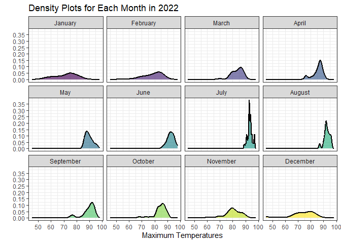

# Data Visualization Project 03


In this exercise you will explore methods to create different types of data visualizations (such as plotting text data, or exploring the distributions of continuous variables).


## PART 1: Density Plots

Using the dataset obtained from FSU's [Florida Climate Center](https://climatecenter.fsu.edu/climate-data-access-tools/downloadable-data), for a station at Tampa International Airport (TPA) for 2022, attempt to recreate the charts shown below which were generated using data from 2016. You can read the 2022 dataset using the code below: 


``` r
library(tidyverse)
weather_tpa <- read_csv("https://raw.githubusercontent.com/aalhamadani/datasets/master/tpa_weather_2022.csv")
# random sample 
sample_n(weather_tpa, 4)
```

```
## # A tibble: 4 × 7
##    year month   day precipitation max_temp min_temp ave_temp
##   <dbl> <dbl> <dbl>         <dbl>    <dbl>    <dbl>    <dbl>
## 1  2022    11    19          0          75       53     64  
## 2  2022    10    16          0          90       71     80.5
## 3  2022     7    19          0.02       93       83     88  
## 4  2022    12    24          0          45       31     38
```

See Slides from Week 4 of Visualizing Relationships and Models (slide 10) for a reminder on how to use this type of dataset with the `lubridate` package for dates and times (example included in the slides uses data from 2016).

Using the 2022 data: 

(a) Create a plot like the one below:


``` r
tpa_dated <- weather_tpa %>% 
  mutate(month_name = month(make_date(year = 2022, month = month), label = TRUE, abbr = FALSE))
```


``` r
ggplot(tpa_dated, aes(
  x = max_temp,
  fill = month_name
)) +
  geom_histogram(binwidth = 3, show.legend = FALSE, color = "white") +
  labs(x = "Maximum Temperatures",
       y = "Number of Days") +
  scale_x_continuous(breaks = seq(40, 100, by = 10)) +
  scale_fill_viridis_d() +
  facet_wrap(~ month_name) +
  theme_bw()
```

<!-- -->

Hint: the option `binwidth = 3` was used with the `geom_histogram()` function.

(b) Create a plot like the one below:


Hint: check the `kernel` parameter of the `geom_density()` function, and use `bw = 0.5`.


``` r
ggplot(tpa_dated, aes(
  x = max_temp
)) +
  geom_density(
    bw = 0.5,
    kernel = "epanechnikov",
    fill = "darkgray",
    linewidth = 1
    
  ) +
  labs(
    x = "Maximum Temperatures",
    y = "Density"
  ) + 
  theme_minimal()
```

<!-- -->


(c) Create a plot like the one below:


Hint: default options for `geom_density()` were used. 


``` r
ggplot(tpa_dated, aes(
  x = max_temp,
  fill = month_name
)) +
  geom_density(linewidth = 1, show.legend = FALSE, alpha = 0.65) +
  scale_y_continuous(breaks=seq(0, 0.4, by = 0.05)) +
  labs(
    title = "Density Plots for Each Month in 2022",
    x = "Maximum Temperatures",
    y = ""
  ) +
  facet_wrap(~ month_name) +
  theme_bw()
```

<!-- -->


(d) Generate a plot like the chart below:


Hint: use the`{ggridges}` package, and the `geom_density_ridges()` function paying close attention to the `quantile_lines` and `quantiles` parameters. The plot above uses the `plasma` option (color scale) for the _viridis_ palette.


``` r
ggplot(tpa_dated, aes(
  x = max_temp,
  y = month_name
)) +
  ggridges::geom_density_ridges_gradient(
    aes(fill = after_stat(x)),
    linewidth = 1,
    quantile_lines = TRUE,
    quantiles = 0.5
  ) +
  scale_x_continuous(breaks = seq(40, 100, by = 10)) +
  scale_fill_viridis_c(option = "plasma", breaks = seq(40, 100, by = 10)) +
  labs(
    y = "",
    x = "Maximum Temperature (in Farenheit Degrees)"
    , fill = ""
  ) +
  theme_minimal()
```

```
## Picking joint bandwidth of 1.93
```

<!-- -->


(e) Create a plot of your choice that uses the attribute for precipitation _(values of -99.9 for temperature or -99.99 for precipitation represent missing data)_.


``` r
# Get rid of any missing precipitation data
tpa_precip <- tpa_dated %>% 
  filter(precipitation != -99.99)

tpa_precip
```

```
## # A tibble: 365 × 8
##     year month   day precipitation max_temp min_temp ave_temp month_name
##    <dbl> <dbl> <dbl>         <dbl>    <dbl>    <dbl>    <dbl> <ord>     
##  1  2022     1     1       0             82       67     74.5 January   
##  2  2022     1     2       0             82       71     76.5 January   
##  3  2022     1     3       0.02          75       55     65   January   
##  4  2022     1     4       0             76       50     63   January   
##  5  2022     1     5       0             75       59     67   January   
##  6  2022     1     6       0.00001       74       56     65   January   
##  7  2022     1     7       0.00001       81       63     72   January   
##  8  2022     1     8       0             81       58     69.5 January   
##  9  2022     1     9       0             84       65     74.5 January   
## 10  2022     1    10       0             81       64     72.5 January   
## # ℹ 355 more rows
```


``` r
ggplot(tpa_precip, aes(

  x = month_name,
  y = precipitation
)) +
  geom_bar(  
  stat = "identity",
  fill = "steelblue") +
  scale_y_continuous(breaks = seq(0.0, 12.5, by = 1.0)) +
  labs(
    title = "Total Precipitation by Month in 2022",
    x = "",
    y = "Precipitation (Inches)"
  ) +
  theme_minimal() +
  coord_flip()
```

<!-- -->


## PART 2 

> **You can choose to work on either Option (A) or Option (B)**. Remove from this template the option you decided not to work on.


### Option (A): Visualizing Text Data

Review the set of slides (and additional resources linked in it) for visualizing text data: Week 6 PowerPoint slides of Visualizing Text Data. 

Choose any dataset with text data, and create at least one visualization with it. For example, you can create a frequency count of most used bigrams, a sentiment analysis of the text data, a network visualization of terms commonly used together, and/or a visualization of a topic modeling approach to the problem of identifying words/documents associated to different topics in the text data you decide to use. 

Make sure to include a copy of the dataset in the `data/` folder, and reference your sources if different from the ones listed below:

- [Billboard Top 100 Lyrics](https://raw.githubusercontent.com/aalhamadani/dataviz_final_project/main/data/BB_top100_2015.csv)

- [RateMyProfessors comments](https://raw.githubusercontent.com/aalhamadani/dataviz_final_project/main/data/rmp_wit_comments.csv)

- [FL Poly News Articles](https://raw.githubusercontent.com/aalhamadani/dataviz_final_project/main/data/flpoly_news_SP23.csv)


(to get the "raw" data from any of the links listed above, simply click on the `raw` button of the GitHub page and copy the URL to be able to read it in your computer using the `read_csv()` function)


``` r
# Probably more interesting to look at text visualization for the final project
# I'm going to look at the billboard top 100 lyrics

# Wordcloud, interactive sentiment analysis scatterplot, and bigram frequency would probably be cool

top_lyrics <- read_csv("https://raw.githubusercontent.com/aalhamadani/dataviz_final_project/main/data/BB_top100_2015.csv")
```

```
## Rows: 100 Columns: 6
## ── Column specification ────────────────────────────────────────────────────────
## Delimiter: ","
## chr (3): Song, Artist, Lyrics
## dbl (3): Rank, Year, Source
## 
## ℹ Use `spec()` to retrieve the full column specification for this data.
## ℹ Specify the column types or set `show_col_types = FALSE` to quiet this message.
```

``` r
top_lyrics
```

```
## # A tibble: 100 × 6
##     Rank Song              Artist                             Year Lyrics Source
##    <dbl> <chr>             <chr>                             <dbl> <chr>   <dbl>
##  1     1 uptown funk       mark ronson featuring bruno mars   2015 this …      1
##  2     2 thinking out loud ed sheeran                         2015 when …      1
##  3     3 see you again     wiz khalifa featuring charlie pu…  2015 its b…      1
##  4     4 trap queen        fetty wap                          2015 im li…      1
##  5     5 sugar             maroon 5                           2015 im hu…      1
##  6     6 shut up and dance walk the moon                      2015 oh do…      1
##  7     7 blank space       taylor swift                       2015 nice …      1
##  8     8 watch me          silento                            2015 now w…      1
##  9     9 earned it         the weeknd                         2015 you m…      1
## 10    10 the hills         the weeknd                         2015 your …      1
## # ℹ 90 more rows
```


