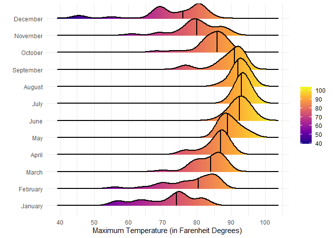

# Data Visualization Project 03


In this exercise you will explore methods to create different types of data visualizations (such as plotting text data, or exploring the distributions of continuous variables).


## PART 1: Density Plots

Using the dataset obtained from FSU's [Florida Climate Center](https://climatecenter.fsu.edu/climate-data-access-tools/downloadable-data), for a station at Tampa International Airport (TPA) for 2022, attempt to recreate the charts shown below which were generated using data from 2016. You can read the 2022 dataset using the code below: 


``` r
library(tidyverse)
weather_tpa <- read_csv("https://raw.githubusercontent.com/aalhamadani/datasets/master/tpa_weather_2022.csv")
# random sample 
sample_n(weather_tpa, 4)
```

```
## # A tibble: 4 × 7
##    year month   day precipitation max_temp min_temp ave_temp
##   <dbl> <dbl> <dbl>         <dbl>    <dbl>    <dbl>    <dbl>
## 1  2022     1     3          0.02       75       55     65  
## 2  2022     3    12          0.41       79       48     63.5
## 3  2022     7     3          0          91       79     85  
## 4  2022     4    25          0          90       71     80.5
```

See Slides from Week 4 of Visualizing Relationships and Models (slide 10) for a reminder on how to use this type of dataset with the `lubridate` package for dates and times (example included in the slides uses data from 2016).

Using the 2022 data: 

(a) Create a plot like the one below:


``` r
tpa_dated <- weather_tpa %>% 
  mutate(month_name = month(make_date(year = 2022, month = month), label = TRUE, abbr = FALSE))
```


``` r
ggplot(tpa_dated, aes(
  x = max_temp,
  fill = month_name
)) +
  geom_histogram(binwidth = 3, show.legend = FALSE, color = "white") +
  labs(x = "Maximum Temperatures",
       y = "Number of Days") +
  scale_x_continuous(breaks = seq(40, 100, by = 10)) +
  scale_fill_viridis_d() +
  facet_wrap(~ month_name) +
  theme_bw()
```

<!-- -->

Hint: the option `binwidth = 3` was used with the `geom_histogram()` function.

(b) Create a plot like the one below:


Hint: check the `kernel` parameter of the `geom_density()` function, and use `bw = 0.5`.


``` r
ggplot(tpa_dated, aes(
  x = max_temp
)) +
  geom_density(
    bw = 0.5,
    kernel = "epanechnikov",
    fill = "darkgray",
    linewidth = 1
    
  ) +
  labs(
    x = "Maximum Temperatures",
    y = "Density"
  ) + 
  theme_minimal()
```

<!-- -->


(c) Create a plot like the one below:


Hint: default options for `geom_density()` were used. 


``` r
ggplot(tpa_dated, aes(
  x = max_temp,
  fill = month_name
)) +
  geom_density(linewidth = 1, show.legend = FALSE, alpha = 0.65) +
  scale_y_continuous(breaks=seq(0, 0.4, by = 0.05)) +
  labs(
    title = "Density Plots for Each Month in 2022",
    x = "Maximum Temperatures",
    y = ""
  ) +
  facet_wrap(~ month_name) +
  theme_bw()
```

<!-- -->


(d) Generate a plot like the chart below:


Hint: use the`{ggridges}` package, and the `geom_density_ridges()` function paying close attention to the `quantile_lines` and `quantiles` parameters. The plot above uses the `plasma` option (color scale) for the _viridis_ palette.


``` r
ggplot(tpa_dated, aes(
  x = max_temp,
  y = month_name
)) +
  ggridges::geom_density_ridges_gradient(
    aes(fill = after_stat(x)),
    linewidth = 1,
    quantile_lines = TRUE,
    quantiles = 0.5
  ) +
  scale_x_continuous(breaks = seq(40, 100, by = 10)) +
  scale_fill_viridis_c(option = "plasma", breaks = seq(40, 100, by = 10)) +
  labs(
    y = "",
    x = "Maximum Temperature (in Farenheit Degrees)"
    , fill = ""
  ) +
  theme_minimal()
```

```
## Picking joint bandwidth of 1.93
```

<!-- -->


(e) Create a plot of your choice that uses the attribute for precipitation _(values of -99.9 for temperature or -99.99 for precipitation represent missing data)_.


``` r
# Get rid of any missing precipitation data
tpa_precip <- tpa_dated %>% 
  filter(precipitation != -99.99)

tpa_precip
```

```
## # A tibble: 365 × 8
##     year month   day precipitation max_temp min_temp ave_temp month_name
##    <dbl> <dbl> <dbl>         <dbl>    <dbl>    <dbl>    <dbl> <ord>     
##  1  2022     1     1       0             82       67     74.5 January   
##  2  2022     1     2       0             82       71     76.5 January   
##  3  2022     1     3       0.02          75       55     65   January   
##  4  2022     1     4       0             76       50     63   January   
##  5  2022     1     5       0             75       59     67   January   
##  6  2022     1     6       0.00001       74       56     65   January   
##  7  2022     1     7       0.00001       81       63     72   January   
##  8  2022     1     8       0             81       58     69.5 January   
##  9  2022     1     9       0             84       65     74.5 January   
## 10  2022     1    10       0             81       64     72.5 January   
## # ℹ 355 more rows
```


``` r
ggplot(tpa_precip, aes(
  x = month_name,
  y = precipitation
)) +
  geom_col(fill = "steelblue") +
  scale_y_continuous(breaks = seq(0.0, 12.5, by = 1.0)) +
  labs(
    title = "Total Precipitation by Month in 2022",
    x = "",
    y = "Precipitation (Inches)"
  ) +
  theme_minimal() +
  coord_flip()
```

<!-- -->


## PART 2 

### Option (A): Visualizing Text Data

Review the set of slides (and additional resources linked in it) for visualizing text data: Week 6 PowerPoint slides of Visualizing Text Data. 

Choose any dataset with text data, and create at least one visualization with it. For example, you can create a frequency count of most used bigrams, a sentiment analysis of the text data, a network visualization of terms commonly used together, and/or a visualization of a topic modeling approach to the problem of identifying words/documents associated to different topics in the text data you decide to use. 

Make sure to include a copy of the dataset in the `data/` folder, and reference your sources if different from the ones listed below:

- [Billboard Top 100 Lyrics](https://raw.githubusercontent.com/aalhamadani/dataviz_final_project/main/data/BB_top100_2015.csv)

- [RateMyProfessors comments](https://raw.githubusercontent.com/aalhamadani/dataviz_final_project/main/data/rmp_wit_comments.csv)

- [FL Poly News Articles](https://raw.githubusercontent.com/aalhamadani/dataviz_final_project/main/data/flpoly_news_SP23.csv)


(to get the "raw" data from any of the links listed above, simply click on the `raw` button of the GitHub page and copy the URL to be able to read it in your computer using the `read_csv()` function)


``` r
# Probably more interesting to look at text visualization for the final project
# I'm going to look at the billboard top 100 lyrics

# Wordcloud, interactive sentiment analysis scatterplot, and bigram frequency would probably be cool

top_lyrics <- read_csv("https://raw.githubusercontent.com/aalhamadani/dataviz_final_project/main/data/BB_top100_2015.csv")
```

```
## Rows: 100 Columns: 6
## ── Column specification ────────────────────────────────────────────────────────
## Delimiter: ","
## chr (3): Song, Artist, Lyrics
## dbl (3): Rank, Year, Source
## 
## ℹ Use `spec()` to retrieve the full column specification for this data.
## ℹ Specify the column types or set `show_col_types = FALSE` to quiet this message.
```

``` r
top_lyrics
```

```
## # A tibble: 100 × 6
##     Rank Song              Artist                             Year Lyrics Source
##    <dbl> <chr>             <chr>                             <dbl> <chr>   <dbl>
##  1     1 uptown funk       mark ronson featuring bruno mars   2015 this …      1
##  2     2 thinking out loud ed sheeran                         2015 when …      1
##  3     3 see you again     wiz khalifa featuring charlie pu…  2015 its b…      1
##  4     4 trap queen        fetty wap                          2015 im li…      1
##  5     5 sugar             maroon 5                           2015 im hu…      1
##  6     6 shut up and dance walk the moon                      2015 oh do…      1
##  7     7 blank space       taylor swift                       2015 nice …      1
##  8     8 watch me          silento                            2015 now w…      1
##  9     9 earned it         the weeknd                         2015 you m…      1
## 10    10 the hills         the weeknd                         2015 your …      1
## # ℹ 90 more rows
```


``` r
library(tidytext)

lyrics_words <- top_lyrics %>% 
  unnest_tokens(word, Lyrics) %>% 
  anti_join(stop_words)
```

```
## Joining with `by = join_by(word)`
```

``` r
lyrics_words
```

```
## # A tibble: 14,836 × 6
##     Rank Song        Artist                            Year Source word    
##    <dbl> <chr>       <chr>                            <dbl>  <dbl> <chr>   
##  1     1 uptown funk mark ronson featuring bruno mars  2015      1 hit     
##  2     1 uptown funk mark ronson featuring bruno mars  2015      1 ice     
##  3     1 uptown funk mark ronson featuring bruno mars  2015      1 cold    
##  4     1 uptown funk mark ronson featuring bruno mars  2015      1 michelle
##  5     1 uptown funk mark ronson featuring bruno mars  2015      1 pfeiffer
##  6     1 uptown funk mark ronson featuring bruno mars  2015      1 white   
##  7     1 uptown funk mark ronson featuring bruno mars  2015      1 gold    
##  8     1 uptown funk mark ronson featuring bruno mars  2015      1 hood    
##  9     1 uptown funk mark ronson featuring bruno mars  2015      1 girls   
## 10     1 uptown funk mark ronson featuring bruno mars  2015      1 girls   
## # ℹ 14,826 more rows
```

Below is a wordcloud of the most frequent words that appear in the top 100 billboard songs for 2015.
*Some explicit words may appear within the cloud due to the unfiltered nature of the dataset.*


``` r
library(ggwordcloud)

# Count words
word_counts <- lyrics_words %>% 
  count(word, sort=TRUE)

# Get top 200 words
ggplot(word_counts %>% slice_head(n = 200),
       aes(label = word, 
          size = n, 
          color = n)) +
  geom_text_wordcloud(area_corr = TRUE) +
  scale_size_area(max_size = 32) +
  theme_minimal() +
  labs(title = "Most Frequent Words in Top 100 Billboard Songs (2015)") +
  theme(plot.title = element_text(hjust=0.5))
```

<!-- -->


``` r
# Get the sum of afinn scores for each word in a song
song_sentiment <- lyrics_words %>% 
  inner_join(get_sentiments("afinn")) %>%
  group_by(Rank, Song, Artist) %>%
  summarize(sentiment_score = sum(value))
```

```
## Joining with `by = join_by(word)`
## `summarise()` has grouped output by 'Rank', 'Song'. You can override using the
## `.groups` argument.
```

``` r
song_sentiment
```

```
## # A tibble: 97 × 4
## # Groups:   Rank, Song [97]
##     Rank Song              Artist                             sentiment_score
##    <dbl> <chr>             <chr>                                        <dbl>
##  1     1 uptown funk       mark ronson featuring bruno mars               -33
##  2     2 thinking out loud ed sheeran                                      42
##  3     3 see you again     wiz khalifa featuring charlie puth              -3
##  4     4 trap queen        fetty wap                                      -32
##  5     5 sugar             maroon 5                                        32
##  6     6 shut up and dance walk the moon                                   -4
##  7     7 blank space       taylor swift                                   -31
##  8     8 watch me          silento                                        -18
##  9     9 earned it         the weeknd                                      41
## 10    10 the hills         the weeknd                                       5
## # ℹ 87 more rows
```


``` r
library(plotly)
```

```
## 
## Attaching package: 'plotly'
```

```
## The following object is masked from 'package:ggplot2':
## 
##     last_plot
```

```
## The following object is masked from 'package:stats':
## 
##     filter
```

```
## The following object is masked from 'package:graphics':
## 
##     layout
```

``` r
g_sent <- ggplot(song_sentiment, aes(
  x = Rank,
  y = sentiment_score,
  color = sentiment_score,
  text = paste("Song:", Song, 
               "<br>Artist:", Artist, 
               "<br>Rank:", Rank, 
               "<br>Sentiment:", sentiment_score
               )
  )) +
  geom_point() +
  geom_hline(yintercept = 0, linetype = "dashed", color = "red") +
  labs(title="AFINN Sentiment Scores of Top 100 Billboard Songs (2015)",
       caption="Score Obtained from Sum of Lyric-Word Sentiment",
       y="",
       x="Song Rank",
       color = "Sentiment Score") +
  theme_minimal()
  
ggplotly(g_sent, tooltip = "text")
```

```{=html}
<div class="plotly html-widget html-fill-item" id="htmlwidget-4c0d86cbcce328d29a58" style="width:672px;height:480px;"></div>
<script type="application/json" data-for="htmlwidget-4c0d86cbcce328d29a58">{"x":{"data":[{"x":[1,2,3,4,5,6,7,8,9,10,11,12,13,14,15,16,17,18,19,20,21,22,23,24,25,26,27,28,29,30,31,32,33,34,35,36,37,38,39,40,41,42,43,44,45,46,47,48,49,51,52,53,54,55,56,57,58,59,60,61,62,63,64,65,66,67,68,69,70,71,72,73,74,75,76,77,78,79,80,81,82,83,84,85,86,87,88,89,90,91,92,93,94,95,98,99,100],"y":[-33,42,-3,-32,32,-4,-31,-18,41,5,19,73,17,-25,-48,-4,-2,-118,-4,-21,-8,1,82,-48,4,-15,-19,0,11,17,-36,-16,9,-1,8,-31,34,32,-35,30,-6,-11,-9,-68,2,-11,-228,-171,-55,-216,-11,15,2,-18,105,9,16,-30,27,4,-7,-10,3,-10,-26,-3,17,-27,-47,6,6,-1,5,4,31,-12,-2,55,0,-9,-19,-9,-29,-20,-112,6,-49,6,-5,0,19,-24,-16,7,-23,-45,96],"text":["Song: uptown funk <br>Artist: mark ronson featuring bruno mars <br>Rank: 1 <br>Sentiment: -33","Song: thinking out loud <br>Artist: ed sheeran <br>Rank: 2 <br>Sentiment: 42","Song: see you again <br>Artist: wiz khalifa featuring charlie puth <br>Rank: 3 <br>Sentiment: -3","Song: trap queen <br>Artist: fetty wap <br>Rank: 4 <br>Sentiment: -32","Song: sugar <br>Artist: maroon 5 <br>Rank: 5 <br>Sentiment: 32","Song: shut up and dance <br>Artist: walk the moon <br>Rank: 6 <br>Sentiment: -4","Song: blank space <br>Artist: taylor swift <br>Rank: 7 <br>Sentiment: -31","Song: watch me <br>Artist: silento <br>Rank: 8 <br>Sentiment: -18","Song: earned it <br>Artist: the weeknd <br>Rank: 9 <br>Sentiment: 41","Song: the hills <br>Artist: the weeknd <br>Rank: 10 <br>Sentiment: 5","Song: cheerleader <br>Artist: omi <br>Rank: 11 <br>Sentiment: 19","Song: cant feel my face <br>Artist: the weeknd <br>Rank: 12 <br>Sentiment: 73","Song: love me like you do <br>Artist: ellie goulding <br>Rank: 13 <br>Sentiment: 17","Song: take me to church <br>Artist: hozier <br>Rank: 14 <br>Sentiment: -25","Song: bad blood <br>Artist: taylor swift featuring kendrick lamar <br>Rank: 15 <br>Sentiment: -48","Song: lean on <br>Artist: major lazer and dj snake featuring mo <br>Rank: 16 <br>Sentiment: -4","Song: want to want me <br>Artist: jason derulo <br>Rank: 17 <br>Sentiment: -2","Song: shake it off <br>Artist: taylor swift <br>Rank: 18 <br>Sentiment: -118","Song: where are \"u now <br>Artist: skrillex and diplo featuring justin bieber <br>Rank: 19 <br>Sentiment: -4","Song: fight song <br>Artist: rachel platten <br>Rank: 20 <br>Sentiment: -21","Song: 679 <br>Artist: fetty wap featuring remy boyz <br>Rank: 21 <br>Sentiment: -8","Song: lips are movin <br>Artist: meghan trainor <br>Rank: 22 <br>Sentiment: 1","Song: worth it <br>Artist: fifth harmony featuring kid ink <br>Rank: 23 <br>Sentiment: 82","Song: post to be <br>Artist: omarion featuring chris brown and jhene aiko <br>Rank: 24 <br>Sentiment: -48","Song: honey im good <br>Artist: andy grammer <br>Rank: 25 <br>Sentiment: 4","Song: im not the only one <br>Artist: sam smith <br>Rank: 26 <br>Sentiment: -15","Song: good for you <br>Artist: selena gomez featuring aap rocky <br>Rank: 27 <br>Sentiment: -19","Song: all about that bass <br>Artist: meghan trainor <br>Rank: 28 <br>Sentiment: 0","Song: style <br>Artist: taylor swift <br>Rank: 29 <br>Sentiment: 11","Song: hotline bling <br>Artist: drake <br>Rank: 30 <br>Sentiment: 17","Song: hey mama <br>Artist: david guetta featuring nicki minaj bebe rexha and afrojack <br>Rank: 31 <br>Sentiment: -36","Song: gdfr <br>Artist: flo rida featuring sage the gemini and lookas <br>Rank: 32 <br>Sentiment: -16","Song: what do you mean <br>Artist: justin bieber <br>Rank: 33 <br>Sentiment: 9","Song: photograph <br>Artist: ed sheeran <br>Rank: 34 <br>Sentiment: -1","Song: hello <br>Artist: adele <br>Rank: 35 <br>Sentiment: 8","Song: stitches <br>Artist: shawn mendes <br>Rank: 36 <br>Sentiment: -31","Song: talking body <br>Artist: tove lo <br>Rank: 37 <br>Sentiment: 34","Song: jealous <br>Artist: nick jonas <br>Rank: 38 <br>Sentiment: 32","Song: time of our lives <br>Artist: pitbull and neyo <br>Rank: 39 <br>Sentiment: -35","Song: locked away <br>Artist: r city featuring adam levine <br>Rank: 40 <br>Sentiment: 30","Song: somebody <br>Artist: natalie la rose featuring jeremih <br>Rank: 41 <br>Sentiment: -6","Song: fourfiveseconds <br>Artist: rihanna kanye west and paul mccartney <br>Rank: 42 <br>Sentiment: -11","Song: centuries <br>Artist: fall out boy <br>Rank: 43 <br>Sentiment: -9","Song: my way <br>Artist: fetty wap featuring monty <br>Rank: 44 <br>Sentiment: -68","Song: take your time <br>Artist: sam hunt <br>Rank: 45 <br>Sentiment: 2","Song: animals <br>Artist: maroon 5 <br>Rank: 46 <br>Sentiment: -11","Song: i dont fuck with you <br>Artist: big sean featuring e40 <br>Rank: 47 <br>Sentiment: -228","Song: bitch better have my money <br>Artist: rihanna <br>Rank: 48 <br>Sentiment: -171","Song: flex ooh ooh ooh <br>Artist: rich homie quan <br>Rank: 49 <br>Sentiment: -55","Song: only <br>Artist: nicki minaj featuring drake lil wayne and chris brown <br>Rank: 51 <br>Sentiment: -216","Song: elastic heart <br>Artist: sia <br>Rank: 52 <br>Sentiment: -11","Song: cool for the summer <br>Artist: demi lovato <br>Rank: 53 <br>Sentiment: 15","Song: renegades <br>Artist: x ambassadors <br>Rank: 54 <br>Sentiment: 2","Song: i dont mind <br>Artist: usher featuring juicy j <br>Rank: 55 <br>Sentiment: -18","Song: love me harder <br>Artist: ariana grande and the weeknd <br>Rank: 56 <br>Sentiment: 105","Song: wildest dreams <br>Artist: taylor swift <br>Rank: 57 <br>Sentiment: 9","Song: stay with me <br>Artist: sam smith <br>Rank: 58 <br>Sentiment: 16","Song: you know you like it <br>Artist: dj snake and alunageorge <br>Rank: 59 <br>Sentiment: -30","Song: uma thurman <br>Artist: fall out boy <br>Rank: 60 <br>Sentiment: 27","Song: 711 <br>Artist: beyonce <br>Rank: 61 <br>Sentiment: 4","Song: the heart wants what it wants <br>Artist: selena gomez <br>Rank: 62 <br>Sentiment: -7","Song: girl crush <br>Artist: little big town <br>Rank: 63 <br>Sentiment: -10","Song: slow motion <br>Artist: trey songz <br>Rank: 64 <br>Sentiment: 3","Song: drag me down <br>Artist: one direction <br>Rank: 65 <br>Sentiment: -10","Song: truffle butter <br>Artist: nicki minaj featuring drake and lil wayne <br>Rank: 66 <br>Sentiment: -26","Song: one last time <br>Artist: ariana grande <br>Rank: 67 <br>Sentiment: -3","Song: chains <br>Artist: nick jonas <br>Rank: 68 <br>Sentiment: 17","Song: all eyes on you <br>Artist: meek mill featuring chris brown and nicki minaj <br>Rank: 69 <br>Sentiment: -27","Song: no type <br>Artist: rae sremmurd <br>Rank: 70 <br>Sentiment: -47","Song: riptide <br>Artist: vance joy <br>Rank: 71 <br>Sentiment: 6","Song: classic man <br>Artist: jidenna featuring roman gianarthur <br>Rank: 72 <br>Sentiment: 6","Song: exs  ohs <br>Artist: elle king <br>Rank: 73 <br>Sentiment: -1","Song: dear future husband <br>Artist: meghan trainor <br>Rank: 74 <br>Sentiment: 5","Song: marvin gaye <br>Artist: charlie puth featuring meghan trainor <br>Rank: 75 <br>Sentiment: 4","Song: like im gonna lose you <br>Artist: meghan trainor featuring john legend <br>Rank: 76 <br>Sentiment: 31","Song: habits stay high <br>Artist: tove lo <br>Rank: 77 <br>Sentiment: -12","Song: the hanging tree <br>Artist: james newton howard featuring jennifer lawrence <br>Rank: 78 <br>Sentiment: -2","Song: coco <br>Artist: ot genasis <br>Rank: 79 <br>Sentiment: 55","Song: bang bang <br>Artist: jessie j ariana grande and nicki minaj <br>Rank: 80 <br>Sentiment: 0","Song: lay me down <br>Artist: sam smith <br>Rank: 81 <br>Sentiment: -9","Song: tuesday <br>Artist: ilovemakonnen featuring drake <br>Rank: 82 <br>Sentiment: -19","Song: hit the quan <br>Artist: ilovememphis <br>Rank: 83 <br>Sentiment: -9","Song: downtown <br>Artist: macklemore and ryan lewis featuring eric nally melle mel kool moe dee and grandmaster caz <br>Rank: 84 <br>Sentiment: -29","Song: house party <br>Artist: sam hunt <br>Rank: 85 <br>Sentiment: -20","Song: ayo <br>Artist: chris brown and tyga <br>Rank: 86 <br>Sentiment: -112","Song: kick the dust up <br>Artist: luke bryan <br>Rank: 87 <br>Sentiment: 6","Song: blessings <br>Artist: big sean featuring drake <br>Rank: 88 <br>Sentiment: -49","Song: budapest <br>Artist: george ezra <br>Rank: 89 <br>Sentiment: 6","Song: chandelier <br>Artist: sia <br>Rank: 90 <br>Sentiment: -5","Song: heartbeat song <br>Artist: kelly clarkson <br>Rank: 91 <br>Sentiment: 0","Song: dont <br>Artist: ed sheeran <br>Rank: 92 <br>Sentiment: 19","Song: ghost <br>Artist: ella henderson <br>Rank: 93 <br>Sentiment: -24","Song: here <br>Artist: alessia cara <br>Rank: 94 <br>Sentiment: -16","Song: waves <br>Artist: mr probz <br>Rank: 95 <br>Sentiment: 7","Song: night changes <br>Artist: one direction <br>Rank: 98 <br>Sentiment: -23","Song: back to back <br>Artist: drake <br>Rank: 99 <br>Sentiment: -45","Song: how deep is your love <br>Artist: calvin harris and disciples <br>Rank: 100 <br>Sentiment: 96"],"type":"scatter","mode":"markers","marker":{"autocolorscale":false,"color":["rgba(57,118,168,1)","rgba(72,149,210,1)","rgba(63,130,184,1)","rgba(57,118,168,1)","rgba(70,145,204,1)","rgba(63,130,184,1)","rgba(57,119,169,1)","rgba(60,124,176,1)","rgba(72,149,209,1)","rgba(64,134,189,1)","rgba(67,140,197,1)","rgba(79,163,228,1)","rgba(67,139,196,1)","rgba(58,121,172,1)","rgba(54,112,159,1)","rgba(63,130,184,1)","rgba(63,131,185,1)","rgba(40,84,122,1)","rgba(63,130,184,1)","rgba(59,123,174,1)","rgba(62,128,182,1)","rgba(64,132,187,1)","rgba(81,167,233,1)","rgba(54,112,159,1)","rgba(64,133,188,1)","rgba(60,125,178,1)","rgba(59,124,175,1)","rgba(63,132,186,1)","rgba(66,136,192,1)","rgba(67,139,196,1)","rgba(56,117,166,1)","rgba(60,125,177,1)","rgba(65,135,191,1)","rgba(63,131,185,1)","rgba(65,135,191,1)","rgba(57,119,169,1)","rgba(71,146,205,1)","rgba(70,145,204,1)","rgba(56,117,166,1)","rgba(70,144,203,1)","rgba(62,129,183,1)","rgba(61,127,180,1)","rgba(62,128,181,1)","rgba(49,104,148,1)","rgba(64,132,187,1)","rgba(61,127,180,1)","rgba(19,43,67,1)","rgba(29,64,95,1)","rgba(52,109,155,1)","rgba(21,47,73,1)","rgba(61,127,180,1)","rgba(67,138,195,1)","rgba(64,132,187,1)","rgba(60,124,176,1)","rgba(86,177,247,1)","rgba(65,135,191,1)","rgba(67,138,195,1)","rgba(57,119,169,1)","rgba(69,143,201,1)","rgba(64,133,188,1)","rgba(62,129,182,1)","rgba(61,127,180,1)","rgba(64,133,188,1)","rgba(61,127,180,1)","rgba(58,121,171,1)","rgba(63,130,184,1)","rgba(67,139,196,1)","rgba(58,120,171,1)","rgba(54,112,160,1)","rgba(65,134,189,1)","rgba(65,134,189,1)","rgba(63,131,185,1)","rgba(64,134,189,1)","rgba(64,133,188,1)","rgba(70,145,204,1)","rgba(61,127,179,1)","rgba(63,131,185,1)","rgba(75,155,218,1)","rgba(63,132,186,1)","rgba(62,128,181,1)","rgba(59,124,175,1)","rgba(62,128,181,1)","rgba(57,119,170,1)","rgba(59,123,175,1)","rgba(41,86,125,1)","rgba(65,134,189,1)","rgba(53,111,159,1)","rgba(65,134,189,1)","rgba(62,129,183,1)","rgba(63,132,186,1)","rgba(67,140,197,1)","rgba(58,122,173,1)","rgba(60,125,177,1)","rgba(65,134,190,1)","rgba(59,122,173,1)","rgba(54,113,161,1)","rgba(84,173,242,1)"],"opacity":1,"size":5.6692913385826778,"symbol":"circle","line":{"width":1.8897637795275593,"color":["rgba(57,118,168,1)","rgba(72,149,210,1)","rgba(63,130,184,1)","rgba(57,118,168,1)","rgba(70,145,204,1)","rgba(63,130,184,1)","rgba(57,119,169,1)","rgba(60,124,176,1)","rgba(72,149,209,1)","rgba(64,134,189,1)","rgba(67,140,197,1)","rgba(79,163,228,1)","rgba(67,139,196,1)","rgba(58,121,172,1)","rgba(54,112,159,1)","rgba(63,130,184,1)","rgba(63,131,185,1)","rgba(40,84,122,1)","rgba(63,130,184,1)","rgba(59,123,174,1)","rgba(62,128,182,1)","rgba(64,132,187,1)","rgba(81,167,233,1)","rgba(54,112,159,1)","rgba(64,133,188,1)","rgba(60,125,178,1)","rgba(59,124,175,1)","rgba(63,132,186,1)","rgba(66,136,192,1)","rgba(67,139,196,1)","rgba(56,117,166,1)","rgba(60,125,177,1)","rgba(65,135,191,1)","rgba(63,131,185,1)","rgba(65,135,191,1)","rgba(57,119,169,1)","rgba(71,146,205,1)","rgba(70,145,204,1)","rgba(56,117,166,1)","rgba(70,144,203,1)","rgba(62,129,183,1)","rgba(61,127,180,1)","rgba(62,128,181,1)","rgba(49,104,148,1)","rgba(64,132,187,1)","rgba(61,127,180,1)","rgba(19,43,67,1)","rgba(29,64,95,1)","rgba(52,109,155,1)","rgba(21,47,73,1)","rgba(61,127,180,1)","rgba(67,138,195,1)","rgba(64,132,187,1)","rgba(60,124,176,1)","rgba(86,177,247,1)","rgba(65,135,191,1)","rgba(67,138,195,1)","rgba(57,119,169,1)","rgba(69,143,201,1)","rgba(64,133,188,1)","rgba(62,129,182,1)","rgba(61,127,180,1)","rgba(64,133,188,1)","rgba(61,127,180,1)","rgba(58,121,171,1)","rgba(63,130,184,1)","rgba(67,139,196,1)","rgba(58,120,171,1)","rgba(54,112,160,1)","rgba(65,134,189,1)","rgba(65,134,189,1)","rgba(63,131,185,1)","rgba(64,134,189,1)","rgba(64,133,188,1)","rgba(70,145,204,1)","rgba(61,127,179,1)","rgba(63,131,185,1)","rgba(75,155,218,1)","rgba(63,132,186,1)","rgba(62,128,181,1)","rgba(59,124,175,1)","rgba(62,128,181,1)","rgba(57,119,170,1)","rgba(59,123,175,1)","rgba(41,86,125,1)","rgba(65,134,189,1)","rgba(53,111,159,1)","rgba(65,134,189,1)","rgba(62,129,183,1)","rgba(63,132,186,1)","rgba(67,140,197,1)","rgba(58,122,173,1)","rgba(60,125,177,1)","rgba(65,134,190,1)","rgba(59,122,173,1)","rgba(54,113,161,1)","rgba(84,173,242,1)"]}},"hoveron":"points","showlegend":false,"xaxis":"x","yaxis":"y","hoverinfo":"text","frame":null},{"x":[-3.9500000000000002,104.95],"y":[0,0],"text":"","type":"scatter","mode":"lines","line":{"width":1.8897637795275593,"color":"rgba(255,0,0,1)","dash":"dash"},"hoveron":"points","showlegend":false,"xaxis":"x","yaxis":"y","hoverinfo":"text","frame":null},{"x":[-4.4408920985006262e-16],"y":[-200],"name":"d437a9aa621512d37971a9d35dac06c7","type":"scatter","mode":"markers","opacity":0,"hoverinfo":"skip","showlegend":false,"marker":{"color":[0,1],"colorscale":[[0,"#132B43"],[0.0033444816053512035,"#132B44"],[0.0066889632107023219,"#132C44"],[0.010033444816053526,"#142C45"],[0.013377926421404644,"#142D45"],[0.016722408026755849,"#142D46"],[0.020066889632107052,"#142D46"],[0.023411371237458171,"#142E47"],[0.026755852842809374,"#152E47"],[0.030100334448160491,"#152F48"],[0.033444816053511697,"#152F48"],[0.0367892976588629,"#152F49"],[0.04013377926421402,"#153049"],[0.043478260869565223,"#16304A"],[0.046822742474916343,"#16304A"],[0.050167224080267546,"#16314B"],[0.053511705685618749,"#16314B"],[0.056856187290969862,"#16324C"],[0.060200668896321072,"#17324D"],[0.063545150501672268,"#17324D"],[0.066889632107023395,"#17334E"],[0.070234113712374591,"#17334E"],[0.073578595317725717,"#17344F"],[0.076923076923076913,"#18344F"],[0.080267558528428123,"#183450"],[0.083612040133779236,"#183550"],[0.086956521739130446,"#183551"],[0.090301003344481642,"#183651"],[0.093645484949832769,"#193652"],[0.096989966555183965,"#193652"],[0.10033444816053509,"#193753"],[0.10367892976588629,"#193754"],[0.1070234113712375,"#193854"],[0.11036789297658861,"#1A3855"],[0.11371237458193982,"#1A3955"],[0.11705685618729093,"#1A3956"],[0.12040133779264214,"#1A3956"],[0.12374581939799334,"#1A3A57"],[0.12709030100334445,"#1B3A57"],[0.13043478260869568,"#1B3B58"],[0.13377926421404679,"#1B3B59"],[0.13712374581939799,"#1B3B59"],[0.14046822742474918,"#1C3C5A"],[0.14381270903010029,"#1C3C5A"],[0.14715719063545152,"#1C3D5B"],[0.15050167224080263,"#1C3D5B"],[0.15384615384615383,"#1C3D5C"],[0.15719063545150502,"#1D3E5C"],[0.16053511705685616,"#1D3E5D"],[0.16387959866220736,"#1D3F5D"],[0.16722408026755847,"#1D3F5E"],[0.17056856187290967,"#1D3F5F"],[0.17391304347826089,"#1E405F"],[0.17725752508361201,"#1E4060"],[0.1806020066889632,"#1E4160"],[0.18394648829431431,"#1E4161"],[0.18729096989966554,"#1E4261"],[0.19063545150501673,"#1F4262"],[0.19397993311036793,"#1F4263"],[0.19732441471571904,"#1F4363"],[0.20066889632107018,"#1F4364"],[0.20401337792642138,"#1F4464"],[0.20735785953177258,"#204465"],[0.21070234113712377,"#204465"],[0.21404682274247491,"#204566"],[0.21739130434782603,"#204566"],[0.22073578595317722,"#214667"],[0.22408026755852842,"#214668"],[0.22742474916387964,"#214768"],[0.23076923076923075,"#214769"],[0.23411371237458187,"#214769"],[0.23745819397993306,"#22486A"],[0.24080267558528429,"#22486A"],[0.24414715719063548,"#22496B"],[0.2474916387959866,"#22496C"],[0.25083612040133774,"#224A6C"],[0.2541806020066889,"#234A6D"],[0.25752508361204013,"#234A6D"],[0.26086956521739135,"#234B6E"],[0.26421404682274247,"#234B6E"],[0.26755852842809363,"#244C6F"],[0.27090301003344475,"#244C70"],[0.27424749163879597,"#244C70"],[0.27759197324414719,"#244D71"],[0.28093645484949831,"#244D71"],[0.28428093645484948,"#254E72"],[0.28762541806020059,"#254E72"],[0.29096989966555181,"#254F73"],[0.29431438127090304,"#254F74"],[0.29765886287625415,"#254F74"],[0.30100334448160532,"#265075"],[0.30434782608695649,"#265075"],[0.30769230769230765,"#265176"],[0.31103678929765882,"#265176"],[0.31438127090301005,"#275277"],[0.31772575250836121,"#275278"],[0.32107023411371233,"#275278"],[0.3244147157190635,"#275379"],[0.32775919732441466,"#275379"],[0.33110367892976589,"#28547A"],[0.33444816053511706,"#28547B"],[0.33779264214046822,"#28557B"],[0.34113712374581934,"#28557C"],[0.34448160535117056,"#28567C"],[0.34782608695652173,"#29567D"],[0.3511705685618729,"#29567D"],[0.35451505016722407,"#29577E"],[0.35785953177257523,"#29577F"],[0.3612040133779264,"#2A587F"],[0.36454849498327757,"#2A5880"],[0.36789297658862874,"#2A5980"],[0.37123745819397991,"#2A5981"],[0.37458193979933108,"#2A5982"],[0.37792642140468224,"#2B5A82"],[0.38127090301003341,"#2B5A83"],[0.38461538461538458,"#2B5B83"],[0.38795986622073581,"#2B5B84"],[0.39130434782608692,"#2C5C85"],[0.39464882943143809,"#2C5C85"],[0.39799331103678931,"#2C5D86"],[0.40133779264214042,"#2C5D86"],[0.40468227424749165,"#2C5D87"],[0.40802675585284276,"#2D5E87"],[0.41137123745819398,"#2D5E88"],[0.41471571906354515,"#2D5F89"],[0.41806020066889626,"#2D5F89"],[0.42140468227424749,"#2E608A"],[0.4247491638795986,"#2E608A"],[0.42809364548494983,"#2E618B"],[0.43143812709030099,"#2E618C"],[0.43478260869565211,"#2E618C"],[0.43812709030100333,"#2F628D"],[0.44147157190635444,"#2F628D"],[0.44481605351170567,"#2F638E"],[0.44816053511705684,"#2F638F"],[0.45150501672240795,"#30648F"],[0.45484949832775917,"#306490"],[0.45819397993311028,"#306590"],[0.46153846153846151,"#306591"],[0.46488294314381268,"#306592"],[0.46822742474916385,"#316692"],[0.47157190635451501,"#316693"],[0.47491638795986624,"#316793"],[0.47826086956521735,"#316794"],[0.48160535117056857,"#326895"],[0.48494983277591969,"#326895"],[0.48829431438127086,"#326996"],[0.49163879598662208,"#326996"],[0.49498327759197319,"#326997"],[0.49832775919732442,"#336A98"],[0.50167224080267547,"#336A98"],[0.50501672240802675,"#336B99"],[0.50836120401337792,"#336B99"],[0.51170568561872909,"#346C9A"],[0.51505016722408026,"#346C9B"],[0.51839464882943131,"#346D9B"],[0.52173913043478259,"#346D9C"],[0.52508361204013376,"#346E9D"],[0.52842809364548493,"#356E9D"],[0.5317725752508361,"#356E9E"],[0.53511705685618727,"#356F9E"],[0.53846153846153844,"#356F9F"],[0.5418060200668896,"#3670A0"],[0.54515050167224077,"#3670A0"],[0.54849498327759194,"#3671A1"],[0.55183946488294311,"#3671A1"],[0.55518394648829428,"#3772A2"],[0.55852842809364545,"#3772A3"],[0.56187290969899661,"#3773A3"],[0.56521739130434778,"#3773A4"],[0.56856187290969895,"#3773A4"],[0.57190635451505012,"#3874A5"],[0.57525083612040129,"#3874A6"],[0.57859531772575246,"#3875A6"],[0.58193979933110362,"#3875A7"],[0.58528428093645479,"#3976A8"],[0.58862876254180596,"#3976A8"],[0.59197324414715713,"#3977A9"],[0.5953177257525083,"#3977A9"],[0.59866220735785947,"#3978AA"],[0.60200668896321063,"#3A78AB"],[0.6053511705685618,"#3A79AB"],[0.60869565217391297,"#3A79AC"],[0.61204013377926425,"#3A79AC"],[0.61538461538461531,"#3B7AAD"],[0.61872909698996659,"#3B7AAE"],[0.62207357859531764,"#3B7BAE"],[0.62541806020066881,"#3B7BAF"],[0.62876254180602009,"#3C7CB0"],[0.63210702341137115,"#3C7CB0"],[0.63545150501672243,"#3C7DB1"],[0.63879598662207349,"#3C7DB1"],[0.64214046822742465,"#3C7EB2"],[0.64548494983277593,"#3D7EB3"],[0.64882943143812699,"#3D7FB3"],[0.65217391304347827,"#3D7FB4"],[0.65551839464882933,"#3D7FB5"],[0.65886287625418061,"#3E80B5"],[0.66220735785953178,"#3E80B6"],[0.66555183946488283,"#3E81B6"],[0.66889632107023411,"#3E81B7"],[0.67224080267558517,"#3F82B8"],[0.67558528428093645,"#3F82B8"],[0.67892976588628762,"#3F83B9"],[0.68227424749163867,"#3F83BA"],[0.68561872909698995,"#4084BA"],[0.68896321070234112,"#4084BB"],[0.69230769230769229,"#4085BB"],[0.69565217391304346,"#4085BC"],[0.69899665551839452,"#4086BD"],[0.7023411371237458,"#4186BD"],[0.70568561872909696,"#4186BE"],[0.70903010033444813,"#4187BF"],[0.7123745819397993,"#4187BF"],[0.71571906354515047,"#4288C0"],[0.71906354515050164,"#4288C1"],[0.72240802675585281,"#4289C1"],[0.72575250836120397,"#4289C2"],[0.72909698996655514,"#438AC2"],[0.73244147157190631,"#438AC3"],[0.73578595317725748,"#438BC4"],[0.73913043478260865,"#438BC4"],[0.74247491638795982,"#438CC5"],[0.74581939799331098,"#448CC6"],[0.74916387959866215,"#448DC6"],[0.75250836120401332,"#448DC7"],[0.75585284280936449,"#448EC8"],[0.75919732441471566,"#458EC8"],[0.76254180602006683,"#458FC9"],[0.76588628762541799,"#458FC9"],[0.76923076923076916,"#458FCA"],[0.77257525083612033,"#4690CB"],[0.77591973244147161,"#4690CB"],[0.77926421404682256,"#4691CC"],[0.78260869565217384,"#4691CD"],[0.785953177257525,"#4792CD"],[0.78929765886287617,"#4792CE"],[0.79264214046822745,"#4793CF"],[0.79598662207357862,"#4793CF"],[0.79933110367892968,"#4894D0"],[0.80267558528428085,"#4894D0"],[0.80602006688963201,"#4895D1"],[0.80936454849498329,"#4895D2"],[0.81270903010033446,"#4896D2"],[0.81605351170568552,"#4996D3"],[0.81939799331103669,"#4997D4"],[0.82274247491638797,"#4997D4"],[0.82608695652173914,"#4998D5"],[0.8294314381270903,"#4A98D6"],[0.83277591973244136,"#4A99D6"],[0.83612040133779253,"#4A99D7"],[0.83946488294314381,"#4A9AD8"],[0.84280936454849498,"#4B9AD8"],[0.84615384615384615,"#4B9BD9"],[0.8494983277591972,"#4B9BDA"],[0.85284280936454837,"#4B9BDA"],[0.85618729096989965,"#4C9CDB"],[0.85953177257525082,"#4C9CDB"],[0.86287625418060199,"#4C9DDC"],[0.86622073578595304,"#4C9DDD"],[0.86956521739130421,"#4D9EDD"],[0.87290969899665549,"#4D9EDE"],[0.87625418060200666,"#4D9FDF"],[0.87959866220735783,"#4D9FDF"],[0.88294314381270889,"#4DA0E0"],[0.88628762541806005,"#4EA0E1"],[0.88963210702341133,"#4EA1E1"],[0.8929765886287625,"#4EA1E2"],[0.89632107023411367,"#4EA2E3"],[0.89966555183946473,"#4FA2E3"],[0.9030100334448159,"#4FA3E4"],[0.90635451505016718,"#4FA3E5"],[0.90969899665551834,"#4FA4E5"],[0.91304347826086951,"#50A4E6"],[0.91638795986622057,"#50A5E7"],[0.91973244147157185,"#50A5E7"],[0.92307692307692302,"#50A6E8"],[0.92642140468227419,"#51A6E8"],[0.92976588628762535,"#51A7E9"],[0.93311036789297663,"#51A7EA"],[0.93645484949832769,"#51A8EA"],[0.93979933110367886,"#52A8EB"],[0.94314381270903003,"#52A9EC"],[0.94648829431438131,"#52A9EC"],[0.94983277591973247,"#52AAED"],[0.95317725752508353,"#53AAEE"],[0.9565217391304347,"#53ABEE"],[0.95986622073578587,"#53ABEF"],[0.96321070234113715,"#53ACF0"],[0.96655518394648832,"#54ACF0"],[0.96989966555183937,"#54ADF1"],[0.97324414715719054,"#54ADF2"],[0.97658862876254171,"#54AEF2"],[0.97993311036789299,"#55AEF3"],[0.98327759197324416,"#55AFF4"],[0.98662207357859522,"#55AFF4"],[0.98996655518394638,"#55B0F5"],[0.99331103678929755,"#56B0F6"],[0.99665551839464883,"#56B1F6"],[1,"#56B1F7"]],"colorbar":{"bgcolor":null,"bordercolor":null,"borderwidth":0,"thickness":23.039999999999996,"title":"Sentiment Score","titlefont":{"color":"rgba(0,0,0,1)","family":"","size":14.611872146118724},"tickmode":"array","ticktext":["-200","-100","0","100"],"tickvals":[0.085470470470470461,0.38476976976976973,0.68406906906906906,0.98336836836836838],"tickfont":{"color":"rgba(0,0,0,1)","family":"","size":11.68949771689498},"ticklen":2,"len":0.5}},"xaxis":"x","yaxis":"y","frame":null}],"layout":{"margin":{"t":43.762557077625573,"r":7.3059360730593621,"b":40.182648401826491,"l":34.337899543379002},"font":{"color":"rgba(0,0,0,1)","family":"","size":14.611872146118724},"title":{"text":"AFINN Sentiment Scores of Top 100 Billboard Songs (2015)","font":{"color":"rgba(0,0,0,1)","family":"","size":17.534246575342465},"x":0,"xref":"paper"},"xaxis":{"domain":[0,1],"automargin":true,"type":"linear","autorange":false,"range":[-3.9500000000000002,104.95],"tickmode":"array","ticktext":["0","25","50","75","100"],"tickvals":[-4.4408920985006262e-16,25,50,75,100],"categoryorder":"array","categoryarray":["0","25","50","75","100"],"nticks":null,"ticks":"","tickcolor":null,"ticklen":3.6529680365296811,"tickwidth":0,"showticklabels":true,"tickfont":{"color":"rgba(77,77,77,1)","family":"","size":11.68949771689498},"tickangle":-0,"showline":false,"linecolor":null,"linewidth":0,"showgrid":true,"gridcolor":"rgba(235,235,235,1)","gridwidth":0.66417600664176002,"zeroline":false,"anchor":"y","title":{"text":"Song Rank","font":{"color":"rgba(0,0,0,1)","family":"","size":14.611872146118724}},"hoverformat":".2f"},"yaxis":{"domain":[0,1],"automargin":true,"type":"linear","autorange":false,"range":[-244.65000000000001,121.65000000000001],"tickmode":"array","ticktext":["-200","-100","0","100"],"tickvals":[-200,-100,0,99.999999999999972],"categoryorder":"array","categoryarray":["-200","-100","0","100"],"nticks":null,"ticks":"","tickcolor":null,"ticklen":3.6529680365296811,"tickwidth":0,"showticklabels":true,"tickfont":{"color":"rgba(77,77,77,1)","family":"","size":11.68949771689498},"tickangle":-0,"showline":false,"linecolor":null,"linewidth":0,"showgrid":true,"gridcolor":"rgba(235,235,235,1)","gridwidth":0.66417600664176002,"zeroline":false,"anchor":"x","title":{"text":"","font":{"color":"rgba(0,0,0,1)","family":"","size":14.611872146118724}},"hoverformat":".2f"},"shapes":[{"type":"rect","fillcolor":null,"line":{"color":null,"width":0,"linetype":[]},"yref":"paper","xref":"paper","x0":0,"x1":1,"y0":0,"y1":1}],"showlegend":false,"legend":{"bgcolor":null,"bordercolor":null,"borderwidth":0,"font":{"color":"rgba(0,0,0,1)","family":"","size":11.68949771689498},"title":{"text":"Sentiment Score","font":{"color":"rgba(0,0,0,1)","family":"","size":14.611872146118724}}},"hovermode":"closest","barmode":"relative"},"config":{"doubleClick":"reset","modeBarButtonsToAdd":["hoverclosest","hovercompare"],"showSendToCloud":false},"source":"A","attrs":{"3f7c5a791dac":{"x":{},"y":{},"colour":{},"text":{},"type":"scatter"},"3f7c6c912953":{"yintercept":{}}},"cur_data":"3f7c5a791dac","visdat":{"3f7c5a791dac":["function (y) ","x"],"3f7c6c912953":["function (y) ","x"]},"highlight":{"on":"plotly_click","persistent":false,"dynamic":false,"selectize":false,"opacityDim":0.20000000000000001,"selected":{"opacity":1},"debounce":0},"shinyEvents":["plotly_hover","plotly_click","plotly_selected","plotly_relayout","plotly_brushed","plotly_brushing","plotly_clickannotation","plotly_doubleclick","plotly_deselect","plotly_afterplot","plotly_sunburstclick"],"base_url":"https://plot.ly"},"evals":[],"jsHooks":[]}</script>
```

